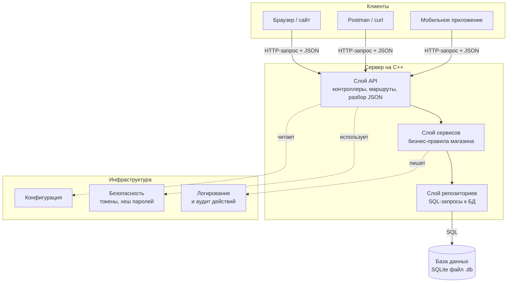
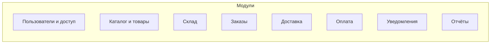
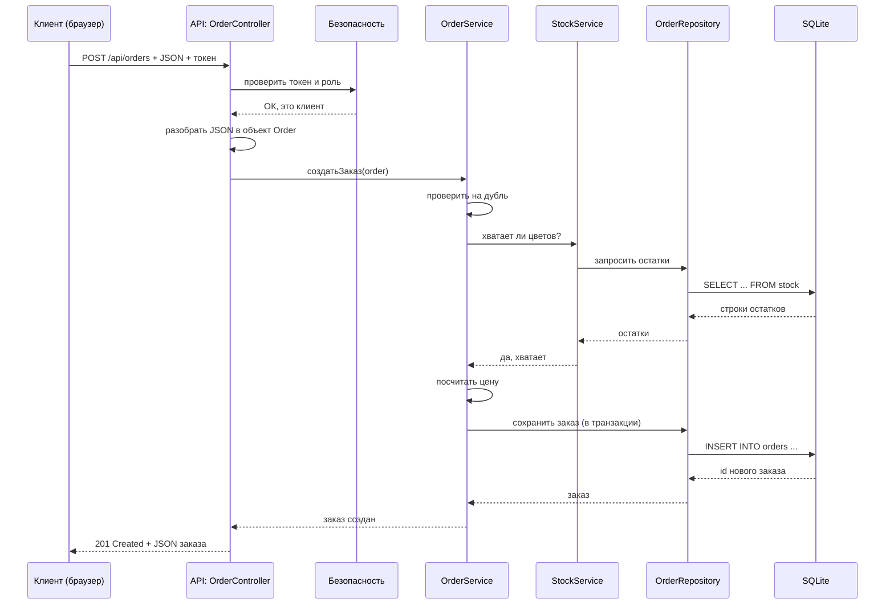

# Шаг 03. Архитектура системы (карта всего проекта)

> **Цель шага:** увидеть проект целиком — из каких частей он состоит, кто с кем
> разговаривает, как запрос проходит сквозь систему. Это **справочный файл**: к нему
> возвращаются на каждом следующем шаге. Кода почти нет — есть диаграммы и объяснения.

> Диаграммы ниже написаны на языке **Mermaid**. Если вы смотрите файл на GitHub или в
> редакторе с поддержкой Mermaid — они нарисуются автоматически. Если нет — рядом всегда
> есть ASCII-версия и текстовое описание.

---

## 1. Что такое архитектура и зачем она

Архитектура — это **решение, как разрезать программу на части**, чтобы:

- части можно было писать и чинить по отдельности;
- замена одной части не ломала остальные;
- новый человек (или ИИ) мог быстро понять, «где что лежит».

Плохая архитектура — это когда весь код в одном файле `main.cpp` на 5000 строк, и любое
изменение что-нибудь ломает. Мы так делать **не будем**.

---

## 2. Главная идея: слоистая архитектура (Layered Architecture)

Мы делим систему на **4 слоя** плюс «инфраструктуру» сбоку. Правило одно и железное:

> **Слой обращается только к слою непосредственно под собой. Снизу вверх вызовов нет.**



**ASCII-версия (та же мысль):**

```
[Браузер/Postman]  --HTTP+JSON-->  [API] --> [Сервисы] --> [Репозитории] --> [(SQLite)]
                                     |            |
                                 (Безопасность) (Логи/Аудит, Конфиг)
```

### Что делает каждый слой

| Слой | Файлы (примерно) | Отвечает за | НЕ отвечает за |
|------|------------------|-------------|----------------|
| **API** | `src/api/*` | принять HTTP-запрос, проверить токен, разобрать JSON, позвать сервис, вернуть JSON и код ответа | бизнес-правила, SQL |
| **Сервисы** | `src/services/*` | правила магазина: «можно ли оформить заказ», «хватает ли цветов», «посчитать цену» | HTTP, SQL напрямую |
| **Репозитории** | `src/repositories/*` | SQL-запросы: достать/сохранить/удалить строки | бизнес-правила, HTTP |
| **Модели** | `src/domain/*` | структуры данных (Заказ, Товар, Клиент) | поведение, БД |
| **Инфраструктура** | `src/infra/*` | БД-подключение, безопасность, логи, конфиг | конкретные бизнес-задачи |

> **Аналогия для новичка.** Ресторан: официант (API) принимает заказ от гостя, но сам не
> готовит. Он передаёт повару (Сервис), который знает рецепты. Повар берёт продукты из
> холодильника через кладовщика (Репозиторий). Холодильник — это БД. Официант никогда не
> лезет в холодильник напрямую, а кладовщик ничего не знает про гостей.

---

## 3. Почему именно так (а не «всё в main.cpp»)

- **Заменяемость.** Меняем SQLite на PostgreSQL → правим только репозитории.
- **Тестируемость.** Сервис можно протестировать без сервера и без БД (шаг `14`).
- **Понятность.** «Где правило про дубли заказов?» → в сервисе заказов, и нигде больше.
- **Командная работа.** Разные люди пишут разные слои, не мешая друг другу (это решает
  проблему №2 из ТЗ — одновременная работа).

---

## 4. Модули системы (вертикальная нарезка)

Слои — это горизонтальные «этажи». Модули — это вертикальные «комнаты» по темам. На
пересечении этажа и комнаты лежит конкретный файл.



Каждый модуль обычно имеет: модель → репозиторий → сервис → контроллер API.

Пример для модуля **Заказы**:

```
src/domain/order.h            (модель: что такое Заказ)
src/repositories/order_repo.* (репозиторий: SQL по заказам)
src/services/order_service.*  (сервис: правила оформления заказа)
src/api/order_controller.*    (API: маршруты /orders)
```

Такую же четвёрку файлов получит каждый модуль. Это очень предсказуемо — и в этом сила.

---

## 5. Как запрос проходит сквозь систему (поток управления)

Возьмём конкретное: **клиент оформляет заказ**. Проследим запрос по слоям.



Прочитайте сверху вниз — это и есть «жизнь одного запроса». Обратите внимание: **каждая
стрелка идёт только к соседнему слою**. Контроллер не лезет в БД, сервис не возвращает
HTTP-коды.

---

## 6. Где в этой схеме требования ТЗ

| Требование ТЗ | Где живёт в архитектуре |
|---------------|--------------------------|
| Роли и права (3.3) | Инфраструктура «Безопасность» + проверки в API (шаг `11`) |
| Логи действий (3.3, админ) | Инфраструктура «Аудит» (шаг `12`) |
| Авто-учёт остатков и списание (3.3) | `StockService` (шаг `09`) |
| Защита от дублей заказов (раздел 2) | `OrderService` (шаг `09`) |
| Расчёт стоимости (3.3, система) | `OrderService` / `PricingService` (шаг `09`) |
| Отчёты (3.3, владелец) | `ReportService` (шаг `13`) |
| Шифрование, контроль доступа (3.4) | Инфраструктура «Безопасность» (шаг `10`) |
| Целостность данных встроенными средствами СУБД (3.6.1) | Репозитории + ограничения в схеме БД (шаг `04`) |

---

## 7. Принципы, которым мы следуем (запомните 4 фразы)

1. **«Слой знает только нижний слой».** Никаких вызовов снизу вверх.
2. **«Модель — это данные, сервис — это поведение».** Класс `Order` не умеет сам себя
   сохранять; за это отвечает `OrderRepository`.
3. **«Одна задача — одно место».** Правило про дубли — только в `OrderService`. Не
   копируем логику.
4. **«Снаружи — JSON и коды HTTP, внутри — C++-объекты».** Превращение JSON ↔ объект
   происходит только в слое API.

Если на любом будущем шаге вы сомневаетесь, «куда положить код» — вернитесь к этим 4
фразам, они почти всегда дают ответ.

---

## Проверь себя

1. Назовите 4 слоя. Кто к кому может обращаться?
2. В каком слое лежит правило «нельзя оформить дубль заказа»?
3. В каком слое JSON превращается в C++-объект?
4. Куда положить новый SQL-запрос — в сервис или репозиторий?
5. Нарисуйте по памяти путь запроса «оформить заказ».

---

## Промпт для ИИ-агента

> Я изучаю C++ и проектирую систему учёта цветочного магазина. Ниже — документ об
> архитектуре (слоистая, 4 слоя). Прочитай его и: (1) погоняй меня по вопросам «куда
> положить такой-то код» (придумай 5 ситуаций); (2) объясни на бытовых аналогиях, зачем
> разделять сервисы и репозитории; (3) проверь, понимаю ли я диаграмму
> последовательности. Код пока не пиши. Документ: [вставьте содержимое файла].

Дальше → [04-проектирование-базы-данных.md](04-проектирование-базы-данных.md)
