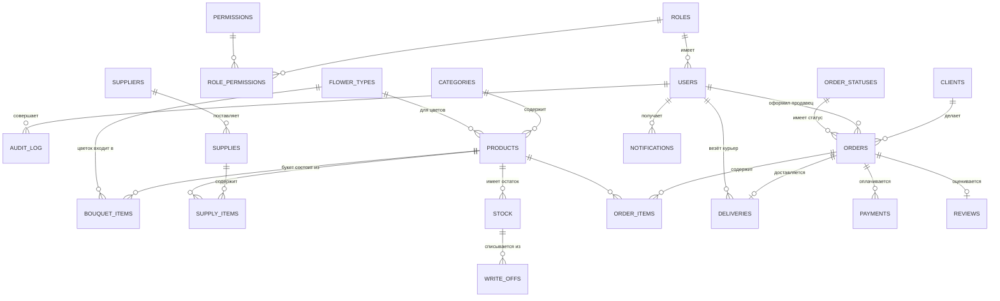

# Шаг 04. Проектирование базы данных

> **Цель шага:** спроектировать таблицы, в которых будут жить все данные магазина, и
> связи между ними. В конце вы получите готовый файл `schema.sql`, который создаёт базу.
> Это **второй справочный файл** (после архитектуры) — к схеме мы возвращаемся постоянно.

---

## 1. Что такое реляционная база данных (для новичка)

Представьте набор таблиц, как в Excel. Каждая таблица — про одну сущность:
таблица «Клиенты», таблица «Заказы», таблица «Товары».

- **Строка (row)** — один объект: один клиент, один заказ.
- **Столбец (column / поле)** — одно свойство: имя, телефон, цена.
- **Первичный ключ (PRIMARY KEY, `id`)** — уникальный номер строки. По нему находят объект.
- **Внешний ключ (FOREIGN KEY)** — поле, которое ссылается на `id` в другой таблице.
  Так таблицы «связываются». Например, в заказе хранится `client_id` — номер клиента.

ТЗ (п. 3.6.1) прямо требует **реляционную СУБД** и **целостность данных встроенными
средствами**. Внешние ключи и ограничения — это и есть «встроенные средства целостности».

> Мы используем **SQLite**: вся база — это один файл `flowershop.db`. Никакого отдельного
> сервера БД ставить не нужно. SQL почти тот же, что в PostgreSQL/MySQL.

---

## 2. Какие сущности нам нужны (выводим из ТЗ)

Перечитываем ТЗ и выписываем существительные — это кандидаты в таблицы:

роли, пользователи, права, категории товаров, виды цветов, товары (цветы и букеты),
состав букета, поставщики, поступления, остатки на складе, клиенты, заказы, позиции
заказа, статусы заказа, доставки, оплаты, списания, уведомления, оценки, логи действий.

Сгруппируем их по модулям из шага `03`.

---

## 3. ER-диаграмма (карта связей)

ER = Entity-Relationship (сущности и связи). Это «схема метро» нашей базы.



Читается так: `ROLES ||--o{ USERS` значит «одна роль — у многих пользователей»
(`||` = один, `o{` = много). Это связь «один-ко-многим», самая частая.

---

## 4. Таблицы по модулям (что хранить)

Ниже — назначение каждой таблицы и ключевые поля. Полный SQL — в разделе 6.

### Модуль «Пользователи и доступ»

- **roles** — справочник ролей: Администратор, Флорист, Продавец, Курьер, Закупщик,
  Клиент, Владелец. Поля: `id`, `code`, `name`.
- **permissions** — справочник прав вида «создавать заказы», «смотреть отчёты». Поля:
  `id`, `code`, `name`.
- **role_permissions** — какие права у какой роли (связь много-ко-многим). Поля:
  `role_id`, `permission_id`.
- **users** — сотрудники и зарегистрированные клиенты. Поля: `id`, `login`,
  `password_hash`, `password_salt`, `full_name`, `role_id`, `is_blocked`, `created_at`.
- **audit_log** — журнал действий (требование ТЗ «просмотр логов»). Поля: `id`,
  `user_id`, `action`, `entity`, `entity_id`, `created_at`.

### Модуль «Каталог и товары»

- **categories** — категории товаров (букеты, горшечные, упаковка…). `id`, `name`.
- **flower_types** — виды цветов (роза, тюльпан…). `id`, `name`, `shelf_life_days`
  (типовой срок годности в днях).
- **products** — товары: и отдельные цветы, и готовые букеты. `id`, `name`, `category_id`,
  `flower_type_id` (NULL для букета), `kind` ('flower'|'bouquet'|'supply'), `base_price`,
  `is_active`.
- **bouquet_items** — состав букета: какие цветы и сколько входят в букет. `id`,
  `bouquet_product_id`, `flower_type_id`, `quantity`.

### Модуль «Склад»

- **suppliers** — поставщики. `id`, `name`, `phone`, `contact`.
- **supplies** — поступления (партии). `id`, `supplier_id`, `received_by` (user),
  `received_at`.
- **supply_items** — позиции поступления: товар, количество, качество, срок годности.
  `id`, `supply_id`, `product_id`, `quantity`, `quality` ('отличное'|'хорошее'|'среднее'),
  `expires_at`, `purchase_price`.
- **stock** — текущие остатки по товару (партии). `id`, `product_id`, `quantity`,
  `quality`, `expires_at`. Уменьшается при продаже/списании, растёт при поступлении.
- **write_offs** — списания (просрочка/брак/использование флористом). `id`, `stock_id`,
  `quantity`, `reason`, `created_by`, `created_at`.

### Модуль «Заказы»

- **order_statuses** — справочник статусов: новый, оплачен, в сборке, готов, в доставке,
  выполнен, отменён, возврат. `id`, `code`, `name`.
- **orders** — заказы. `id`, `client_id` (может быть NULL — продажа без регистрации),
  `seller_id` (продавец, оформивший), `status_id`, `total_price`, `created_at`,
  `delivery_at` (желаемые дата/время), `is_duplicate_checked`.
- **order_items** — позиции заказа. `id`, `order_id`, `product_id`, `quantity`,
  `price_each`.
- **reviews** — оценки заказов. `id`, `order_id`, `rating` (1–5), `comment`, `created_at`.

### Модуль «Доставка»

- **deliveries** — доставки. `id`, `order_id`, `courier_id`, `address`, `phone`,
  `status` ('назначена'|'в пути'|'доставлена'|'не доставлена'), `delivered_at`.

### Модуль «Оплата»

- **payments** — оплаты. `id`, `order_id`, `method` ('наличные'|'карта'|'онлайн'),
  `amount`, `status` ('ожидает'|'оплачен'|'возврат'), `paid_at`.

### Модуль «Уведомления»

- **notifications** — уведомления пользователям. `id`, `user_id`, `type`, `message`,
  `is_read`, `created_at`.

---

## 5. Важные правила целостности (почему БД не даст «налажать»)

Это то, что ТЗ называет «целостность данных встроенными средствами СУБД»:

- **NOT NULL** — поле обязательно (например, у заказа обязан быть статус).
- **FOREIGN KEY** — нельзя создать заказ с несуществующим клиентом.
- **UNIQUE** — логин пользователя уникален, двух одинаковых не будет.
- **CHECK** — рейтинг только 1–5, количество ≥ 0.
- **DEFAULT** — у нового заказа статус по умолчанию «новый».

Благодаря этому даже если программист ошибётся, **база сама не пустит плохие данные**.

---

## 6. Готовая схема `schema.sql`

Создайте файл `db/schema.sql` со следующим содержимым. Запускать его будем в шаге `07`.
Пока — просто разберитесь, как он повторяет таблицы выше.

```sql
-- Включаем поддержку внешних ключей (в SQLite она по умолчанию выключена!)
PRAGMA foreign_keys = ON;

-- ===== Пользователи и доступ =====
CREATE TABLE roles (
    id          INTEGER PRIMARY KEY AUTOINCREMENT,
    code        TEXT NOT NULL UNIQUE,         -- 'admin', 'florist', ...
    name        TEXT NOT NULL                 -- 'Администратор'
);

CREATE TABLE permissions (
    id          INTEGER PRIMARY KEY AUTOINCREMENT,
    code        TEXT NOT NULL UNIQUE,         -- 'order.create'
    name        TEXT NOT NULL
);

CREATE TABLE role_permissions (
    role_id        INTEGER NOT NULL REFERENCES roles(id),
    permission_id  INTEGER NOT NULL REFERENCES permissions(id),
    PRIMARY KEY (role_id, permission_id)
);

CREATE TABLE users (
    id            INTEGER PRIMARY KEY AUTOINCREMENT,
    login         TEXT NOT NULL UNIQUE,
    password_hash TEXT NOT NULL,
    password_salt TEXT NOT NULL,
    full_name     TEXT NOT NULL,
    role_id       INTEGER NOT NULL REFERENCES roles(id),
    is_blocked    INTEGER NOT NULL DEFAULT 0, -- 0/1 = false/true
    created_at    TEXT NOT NULL DEFAULT (datetime('now'))
);

CREATE TABLE audit_log (
    id          INTEGER PRIMARY KEY AUTOINCREMENT,
    user_id     INTEGER REFERENCES users(id),
    action      TEXT NOT NULL,                -- 'login', 'order.create'
    entity      TEXT,                         -- 'order'
    entity_id   INTEGER,
    created_at  TEXT NOT NULL DEFAULT (datetime('now'))
);

-- ===== Каталог и товары =====
CREATE TABLE categories (
    id    INTEGER PRIMARY KEY AUTOINCREMENT,
    name  TEXT NOT NULL UNIQUE
);

CREATE TABLE flower_types (
    id               INTEGER PRIMARY KEY AUTOINCREMENT,
    name             TEXT NOT NULL UNIQUE,
    shelf_life_days  INTEGER NOT NULL DEFAULT 7 CHECK (shelf_life_days > 0)
);

CREATE TABLE products (
    id             INTEGER PRIMARY KEY AUTOINCREMENT,
    name           TEXT NOT NULL,
    category_id    INTEGER REFERENCES categories(id),
    flower_type_id INTEGER REFERENCES flower_types(id), -- NULL для букета/расходника
    kind           TEXT NOT NULL CHECK (kind IN ('flower','bouquet','supply')),
    base_price     REAL NOT NULL CHECK (base_price >= 0),
    is_active      INTEGER NOT NULL DEFAULT 1
);

CREATE TABLE bouquet_items (
    id                 INTEGER PRIMARY KEY AUTOINCREMENT,
    bouquet_product_id INTEGER NOT NULL REFERENCES products(id),
    flower_type_id     INTEGER NOT NULL REFERENCES flower_types(id),
    quantity           INTEGER NOT NULL CHECK (quantity > 0)
);

-- ===== Склад =====
CREATE TABLE suppliers (
    id       INTEGER PRIMARY KEY AUTOINCREMENT,
    name     TEXT NOT NULL,
    phone    TEXT,
    contact  TEXT
);

CREATE TABLE supplies (
    id           INTEGER PRIMARY KEY AUTOINCREMENT,
    supplier_id  INTEGER NOT NULL REFERENCES suppliers(id),
    received_by  INTEGER REFERENCES users(id),
    received_at  TEXT NOT NULL DEFAULT (datetime('now'))
);

CREATE TABLE supply_items (
    id             INTEGER PRIMARY KEY AUTOINCREMENT,
    supply_id      INTEGER NOT NULL REFERENCES supplies(id),
    product_id     INTEGER NOT NULL REFERENCES products(id),
    quantity       INTEGER NOT NULL CHECK (quantity > 0),
    quality        TEXT NOT NULL CHECK (quality IN ('отличное','хорошее','среднее')),
    expires_at     TEXT,                      -- дата срока годности
    purchase_price REAL NOT NULL CHECK (purchase_price >= 0)
);

CREATE TABLE stock (
    id          INTEGER PRIMARY KEY AUTOINCREMENT,
    product_id  INTEGER NOT NULL REFERENCES products(id),
    quantity    INTEGER NOT NULL CHECK (quantity >= 0),
    quality     TEXT NOT NULL CHECK (quality IN ('отличное','хорошее','среднее')),
    expires_at  TEXT
);

CREATE TABLE write_offs (
    id          INTEGER PRIMARY KEY AUTOINCREMENT,
    stock_id    INTEGER NOT NULL REFERENCES stock(id),
    quantity    INTEGER NOT NULL CHECK (quantity > 0),
    reason      TEXT NOT NULL,                -- 'просрочка','брак','использован'
    created_by  INTEGER REFERENCES users(id),
    created_at  TEXT NOT NULL DEFAULT (datetime('now'))
);

-- ===== Заказы =====
CREATE TABLE order_statuses (
    id    INTEGER PRIMARY KEY AUTOINCREMENT,
    code  TEXT NOT NULL UNIQUE,
    name  TEXT NOT NULL
);

CREATE TABLE orders (
    id           INTEGER PRIMARY KEY AUTOINCREMENT,
    client_id    INTEGER REFERENCES users(id),       -- NULL = продажа без регистрации
    seller_id    INTEGER REFERENCES users(id),
    status_id    INTEGER NOT NULL REFERENCES order_statuses(id),
    total_price  REAL NOT NULL DEFAULT 0 CHECK (total_price >= 0),
    delivery_at  TEXT,
    created_at   TEXT NOT NULL DEFAULT (datetime('now'))
);

CREATE TABLE order_items (
    id          INTEGER PRIMARY KEY AUTOINCREMENT,
    order_id    INTEGER NOT NULL REFERENCES orders(id),
    product_id  INTEGER NOT NULL REFERENCES products(id),
    quantity    INTEGER NOT NULL CHECK (quantity > 0),
    price_each  REAL NOT NULL CHECK (price_each >= 0)
);

CREATE TABLE reviews (
    id          INTEGER PRIMARY KEY AUTOINCREMENT,
    order_id    INTEGER NOT NULL UNIQUE REFERENCES orders(id),
    rating      INTEGER NOT NULL CHECK (rating BETWEEN 1 AND 5),
    comment     TEXT,
    created_at  TEXT NOT NULL DEFAULT (datetime('now'))
);

-- ===== Доставка =====
CREATE TABLE deliveries (
    id           INTEGER PRIMARY KEY AUTOINCREMENT,
    order_id     INTEGER NOT NULL UNIQUE REFERENCES orders(id),
    courier_id   INTEGER REFERENCES users(id),
    address      TEXT NOT NULL,
    phone        TEXT,
    status       TEXT NOT NULL DEFAULT 'назначена'
                 CHECK (status IN ('назначена','в пути','доставлена','не доставлена')),
    delivered_at TEXT
);

-- ===== Оплата =====
CREATE TABLE payments (
    id        INTEGER PRIMARY KEY AUTOINCREMENT,
    order_id  INTEGER NOT NULL REFERENCES orders(id),
    method    TEXT NOT NULL CHECK (method IN ('наличные','карта','онлайн')),
    amount    REAL NOT NULL CHECK (amount >= 0),
    status    TEXT NOT NULL DEFAULT 'ожидает'
              CHECK (status IN ('ожидает','оплачен','возврат')),
    paid_at   TEXT
);

-- ===== Уведомления =====
CREATE TABLE notifications (
    id          INTEGER PRIMARY KEY AUTOINCREMENT,
    user_id     INTEGER NOT NULL REFERENCES users(id),
    type        TEXT NOT NULL,
    message     TEXT NOT NULL,
    is_read     INTEGER NOT NULL DEFAULT 0,
    created_at  TEXT NOT NULL DEFAULT (datetime('now'))
);

-- Индексы для скорости частых запросов
CREATE INDEX idx_orders_client ON orders(client_id);
CREATE INDEX idx_orders_status ON orders(status_id);
CREATE INDEX idx_stock_product ON stock(product_id);
CREATE INDEX idx_notif_user    ON notifications(user_id, is_read);
```

---

## 7. Начальные данные (`seed.sql`)

Чтобы система сразу работала, заполним справочники. Создайте `db/seed.sql`:

```sql
INSERT INTO roles (code, name) VALUES
 ('admin','Администратор'), ('florist','Флорист'), ('seller','Продавец'),
 ('courier','Курьер'), ('purchaser','Закупщик'), ('client','Клиент'),
 ('owner','Владелец');

INSERT INTO order_statuses (code, name) VALUES
 ('new','Новый'), ('paid','Оплачен'), ('assembling','В сборке'),
 ('ready','Готов'), ('delivering','В доставке'), ('done','Выполнен'),
 ('cancelled','Отменён'), ('returned','Возврат');

INSERT INTO categories (name) VALUES
 ('Букеты'), ('Срезанные цветы'), ('Упаковка'), ('Открытки');
```

> Права (`permissions`) и их привязку к ролям заполним в шаге `11`, когда разберём RBAC.

---

## 8. Жизненный цикл данных (как меняются остатки)

Чтобы прочувствовать связи, проследите движение количества цветов:

```
Поступление (supplies + supply_items)  →  +N в stock
Оформление заказа (order_items)         →  «резерв», цена считается из stock/products
Сборка букета флористом                 →  -N из stock + запись в write_offs (reason='использован')
Просрочка (expires_at < сегодня)        →  авто -N из stock + write_offs (reason='просрочка')
```

Эту логику в коде реализует `StockService` (шаг `09`). База лишь хранит числа; **правила
изменения чисел — в сервисах**.

---

## Проверь себя

1. Что такое первичный и внешний ключ? Приведите пример из нашей схемы.
2. Почему `client_id` в `orders` может быть NULL?
3. Какое ограничение не даст поставить рейтинг 7?
4. В какой таблице хранится «кто, что и когда сделал» (логи)?
5. Как из схемы видно, что у одного заказа много позиций, а оценка — одна?

---

## Промпт для ИИ-агента

> Я изучаю C++ и проектирую БД для системы цветочного магазина (SQLite). Ниже — документ
> со схемой. Прочитай его и: (1) проверь моё понимание связей — задай 5 вопросов вида
> «какая связь между таблицами X и Y и почему»; (2) объясни на примерах ограничения
> NOT NULL/FOREIGN KEY/CHECK/UNIQUE; (3) если найдёшь в схеме потенциальную проблему —
> укажи, но не переписывай схему, мы её зафиксировали. Документ: [вставьте содержимое].

Дальше → [05-структура-каталогов-и-сборка.md](05-структура-каталогов-и-сборка.md)
