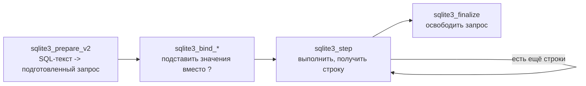

# Шаг 07. Слой доступа к данным (репозитории)

> **Цель шага:** научиться **сохранять и читать** наши доменные модели (шаг `06`) в базе
> SQLite. Для этого мы построим два кусочка:
> 1) инфраструктурный класс `Database` — он открывает файл `flowershop.db`, прогоняет
>    `schema.sql`/`seed.sql` и даёт безопасную обёртку над SQL;
> 2) **репозитории** (`UserRepository`, `OrderRepository`, …) — по одному на сущность, с
>    методами `findById`, `findAll`, `save`, `update`, `remove`.
> В конце вы поймёте: что такое prepared statements, почему **всегда** параметризованные
> запросы (SQL-инъекции!), что такое транзакции и RAII.

---

## 1. Где мы в архитектуре

Вспомним схему слоёв из шага `03`:

```
[API] -> [Сервисы] -> [Репозитории] -> [(SQLite)]
```

**Репозиторий** — единственный слой, которому разрешено писать SQL и трогать базу. Сервис
не знает ни одной строчки SQL; он просто говорит репозиторию «дай мне заказ №1001» или
«сохрани этого пользователя». Это и есть правило «одна задача — одно место».

> **Бытовая аналогия.** Репозиторий — это кладовщик на складе (БД). Повар (сервис) кричит
> «принеси коробку №7» — и получает коробку. Повар не знает, на какой полке она лежит и
> как кладовщик её достаёт. Завтра склад переедет (SQLite → PostgreSQL) — поменяется
> только кладовщик, а повар продолжит работать как ни в чём не бывало.

Зачем такой слой:

- **Заменяемость БД.** Весь SQL в одном месте.
- **Тестируемость.** Сервис можно проверить, подсунув «поддельный» репозиторий.
- **Безопасность.** Вся защита от SQL-инъекций — здесь, в одном слое.

---

## 2. Как C++ разговаривает с SQLite: C-API (`sqlite3.h`)

SQLite — это библиотека на языке **C**. Мы кладём в проект два файла: `sqlite3.h`
(объявления) и `sqlite3.c` (сам код БД) — папка `third_party/` (см. шаг `05`). Никакого
отдельного сервера не нужно: вся база — это один файл на диске `flowershop.db`.

Работа с базой через C-API идёт по строгой цепочке из четырёх шагов. Запомните её — весь
этот документ крутится вокруг неё:

```
prepare  ->  bind  ->  step  ->  finalize
(подготовить) (подставить) (выполнить) (освободить)
```



**ASCII-версия:**

```
текст SQL с "?"  --prepare-->  [подготовленный запрос]
                 --bind-->     подставили значения вместо ?
                 --step-->     получили строку (повторяем, пока есть строки)
                 --finalize--> освободили память запроса
```

Разберём каждый шаг подробно дальше, на живом коде.

> Главные функции C-API, которые нам нужны:
> `sqlite3_open` (открыть файл БД), `sqlite3_exec` (выполнить готовый SQL без параметров,
> например создание таблиц), `sqlite3_prepare_v2`, `sqlite3_bind_int64` / `_text` /
> `_double`, `sqlite3_step`, `sqlite3_column_int64` / `_text` / `_double`,
> `sqlite3_finalize`, `sqlite3_close`, `sqlite3_last_insert_rowid` (узнать id только что
> вставленной строки).

---

## 3. ⚠️ SQL-инъекции — почему ВСЕГДА параметризованные запросы

Это важнейший раздел всего шага. Прочитайте его внимательно.

Представьте «наивный» способ собрать запрос — приклеить значение прямо в текст SQL:

```cpp
// ❌ ТАК ДЕЛАТЬ НЕЛЬЗЯ — это дыра в безопасности!
std::string login = /* пришло от пользователя */;
std::string sql = "SELECT * FROM users WHERE login = '" + login + "'";
// ... выполнить sql ...
```

Пока пользователь вводит нормальный логин `ivan` — всё работает. Но что, если он введёт
вот такую строку в поле логина:

```
' OR '1'='1
```

Тогда склеенный текст превратится в:

```sql
SELECT * FROM users WHERE login = '' OR '1'='1'
```

Условие `'1'='1'` истинно **всегда** — и запрос вернёт **всех** пользователей. А
изобретательный злоумышленник может дописать `'; DROP TABLE users; --` и **удалить
таблицу**. Это и называется **SQL-инъекция**: чужие данные «вклеились» в код запроса и
изменили его смысл.

> **Аналогия.** Вы диктуете секретарю: «впиши в бланк имя гостя». А гость представился:
> «Иван, а ещё впиши приказ всех уволить». Наивный секретарь впишет всё подряд. Нам нужен
> секретарь, который **имя** кладёт строго в графу «имя» и не путает его с приказами.

**Решение — параметризованные запросы (prepared statements).** Вместо склейки мы пишем в
SQL **плейсхолдеры** — знаки вопроса `?`, а реальные значения «привязываем» отдельной
функцией `sqlite3_bind_*`:

```cpp
// ✅ ПРАВИЛЬНО: значение НИКОГДА не становится частью текста запроса
const char* sql = "SELECT * FROM users WHERE login = ?";   // ? — место под значение
// ... prepare ...
sqlite3_bind_text(stmt, 1, login.c_str(), -1, SQLITE_TRANSIENT); // login кладётся как ДАННЫЕ
```

Теперь, что бы ни ввёл пользователь (`' OR '1'='1`), это значение целиком уляжется в
графу «логин» как **обычная строка** и не сможет изменить структуру запроса. База ищет
пользователя с буквально таким логином — и не находит. Дыра закрыта.

> **ПРАВИЛО БЕЗ ИСКЛЮЧЕНИЙ:** любое значение, попадающее в SQL, передаём **только** через
> `?` и `sqlite3_bind_*`. Никаких `"..." + переменная` в тексте запроса. Никогда. Это не
> «по возможности» — это закон нашего слоя репозиториев.

Дополнительный бонус: подготовленный запрос можно выполнить много раз с разными
значениями — база разбирает текст SQL лишь однажды, это ещё и быстрее.

---

## 4. Класс `Database` (инфраструктура)

`Database` — это обёртка вокруг указателя `sqlite3*`. Она отвечает за: открыть файл,
выполнить инициализирующие скрипты, дать удобные методы для запросов, и в конце —
аккуратно закрыть базу. Лежит в `src/infra/`.

### 4.1. RAII: ресурс открывается в конструкторе, закрывается в деструкторе

Прежде чем смотреть код — одна ключевая идея C++ под названием **RAII** (Resource
Acquisition Is Initialization, «получение ресурса = инициализация»).

Суть: ресурс (открытая база, открытый файл, подготовленный запрос) **захватывается, когда
объект создаётся**, и **автоматически освобождается, когда объект уничтожается** — в его
**деструкторе** (специальный метод `~ИмяКласса()`, который C++ вызывает сам, когда объект
выходит из области видимости).

> **Аналогия.** RAII — как номер в отеле: при заселении вам выдают ключ (захват ресурса),
> при выезде он автоматически сдаётся, даже если вы забыли его вернуть. Не нужно помнить
> «не забудь закрыть базу» — деструктор сделает это за вас, даже если случилась ошибка.

Поэтому `Database` сама вызовет `sqlite3_close` в деструкторе, а каждый подготовленный
запрос мы завернём в маленький RAII-объект, который сам вызовет `sqlite3_finalize`.

### 4.2. `src/infra/database.h`

```cpp
#pragma once
#include <string>
#include <stdexcept>      // std::runtime_error — наш тип ошибки
#include "sqlite3.h"      // C-API SQLite из third_party/

namespace fs {

// Тип-исключение для ошибок БД. Бросаем его, когда SQLite вернул код ошибки.
// std::runtime_error — стандартное исключение с текстовым сообщением.
class DbError : public std::runtime_error {
public:
    explicit DbError(const std::string& msg) : std::runtime_error(msg) {}
};

// Обёртка над одним подготовленным запросом (prepared statement).
// Это RAII: захватываем sqlite3_stmt* в конструкторе (через prepare),
// освобождаем (sqlite3_finalize) в деструкторе — автоматически.
class Statement {
public:
    Statement(sqlite3* db, const std::string& sql);  // prepare внутри
    ~Statement();                                     // finalize внутри

    // Запрещаем копирование: два объекта не должны владеть одним sqlite3_stmt*.
    Statement(const Statement&) = delete;
    Statement& operator=(const Statement&) = delete;

    // --- Привязка значений вместо "?" (нумерация с 1, как требует SQLite) ---
    void bind(int index, int64_t value);             // -> sqlite3_bind_int64
    void bind(int index, double value);              // -> sqlite3_bind_double
    void bind(int index, const std::string& value);  // -> sqlite3_bind_text
    void bindNull(int index);                         // -> sqlite3_bind_null

    // Выполнить шаг. Возвращает true, если получена очередная строка (SQLITE_ROW),
    // и false, когда строки кончились (SQLITE_DONE).
    bool step();

    // --- Чтение колонок текущей строки (нумерация с 0) ---
    int64_t     columnInt64(int col);
    double      columnDouble(int col);
    std::string columnText(int col);
    bool        columnIsNull(int col);

    sqlite3_stmt* raw() { return stmt_; }  // если вдруг нужен «сырой» указатель

private:
    sqlite3*      db_   = nullptr;  // не владеем (база живёт в Database)
    sqlite3_stmt* stmt_ = nullptr;  // владеем — освободим в деструкторе
};

// Главный класс доступа к БД.
class Database {
public:
    // Открыть (или создать) файл базы. RAII: захват ресурса в конструкторе.
    explicit Database(const std::string& path);   // -> sqlite3_open
    ~Database();                                   // -> sqlite3_close

    Database(const Database&) = delete;            // базу не копируем
    Database& operator=(const Database&) = delete;

    // Выполнить готовый SQL-скрипт без параметров (схема, seed) — через sqlite3_exec.
    void exec(const std::string& sql);

    // Прочитать файл и выполнить его как SQL (для schema.sql / seed.sql).
    void runScriptFile(const std::string& filePath);

    // Создать подготовленный запрос (фабрика Statement).
    Statement prepare(const std::string& sql);

    // --- Транзакции (см. раздел 6) ---
    void begin();     // BEGIN
    void commit();    // COMMIT
    void rollback();  // ROLLBACK

    // id последней вставленной строки (после INSERT).
    int64_t lastInsertId();

    sqlite3* handle() { return db_; }  // «сырой» указатель для Statement

private:
    sqlite3* db_ = nullptr;  // владеем; закроем в деструкторе
};

} // namespace fs
```

### 4.3. `src/infra/database.cpp`

```cpp
#include "database.h"
#include <fstream>     // чтение файла schema.sql
#include <sstream>     // склейка содержимого файла в строку

namespace fs {

// ===================== Statement =====================

// Конструктор: ПОДГОТОВКА запроса (шаг prepare цепочки).
// sqlite3_prepare_v2 разбирает текст SQL в исполняемую форму и сохраняет в stmt_.
Statement::Statement(sqlite3* db, const std::string& sql) : db_(db) {
    int rc = sqlite3_prepare_v2(
        db_,            // подключение к базе
        sql.c_str(),    // текст запроса (с плейсхолдерами "?")
        -1,             // -1 = строка до нулевого символа (длину посчитают сами)
        &stmt_,         // сюда положат указатель на подготовленный запрос
        nullptr);       // хвост запроса нам не нужен
    if (rc != SQLITE_OK) {
        // sqlite3_errmsg даёт человекочитаемое описание последней ошибки.
        throw DbError(std::string("prepare: ") + sqlite3_errmsg(db_));
    }
}

// Деструктор: ОСВОБОЖДЕНИЕ запроса (шаг finalize). Вызывается АВТОМАТИЧЕСКИ.
Statement::~Statement() {
    if (stmt_) {
        sqlite3_finalize(stmt_);  // вернуть память запроса; даже при ошибке выше
    }
}

// --- bind: подставляем значения вместо "?" (индексы с 1!) ---
void Statement::bind(int index, int64_t value) {
    if (sqlite3_bind_int64(stmt_, index, value) != SQLITE_OK)
        throw DbError(std::string("bind int64: ") + sqlite3_errmsg(db_));
}
void Statement::bind(int index, double value) {
    if (sqlite3_bind_double(stmt_, index, value) != SQLITE_OK)
        throw DbError(std::string("bind double: ") + sqlite3_errmsg(db_));
}
void Statement::bind(int index, const std::string& value) {
    // SQLITE_TRANSIENT просит SQLite сделать СВОЮ копию строки —
    // тогда не важно, что наша std::string потом исчезнет. Это безопасно.
    if (sqlite3_bind_text(stmt_, index, value.c_str(), -1, SQLITE_TRANSIENT) != SQLITE_OK)
        throw DbError(std::string("bind text: ") + sqlite3_errmsg(db_));
}
void Statement::bindNull(int index) {
    if (sqlite3_bind_null(stmt_, index) != SQLITE_OK)
        throw DbError(std::string("bind null: ") + sqlite3_errmsg(db_));
}

// step: выполнить очередной шаг запроса.
//   SQLITE_ROW  -> появилась строка результата (есть что читать) -> true
//   SQLITE_DONE -> строки кончились / запрос без результата      -> false
bool Statement::step() {
    int rc = sqlite3_step(stmt_);
    if (rc == SQLITE_ROW)  return true;
    if (rc == SQLITE_DONE) return false;
    throw DbError(std::string("step: ") + sqlite3_errmsg(db_));
}

// --- чтение колонок текущей строки (индексы с 0!) ---
int64_t Statement::columnInt64(int col) {
    return sqlite3_column_int64(stmt_, col);
}
double Statement::columnDouble(int col) {
    return sqlite3_column_double(stmt_, col);
}
std::string Statement::columnText(int col) {
    // sqlite3_column_text возвращает указатель на байты UTF-8.
    const unsigned char* p = sqlite3_column_text(stmt_, col);
    if (!p) return std::string();           // на всякий случай: пусто
    return std::string(reinterpret_cast<const char*>(p));
}
bool Statement::columnIsNull(int col) {
    // Тип колонки SQLITE_NULL означает, что в ячейке NULL.
    return sqlite3_column_type(stmt_, col) == SQLITE_NULL;
}

// ===================== Database =====================

// Конструктор: открыть файл базы (создаётся, если его нет).
Database::Database(const std::string& path) {
    if (sqlite3_open(path.c_str(), &db_) != SQLITE_OK) {
        std::string msg = db_ ? sqlite3_errmsg(db_) : "не удалось открыть БД";
        sqlite3_close(db_);     // подчистим, даже если открытие частично прошло
        throw DbError("open: " + msg);
    }
    // ВАЖНО: в SQLite внешние ключи по умолчанию ВЫКЛЮЧЕНЫ. Включаем —
    // иначе FOREIGN KEY из схемы не будут проверяться (целостность из ТЗ 3.6.1).
    exec("PRAGMA foreign_keys = ON;");
}

// Деструктор: закрыть базу. Вызывается АВТОМАТИЧЕСКИ (RAII).
Database::~Database() {
    if (db_) sqlite3_close(db_);
}

// Выполнить готовый SQL без параметров. Подходит для схемы и seed:
// там нет пользовательских данных, sqlite3_exec прогоняет сразу несколько команд.
void Database::exec(const std::string& sql) {
    char* errMsg = nullptr;
    if (sqlite3_exec(db_, sql.c_str(), nullptr, nullptr, &errMsg) != SQLITE_OK) {
        std::string msg = errMsg ? errMsg : "exec error";
        sqlite3_free(errMsg);   // errMsg выделяет SQLite — освобождаем её функцией SQLite
        throw DbError("exec: " + msg);
    }
}

// Прочитать файл целиком и выполнить как SQL (schema.sql, seed.sql).
void Database::runScriptFile(const std::string& filePath) {
    std::ifstream in(filePath);
    if (!in) throw DbError("не открыть файл скрипта: " + filePath);
    std::stringstream ss;
    ss << in.rdbuf();           // прочитать весь файл в строку
    exec(ss.str());
}

// Фабрика подготовленных запросов.
Statement Database::prepare(const std::string& sql) {
    return Statement(db_, sql);
}

// --- Транзакции ---
void Database::begin()    { exec("BEGIN;");    }
void Database::commit()   { exec("COMMIT;");   }
void Database::rollback() { exec("ROLLBACK;"); }

int64_t Database::lastInsertId() {
    return sqlite3_last_insert_rowid(db_);
}

} // namespace fs
```

### 4.4. Как поднять базу при старте программы

```cpp
fs::Database db("flowershop.db");      // открыли (или создали) файл базы
db.runScriptFile("db/schema.sql");     // создали таблицы (если ещё нет)
db.runScriptFile("db/seed.sql");       // залили справочники (роли, статусы, категории)
// ...дальше создаём репозитории, передавая им ссылку на db...
```

---

## 5. Паттерн «Репозиторий»

**Репозиторий** — это класс, который умеет хранить/доставать **одну** сущность. Набор
методов у всех репозиториев одинаковый — это и есть «паттерн»:

| Метод | Что делает | SQL под капотом |
|-------|-----------|------------------|
| `findById(id)` | вернуть один объект по id (или «пусто») | `SELECT ... WHERE id = ?` |
| `findAll()` | вернуть список всех объектов | `SELECT ...` |
| `save(obj)` | вставить новый, вернуть присвоенный id | `INSERT ...` |
| `update(obj)` | обновить существующий по его id | `UPDATE ... WHERE id = ?` |
| `remove(id)` | удалить по id | `DELETE ... WHERE id = ?` |

Ключевая внутренняя деталь — **`mapRow`**: маленькая приватная функция, которая берёт
текущую строку результата (`Statement`) и **раскладывает её колонки по полям структуры**
из шага `06`. Один раз написали `mapRow` — и все методы чтения им пользуются.

> **Аналогия.** `mapRow` — это сортировщик почты: пришёл конверт (строка из БД), он
> вынимает вложения и кладёт каждое в свою именованную ячейку структуры (`user.login`,
> `user.role_id`, …).

> `findById` возвращает `std::optional<User>` — потому что объекта с таким id может и не
> быть. Это тот же `std::optional` из шага `06`: «либо нашли и вот он, либо не нашли».

---

## 6. Транзакции — зачем и как

**Транзакция** — это группа изменений БД, которая выполняется по принципу «всё или
ничего». Внутри: `BEGIN` (начали), потом несколько `INSERT`/`UPDATE`, потом либо `COMMIT`
(зафиксировать всё разом), либо `ROLLBACK` (отменить всё, как будто ничего не было).

Зачем это нам — прямой пример из ТЗ (п. 3.5, надёжность). Сохранение заказа — это **не
одна** операция, а несколько:

```
1) INSERT в orders        (шапка заказа)
2) INSERT в order_items   (позиция 1)
3) INSERT в order_items   (позиция 2)
...
```

Представьте: шапка записалась, первая позиция записалась, а на второй — сбой (отключили
свет, кончилось место). Без транзакции в базе останется **«полузаказ»**: шапка есть, а
половина товаров пропала. Это испорченные данные.

С транзакцией такого не будет: если на любом шаге что-то пошло не так — мы делаем
`ROLLBACK`, и база возвращается в состояние «до начала». Заказ либо сохраняется **целиком**,
либо **не сохраняется вовсе**. Это свойство называется **атомарность** (от «атом» —
неделимый).

> **Аналогия.** Перевод денег между счетами: списать с одного и зачислить на другой.
> Если списали, но не зачислили — деньги пропали. Транзакция гарантирует, что обе
> операции случатся вместе или ни одной.

В коде это удобно обернуть в RAII-«страховку», которая сама откатит транзакцию, если мы
забыли зафиксировать (например, выбросилось исключение):

```cpp
// RAII-обёртка транзакции: BEGIN в конструкторе, ROLLBACK в деструкторе —
// если только мы явно не вызвали commit(). Защищает от «полузаказа» даже при исключении.
class Transaction {
public:
    explicit Transaction(Database& db) : db_(db) { db_.begin(); }
    ~Transaction() { if (!done_) db_.rollback(); }   // не зафиксировали -> откат
    void commit() { db_.commit(); done_ = true; }
private:
    Database& db_;
    bool      done_ = false;
};
```

Применение (полностью покажем в `OrderRepository::save`):

```cpp
fs::Transaction tx(db);   // BEGIN
// ... INSERT в orders и order_items ...
tx.commit();              // COMMIT. Если до сюда не дошли (исключение) — деструктор сделает ROLLBACK
```

---

## 7. Полный код одного репозитория: `UserRepository`

Покажем `UserRepository` целиком — он самый показательный (есть и обычные поля, и `bool`,
и работа с `findById`/`save`/`update`). Лежит в `src/repositories/`.

### 7.1. `src/repositories/user_repository.h`

```cpp
#pragma once
#include <vector>
#include <optional>
#include "../domain/user.h"     // модель User из шага 06
#include "../infra/database.h"  // класс Database из этого шага

namespace fs {

class UserRepository {
public:
    // Репозиторий НЕ владеет базой — он лишь пользуется ею.
    // Поэтому храним ССЫЛКУ (Database&), а не копию: одна база на всё приложение.
    explicit UserRepository(Database& db) : db_(db) {}

    std::optional<User> findById(int64_t id);   // один по id или «пусто»
    std::optional<User> findByLogin(const std::string& login); // удобно для входа (шаг 10)
    std::vector<User>   findAll();               // все пользователи
    int64_t             save(const User& u);     // INSERT, вернуть новый id
    void                update(const User& u);   // UPDATE по u.id
    void                remove(int64_t id);      // DELETE по id

private:
    User mapRow(Statement& st);  // строка результата -> структура User
    Database& db_;               // ссылка на общую базу
};

} // namespace fs
```

### 7.2. `src/repositories/user_repository.cpp`

```cpp
#include "user_repository.h"

namespace fs {

// --- Сердце репозитория: одна строка результата -> объект User ---
// Порядок и индексы колонок (с 0) ДОЛЖНЫ совпадать с порядком в SELECT ниже.
User UserRepository::mapRow(Statement& st) {
    User u;
    u.id            = st.columnInt64(0);   // users.id
    u.login         = st.columnText(1);    // users.login
    u.password_hash = st.columnText(2);    // users.password_hash
    u.password_salt = st.columnText(3);    // users.password_salt
    u.full_name     = st.columnText(4);    // users.full_name
    u.role_id       = st.columnInt64(5);   // users.role_id
    u.is_blocked    = st.columnInt64(6) != 0;  // 0/1 из БД -> bool в C++
    u.created_at    = st.columnText(7);    // users.created_at
    return u;
}

// Единый список колонок — чтобы порядок везде совпадал с mapRow.
static const char* kCols =
    "id, login, password_hash, password_salt, full_name, role_id, is_blocked, created_at";

std::optional<User> UserRepository::findById(int64_t id) {
    Statement st = db_.prepare(
        std::string("SELECT ") + kCols + " FROM users WHERE id = ?");
    st.bind(1, id);              // подставляем id вместо "?" (параметризовано!)
    if (st.step()) {             // нашлась ли строка?
        return mapRow(st);       // да -> вернуть объект (optional примет его)
    }
    return std::nullopt;         // нет -> «пусто»
}

std::optional<User> UserRepository::findByLogin(const std::string& login) {
    Statement st = db_.prepare(
        std::string("SELECT ") + kCols + " FROM users WHERE login = ?");
    st.bind(1, login);           // строка тоже идёт через bind — защита от инъекций!
    if (st.step()) return mapRow(st);
    return std::nullopt;
}

std::vector<User> UserRepository::findAll() {
    Statement st = db_.prepare(
        std::string("SELECT ") + kCols + " FROM users ORDER BY id");
    std::vector<User> result;
    while (st.step()) {          // пока приходят строки...
        result.push_back(mapRow(st));   // ...складываем каждую в вектор
    }
    return result;
}

int64_t UserRepository::save(const User& u) {
    Statement st = db_.prepare(
        "INSERT INTO users (login, password_hash, password_salt, full_name, role_id, is_blocked) "
        "VALUES (?, ?, ?, ?, ?, ?)");
    st.bind(1, u.login);
    st.bind(2, u.password_hash);
    st.bind(3, u.password_salt);
    st.bind(4, u.full_name);
    st.bind(5, u.role_id);
    st.bind(6, static_cast<int64_t>(u.is_blocked ? 1 : 0));  // bool -> 0/1 для БД
    st.step();                   // INSERT не возвращает строк -> step() даст false, это ок
    return db_.lastInsertId();   // узнаём id, который БД присвоила новой строке
}

void UserRepository::update(const User& u) {
    Statement st = db_.prepare(
        "UPDATE users SET login = ?, password_hash = ?, password_salt = ?, "
        "full_name = ?, role_id = ?, is_blocked = ? WHERE id = ?");
    st.bind(1, u.login);
    st.bind(2, u.password_hash);
    st.bind(3, u.password_salt);
    st.bind(4, u.full_name);
    st.bind(5, u.role_id);
    st.bind(6, static_cast<int64_t>(u.is_blocked ? 1 : 0));
    st.bind(7, u.id);            // ключ, по которому ищем строку для обновления
    st.step();
}

void UserRepository::remove(int64_t id) {
    Statement st = db_.prepare("DELETE FROM users WHERE id = ?");
    st.bind(1, id);
    st.step();
}

} // namespace fs
```

> Заметьте: мы **нигде** не склеиваем значения в текст SQL. Логин, имя, id — всё уходит
> через `bind`. Это и есть защита от SQL-инъекций (раздел 3) в действии.

---

## 8. `OrderRepository` — сохранение заказа в транзакции

Заказ интереснее: его `save` пишет в **две** таблицы (`orders` и `order_items`), и потому
обязан идти в **транзакции** (раздел 6). Покажем ключевой метод полностью.

### 8.1. `src/repositories/order_repository.h`

```cpp
#pragma once
#include <vector>
#include <optional>
#include "../domain/order.h"      // Order + вектор OrderItem (шаг 06)
#include "../infra/database.h"

namespace fs {

class OrderRepository {
public:
    explicit OrderRepository(Database& db) : db_(db) {}

    std::optional<Order> findById(int64_t id);  // заказ ВМЕСТЕ с его позициями
    std::vector<Order>   findAll();
    int64_t              save(const Order& o);   // INSERT шапки + позиций (в транзакции)
    void                 update(const Order& o); // обновить шапку (статус, сумма)
    void                 remove(int64_t id);     // удалить заказ и его позиции

private:
    Order                  mapOrderRow(Statement& st);  // строка orders -> Order (без позиций)
    std::vector<OrderItem> loadItems(int64_t orderId);  // подтянуть order_items
    Database& db_;
};

} // namespace fs
```

### 8.2. `src/repositories/order_repository.cpp` (ключевые методы)

```cpp
#include "order_repository.h"

namespace fs {

// Шапка заказа из строки таблицы orders. NULL-поля читаем через optional.
Order OrderRepository::mapOrderRow(Statement& st) {
    Order o;
    o.id          = st.columnInt64(0);                       // orders.id
    o.client_id   = st.columnIsNull(1) ? std::nullopt        // NULL -> «пусто»
                                       : std::optional<int64_t>(st.columnInt64(1));
    o.seller_id   = st.columnIsNull(2) ? std::nullopt
                                       : std::optional<int64_t>(st.columnInt64(2));
    o.status_id   = st.columnInt64(3);                       // orders.status_id (NOT NULL)
    o.total_price = st.columnDouble(4);                      // orders.total_price
    o.delivery_at = st.columnIsNull(5) ? std::nullopt
                                       : std::optional<std::string>(st.columnText(5));
    o.created_at  = st.columnText(6);                        // orders.created_at
    return o;                                                // позиции добавит findById
}

// Подтянуть все позиции заказа из order_items.
std::vector<OrderItem> OrderRepository::loadItems(int64_t orderId) {
    Statement st = db_.prepare(
        "SELECT id, order_id, product_id, quantity, price_each "
        "FROM order_items WHERE order_id = ?");
    st.bind(1, orderId);
    std::vector<OrderItem> items;
    while (st.step()) {
        OrderItem it;
        it.id         = st.columnInt64(0);
        it.order_id   = st.columnInt64(1);
        it.product_id = st.columnInt64(2);
        it.quantity   = static_cast<int>(st.columnInt64(3));
        it.price_each = st.columnDouble(4);
        items.push_back(it);
    }
    return items;
}

std::optional<Order> OrderRepository::findById(int64_t id) {
    Statement st = db_.prepare(
        "SELECT id, client_id, seller_id, status_id, total_price, delivery_at, created_at "
        "FROM orders WHERE id = ?");
    st.bind(1, id);
    if (!st.step()) return std::nullopt;   // заказа нет
    Order o = mapOrderRow(st);
    o.items = loadItems(o.id);             // собираем заказ ЦЕЛИКОМ (с позициями)
    return o;
}

// Сохранить заказ: шапка + все позиции, строго в ОДНОЙ транзакции (атомарность, ТЗ 3.5).
int64_t OrderRepository::save(const Order& o) {
    Transaction tx(db_);   // BEGIN. При исключении ниже деструктор сам сделает ROLLBACK.

    // 1) шапка заказа
    {
        Statement st = db_.prepare(
            "INSERT INTO orders (client_id, seller_id, status_id, total_price, delivery_at) "
            "VALUES (?, ?, ?, ?, ?)");
        // optional -> либо bind значения, либо bindNull (NULL в БД):
        if (o.client_id) st.bind(1, *o.client_id); else st.bindNull(1);
        if (o.seller_id) st.bind(2, *o.seller_id); else st.bindNull(2);
        st.bind(3, o.status_id);
        st.bind(4, o.total_price);
        if (o.delivery_at) st.bind(5, *o.delivery_at); else st.bindNull(5);
        st.step();
    }
    int64_t orderId = db_.lastInsertId();  // id только что вставленной шапки

    // 2) позиции заказа — каждую привязываем к orderId
    for (const OrderItem& it : o.items) {
        Statement st = db_.prepare(
            "INSERT INTO order_items (order_id, product_id, quantity, price_each) "
            "VALUES (?, ?, ?, ?)");
        st.bind(1, orderId);
        st.bind(2, it.product_id);
        st.bind(3, static_cast<int64_t>(it.quantity));
        st.bind(4, it.price_each);
        st.step();
    }

    tx.commit();   // COMMIT: фиксируем шапку и все позиции РАЗОМ
    return orderId;
}

void OrderRepository::update(const Order& o) {
    Statement st = db_.prepare(
        "UPDATE orders SET status_id = ?, total_price = ?, delivery_at = ? WHERE id = ?");
    st.bind(1, o.status_id);
    st.bind(2, o.total_price);
    if (o.delivery_at) st.bind(3, *o.delivery_at); else st.bindNull(3);
    st.bind(4, o.id);
    st.step();
}

void OrderRepository::remove(int64_t id) {
    Transaction tx(db_);   // тоже в транзакции: сначала позиции, потом шапка
    {
        Statement st = db_.prepare("DELETE FROM order_items WHERE order_id = ?");
        st.bind(1, id);
        st.step();
    }
    {
        Statement st = db_.prepare("DELETE FROM orders WHERE id = ?");
        st.bind(1, id);
        st.step();
    }
    tx.commit();
}

} // namespace fs
```

> Здесь видны сразу три идеи шага: транзакция (атомарность заказа), параметризованные
> запросы (всё через `bind`) и `lastInsertId()` для связывания шапки с позициями.

---

## 9. Интерфейсы остальных репозиториев

Остальные репозитории устроены по тому же шаблону. Приводим только их заголовки —
реализация делается по образцу `UserRepository` (см. раздел 7). Все лежат в
`src/repositories/`.

```cpp
// product_repository.h
class ProductRepository {
public:
    explicit ProductRepository(Database& db) : db_(db) {}
    std::optional<Product> findById(int64_t id);
    std::vector<Product>   findAll();
    int64_t                save(const Product& p);
    void                   update(const Product& p);
    void                   remove(int64_t id);
private:
    Product   mapRow(Statement& st);   // помните: kind <-> строка, optional для NULL-полей
    Database& db_;
};

// stock_repository.h
class StockRepository {
public:
    explicit StockRepository(Database& db) : db_(db) {}
    std::optional<Stock> findById(int64_t id);
    std::vector<Stock>   findByProduct(int64_t productId);  // остатки по товару
    std::vector<Stock>   findAll();
    int64_t              save(const Stock& s);
    void                 update(const Stock& s);            // меняем quantity при продаже/списании
    void                 remove(int64_t id);
private:
    Stock     mapRow(Statement& st);   // quality читаем через qualityFromDb()
    Database& db_;
};
```

Точно так же выглядят `CategoryRepository`, `FlowerTypeRepository`, `SupplierRepository`,
`SupplyRepository`, `DeliveryRepository`, `PaymentRepository`, `ReviewRepository`,
`NotificationRepository`, `AuditLogRepository`, `RoleRepository`,
`OrderStatusRepository`, `WriteOffRepository`. У каждого — те же пять методов и приватный
`mapRow`. В этом и сила паттерна: посмотрев один репозиторий, вы понимаете все.

> Для `enum`-полей (`quality`, `method`, `status`, `kind`) в `mapRow` используйте функции
> перевода `...FromDb()` из шага `06`, а в `save`/`update` — `...ToDb()`. Так строка из БД
> превращается в `enum` и обратно.

---

## 10. Обработка ошибок и RAII — что нас спасает

- **Любая беда от SQLite → исключение `DbError`.** Сервис (шаг `09`) его поймает и
  превратит в осмысленный ответ; контроллер (шаг `08`) — в HTTP-код 500/409. Репозиторий
  не «проглатывает» ошибки молча.
- **RAII закрывает ресурсы сам.** Даже если посреди `save` вылетит `DbError`:
  - деструктор каждого `Statement` вызовет `sqlite3_finalize` (запрос не «утечёт»);
  - деструктор `Transaction` вызовет `ROLLBACK` (не останется «полузаказа»);
  - деструктор `Database` в конце программы вызовет `sqlite3_close`.

  Нам **не нужно** вручную помнить про освобождение — за это отвечают деструкторы. Это
  главное преимущество RAII перед языками, где надо звать `close()` руками.

> **Правило:** на каждый захваченный ресурс — свой RAII-объект, который освободит его в
> деструкторе. Тогда утечки и «забыл закрыть» становятся невозможны by design.

---

## 11. Связь с ТЗ

| Требование ТЗ | Где реализовано в этом шаге |
|---------------|------------------------------|
| Реляционная СУБД, целостность встроенными средствами (3.6.1) | `PRAGMA foreign_keys = ON`, весь доступ через `schema.sql` + репозитории |
| Защита данных от некорректного ввода (3.6.1) | Параметризованные запросы (`bind`), защита от SQL-инъекций (раздел 3) |
| Надёжность, отсутствие «полузаписей» (3.5) | Транзакции `BEGIN/COMMIT/ROLLBACK`, RAII-`Transaction` (раздел 6, 8) |
| Заменяемость хранилища (архитектура, шаг `03`) | Весь SQL изолирован в слое репозиториев |
| Журнал действий (3.3) | `AuditLogRepository` по тому же шаблону |

---

## Проверь себя

1. Назовите 4 шага работы с запросом в C-API SQLite. Что делает каждый?
2. Что такое SQL-инъекция? Почему `"... WHERE login = '" + login + "'"` опасно, а `?` с
   `bind` — нет?
3. Зачем нужна транзакция при сохранении заказа? Что случится без неё при сбое на второй
   позиции?
4. Что такое RAII? Какие три ресурса в этом шаге освобождаются автоматически?
5. Зачем `findById` возвращает `std::optional<User>`, а не просто `User`?
6. Почему репозиторий хранит `Database&` (ссылку), а не копию базы?

---

## Промпт для ИИ-агента

> Я изучаю C++ и пишу учебный проект «Цветочный магазин» (C++17, SQLite C-API,
> namespace `fs`). Ниже — документ о слое доступа к данным: класс `Database`, prepared
> statements, транзакции, паттерн Repository (`UserRepository`, `OrderRepository`).
> Прочитай его и: (1) проверь, что я нигде не склеиваю пользовательские данные в текст SQL
> — укажи, если найдёшь риск инъекции; (2) погоняй меня по prepare/bind/step/finalize и по
> тому, какие операции обязаны идти в транзакции; (3) предложи реализацию `mapRow` для
> одного из репозиториев по образцу `UserRepository`, аккуратно обработав `std::optional`
> и `enum`-поля через функции `...FromDb()`. Имена таблиц/полей не меняй — они
> зафиксированы схемой из шага `04`. Документ: [вставьте содержимое этого файла].

---

Назад → [06-доменные-модели.md](06-доменные-модели.md)  Дальше → [08-rest-api.md](08-rest-api.md)
