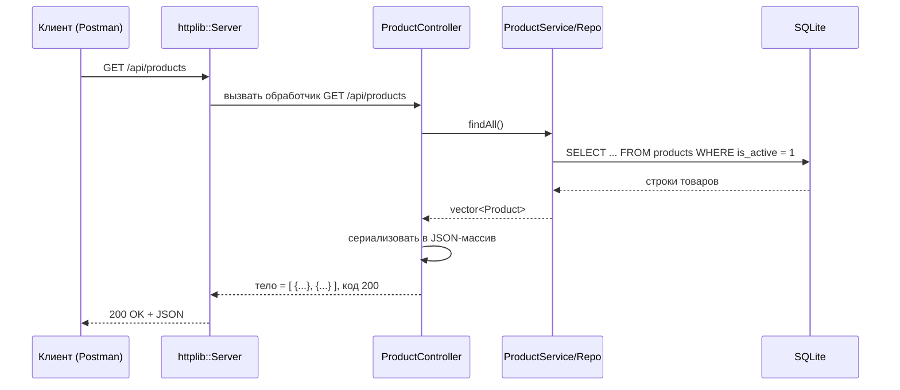
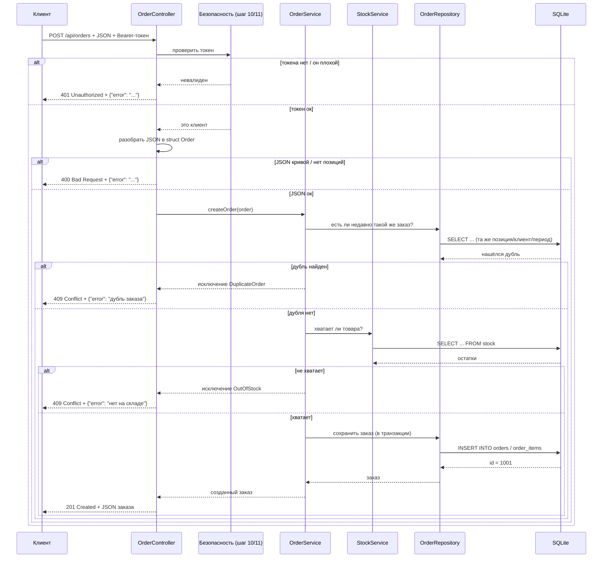
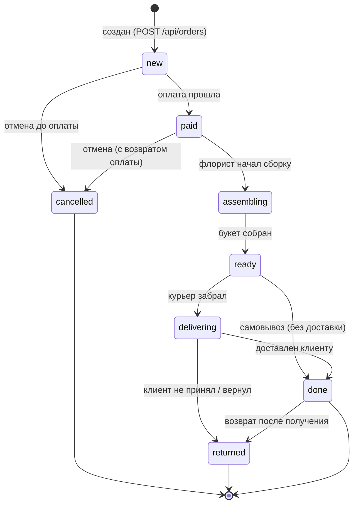

# Шаг 08. REST API на cpp-httplib

> **Цель шага:** научиться «открывать дверь наружу». До сих пор наш код (модели,
> репозитории) жил внутри программы и ни с кем не разговаривал. Теперь мы поднимем
> **HTTP-сервер**, который будет принимать запросы из интернета (от браузера, мобильного
> приложения, программы Postman) и отвечать на них **в формате JSON**. Вы поймёте, что
> такое HTTP, REST, эндпоинт, токен, и напишете первый рабочий контроллер
> (`ProductController`, `OrderController`) на библиотеке **cpp-httplib**.

> Диаграммы ниже написаны на языке **Mermaid**. Если ваш редактор умеет их рисовать —
> увидите картинку; если нет — рядом всегда лежит ASCII-дубликат и словесное описание.
> В этом шаге диаграмм особенно много: API — это «общение», а общение удобнее всего
> рисовать стрелочками.

---

## 1. Зачем нам вообще сервер, а не программа с кнопками

Представьте, что мы написали обычное оконное приложение (GUI) — с кнопками «Создать
заказ», «Показать товары». Такая программа работает **только на том компьютере, где её
запустили**. А ТЗ требует, чтобы с системой одновременно работали разные люди: продавец
в зале, флорист в мастерской, курьер с телефона, владелец из дома. Поставить им всем по
копии программы и как-то синхронизировать данные между ними — кошмар.

Поэтому мы делаем иначе. Данные и логика живут **в одном месте — на сервере**. А все
остальные (продавец, курьер, владелец) — это **клиенты**, которые по сети шлют серверу
запросы: «дай список товаров», «создай заказ». Сервер — единственный, кто трогает базу.

> **Бытовая аналогия.** Сервер — это кухня ресторана (одна на всех). Клиенты — это
> столики. Любой столик может сделать заказ, но готовит всегда одна кухня, и блюда (данные)
> у всех согласованы. Если бы у каждого столика была своя кухня — салаты в одном зале
> отличались бы от салатов в другом.

**Что такое клиент API.** Клиент — это любая программа, умеющая слать HTTP-запросы:

- **браузер** — когда вы открываете сайт;
- **`curl`** — консольная утилита, шлёт запрос одной командой (удобно для тестов);
- **Postman** — программа с окошками, где можно вручную составить запрос и посмотреть
  ответ (любимый инструмент для проверки API);
- **мобильное приложение** или другой сервер.

Важная мысль: **мы пишем только сервер (API). Мы НЕ пишем красивый интерфейс с кнопками.**
Интерфейс (сайт, приложение) — это отдельная задача, её может сделать кто угодно потом,
лишь бы он умел слать запросы к нашему API. Наш продукт — это «розетка», в которую можно
воткнуть любой «прибор».

---

## 2. Что такое HTTP (на пальцах)

**HTTP** (HyperText Transfer Protocol) — это правила, по которым клиент и сервер
обмениваются сообщениями. Общение всегда строго по схеме «вопрос — ответ»:

1. Клиент шлёт **запрос** (request): «хочу то-то».
2. Сервер шлёт **ответ** (response): «вот результат» или «ошибка такая-то».

Сервер сам **никогда** не заговаривает первым. Он молчит и ждёт запросов, как продавец за
прилавком: пока к нему не обратились — он ничего не делает.

### 2.1. Из чего состоит запрос

Любой HTTP-запрос состоит из четырёх частей:

| Часть | Что это | Пример |
|-------|---------|--------|
| **Метод** | что мы хотим сделать (глагол) | `GET`, `POST`, `PATCH`, `DELETE` |
| **Путь (URL)** | с каким ресурсом | `/api/products`, `/api/orders/42` |
| **Заголовки (headers)** | служебная информация «о письме» | `Content-Type: application/json`, `Authorization: Bearer ...` |
| **Тело (body)** | сами данные (есть не всегда) | `{"product_id": 5, "quantity": 3}` |

> **Аналогия с почтой.** Запрос — это посылка. **Метод** — что сделать с посылкой
> (доставить/забрать). **Путь** — адрес получателя. **Заголовки** — надписи на коробке
> (хрупкое, кому, обратный адрес). **Тело** — то, что внутри коробки.

### 2.2. Из чего состоит ответ

| Часть | Что это | Пример |
|-------|---------|--------|
| **Код состояния** | как всё прошло (число) | `200`, `201`, `404`, `409` |
| **Заголовки** | служебная информация | `Content-Type: application/json` |
| **Тело** | результат (обычно JSON) | `{"id": 1001, "total_price": 2500}` |

### 2.3. HTTP-методы (глаголы)

Метод говорит серверу, **что мы хотим сделать** с ресурсом. Мы используем четыре:

| Метод | Смысл | Бытовая аналогия | Меняет данные? |
|-------|-------|------------------|----------------|
| **GET** | прочитать (получить) | «покажи мне меню» | нет, только читает |
| **POST** | создать новое | «оформи новый заказ» | да, добавляет |
| **PATCH** | частично изменить | «поменяй статус заказа на „оплачен“» | да, обновляет часть |
| **DELETE** | удалить | «отмени бронь» | да, удаляет |

> Есть ещё `PUT` (заменить целиком), но в нашем проекте обходимся `PATCH`.

### 2.4. Коды состояния (как сервер сообщает результат)

Код состояния — трёхзначное число. Первая цифра задаёт «семейство»:

- **2xx — успех** («всё хорошо»);
- **4xx — ошибка клиента** («ты сам прислал что-то не то»);
- **5xx — ошибка сервера** («это мы сломались»).

Те коды, что зафиксированы в нашей общей спецификации (используем строго их):

| Код | Имя | Когда отдаём |
|-----|-----|--------------|
| **200** | OK | успешно прочитали/обновили |
| **201** | Created | успешно **создали** новый объект (заказ, товар) |
| **400** | Bad Request | клиент прислал кривой JSON или неполные данные |
| **401** | Unauthorized | нет токена или токен недействителен («ты кто?») |
| **403** | Forbidden | токен есть, но роли не хватает прав («тебе сюда нельзя») |
| **404** | Not Found | объект с таким id не найден |
| **409** | Conflict | конфликт — например, **дубль заказа** (ключевой случай ТЗ) |
| **500** | Internal Server Error | у нас на сервере вылетело исключение |

> Запомните разницу 401 и 403: **401 — «я тебя не узнаю»**, **403 — «я тебя узнал, но
> тебе нельзя»**. Это частая путаница у новичков.

---

## 3. Что такое REST и эндпоинт

**REST** — это стиль проектирования API. Идея простая: всё в системе — это **ресурсы**
(товары, заказы, пользователи), у каждого ресурса есть свой **адрес (путь)**, а действия
над ним выражаются **HTTP-методами**. То есть мы не придумываем имена функций вроде
`/getProductList` или `/createNewOrder`, а делаем так:

| Хочу | Метод + путь |
|------|--------------|
| показать все товары | `GET /api/products` |
| показать товар №5 | `GET /api/products/5` |
| создать заказ | `POST /api/orders` |
| поменять статус заказа №42 | `PATCH /api/orders/42/status` |
| удалить (отменить) заказ №42 | `DELETE /api/orders/42` |

Видите систему? **Путь = существительное (что), метод = глагол (что сделать).** Это и
есть REST. Он предсказуем: зная одно правило, вы угадываете остальные.

**Эндпоинт (endpoint)** — это конкретная пара «метод + путь», на которую сервер умеет
отвечать. `GET /api/products` — это один эндпоинт. `POST /api/products` — уже **другой**
эндпоинт (тот же путь, но другой метод и другое поведение). Эндпоинт — это «дверь» с
табличкой; за каждой дверью свой обработчик.

> **База путей.** Все наши эндпоинты начинаются с `/api` (префикс из спецификации).
> `{id}` в пути — это «подставь сюда число»: `GET /api/orders/{id}` означает
> `GET /api/orders/42`, `GET /api/orders/7` и т.д.

---

## 4. Что такое JSON и почему мы обмениваемся в нём

**JSON** (JavaScript Object Notation) — это текстовый формат записи данных. Он выглядит
как наши C++-структуры, только текстом, который понимает любой язык программирования:

```json
{
  "id": 1001,
  "client_id": 42,
  "status": "new",
  "total_price": 2500.0,
  "items": [
    { "product_id": 5, "quantity": 3, "price_each": 500.0 },
    { "product_id": 8, "quantity": 1, "price_each": 1000.0 }
  ]
}
```

Правила JSON минимальны:

- объект — в фигурных скобках `{ }`, внутри пары `"ключ": значение`;
- массив (список) — в квадратных скобках `[ ]`;
- значения: строка `"текст"`, число `2500`, логическое `true`/`false`, `null` (пусто),
  вложенный объект или массив.

**Почему именно JSON:**

- его понимают **все** языки и инструменты (браузер, Postman, Python, телефон) — это
  общий язык общения;
- он читаем человеком (в отличие от двоичных форматов);
- наша библиотека **nlohmann/json** (`json.hpp`, см. стек) превращает C++-структуру в JSON
  и обратно почти автоматически.

> **Главное правило архитектуры (из шага 03):** JSON живёт **только в слое API**. Сервисы
> и репозитории работают с C++-объектами (`Order`, `Product`) и слыхом не слыхивали ни про
> какой JSON. Контроллер — это «переводчик»: на входе превращает JSON в объект, на выходе
> объект в JSON.

---

## 5. Что такое токен и `Authorization: Bearer`

Когда продавец входит в систему (`POST /api/auth/login` с логином и паролем), сервер
проверяет пароль и выдаёт ему **токен** — длинную строку-«пропуск». Дальше при **каждом**
запросе клиент прикладывает этот токен в специальном заголовке:

```
Authorization: Bearer eyJhbGci... (длинная строка-токен)
```

Слово `Bearer` («предъявитель») — это стандартная схема: «пускайте предъявителя вот этого
токена». Сервер по токену понимает, **кто** прислал запрос и **какая у него роль** — и
решает, можно ли (роли и права — это шаг 11, выдача токена — шаг 10; здесь мы только
**читаем** токен из заголовка).

> **Аналогия.** Токен — это бейдж сотрудника. На входе (login) вам выдали бейдж. Дальше у
> каждой двери охранник смотрит бейдж: нет бейджа — `401` («вы кто?»), бейдж есть, но не
> того уровня — `403` («сюда нельзя»).

---

## 6. Общая блок-схема: как HTTP-запрос идёт сквозь слои

Соберём всё вместе. Вот путь любого запроса от клиента до базы и обратно — это та же
4-слойная картина из шага 03, но с акцентом на HTTP.

```mermaid
flowchart LR
    subgraph Клиенты
      C1[Браузер]
      C2[Postman / curl]
      C3[Мобильное приложение]
    end

    C1 & C2 & C3 -->|"HTTP-запрос: метод+путь+JSON+токен"| SRV

    subgraph Сервер на C++ (наш проект)
      SRV[httplib::Server<br/>принял соединение]
      CTRL[Контроллер<br/>ProductController / OrderController]
      SVC[Сервис<br/>OrderService / StockService]
      REPO[Репозиторий<br/>OrderRepository ...]
      SRV --> CTRL
      CTRL -->|C++-объект| SVC
      SVC --> REPO
    end

    REPO -->|SQL| DB[(SQLite<br/>flowershop.db)]
    DB -->|строки| REPO
    REPO -->|объект| SVC
    SVC -->|объект| CTRL
    CTRL -->|"HTTP-ответ: код + JSON"| C1
```

**ASCII-дубликат:**

```
                          HTTP-запрос (метод, путь, JSON, токен)
[Браузер/Postman/curl] ───────────────────────────────────────────►  ┌───────────────┐
                                                                       │ httplib::Server│
                                                                       └──────┬─────────┘
                                                                              ▼
                                                                       [Контроллер] (JSON -> объект, читает токен)
                                                                              ▼ объект
                                                                       [Сервис]     (правила магазина)
                                                                              ▼ объект
                                                                       [Репозиторий](SQL)
                                                                              ▼ SQL
                                                                       [(SQLite .db)]
[Браузер/Postman/curl] ◄───────────────────────────────────────────  объект -> JSON + код ответа
                          HTTP-ответ (код состояния + JSON)
```

**Словами:** запрос входит в `httplib::Server`, тот по методу и пути выбирает нужный
**обработчик** (это и есть контроллер). Контроллер проверяет токен, превращает JSON тела
в C++-объект, зовёт **сервис**. Сервис применяет правила (хватает ли товара, не дубль ли)
и через **репозиторий** ходит в базу. Назад поднимается C++-объект, контроллер превращает
его обратно в JSON и отдаёт клиенту с подходящим **кодом состояния**.

---

## 7. Sequence-диаграмма: обработка `GET /api/products`

Самый простой случай — чтение списка товаров. Токен здесь для примера проверяем мягко
(каталог можно показывать и гостю), упор — на путь данных.



**ASCII-дубликат:**

```
Клиент      Server         ProductController     Repo            SQLite
  │  GET /api/products │             │              │              │
  │───────────────────►│             │              │              │
  │                    │── обработчик ►│             │              │
  │                    │             │── findAll() ─►│              │
  │                    │             │              │── SELECT ───►│
  │                    │             │              │◄── строки ───│
  │                    │             │◄ vector<Product>            │
  │                    │             │ (объекты -> JSON-массив)     │
  │◄─── 200 OK + JSON ─┤◄── 200,JSON ┤              │              │
```

**Словами:** сервер получил `GET /api/products`, нашёл обработчик, тот попросил у
репозитория все активные товары, превратил `std::vector<Product>` в JSON-массив и вернул
с кодом **200**.

---

## 8. Sequence-диаграмма: обработка `POST /api/orders` (ключевой сценарий)

А это — главный, «боевой» сценарий проекта: оформление заказа. Здесь сразу видно всё:
проверка токена, защита от дубля (`409`), проверка склада, ответ `201` или `409`.



**ASCII-дубликат (упрощённо, ветками):**

```
POST /api/orders + JSON + токен
        │
        ▼
  [нет/плохой токен?] ── да ──► 401 {"error":"не авторизован"}
        │ нет
        ▼
  [JSON кривой / нет позиций?] ── да ──► 400 {"error":"некорректные данные"}
        │ нет
        ▼  createOrder(order)
  [есть недавний такой же заказ?] ── да ──► 409 {"error":"дубль заказа"}
        │ нет
        ▼
  [хватает товара на складе?] ── нет ──► 409 {"error":"нет на складе"}
        │ да
        ▼
  сохранить в транзакции (orders + order_items), посчитать цену, статус 'new'
        │
        ▼
  201 Created + JSON созданного заказа (с присвоенным id)
```

**Словами:** контроллер сначала проверяет токен (нет — `401`), затем валидность JSON (кривой
— `400`), затем зовёт `OrderService.createOrder`. Сервис проверяет дубль (есть — `409`),
проверяет склад (не хватает — `409`), и только если всё хорошо — сохраняет заказ в
транзакции и контроллер отдаёт `201`. Сама бизнес-логика (как именно проверяется дубль и
склад) — это шаг 09; здесь контроллер лишь раскладывает исходы по HTTP-кодам.

---

## 9. Диаграмма состояний заказа (`order_statuses`)

Из шага 04 у нас есть справочник `order_statuses` с кодами: `new`, `paid`, `assembling`,
`ready`, `delivering`, `done`, `cancelled`, `returned`. Заказ не может прыгать из любого
состояния в любое — есть разрешённые переходы. Контроллер `PATCH /api/orders/{id}/status`
обязан их соблюдать (иначе вернёт `409`).



**ASCII-дубликат:**

```
       (создан)
          │
          ▼
        [new] ───────────► [cancelled] ──► (конец)
          │
       (оплата)
          ▼
        [paid] ──────────► [cancelled] ──► (конец)
          │
       (сборка)
          ▼
     [assembling]
          │
       (собран)
          ▼
        [ready] ─── самовывоз ──► [done]
          │
      (курьер забрал)
          ▼
     [delivering] ── доставлен ──► [done] ──► (конец)
          │                          │
     (не принял)                 (возврат)
          ▼                          ▼
      [returned] ◄──────────────────┘ ──► (конец)
```

**Словами:** нормальный путь — `new → paid → assembling → ready → delivering → done`.
Возможны ветки: `cancelled` (отмена из `new` или `paid`), самовывоз (`ready → done` без
доставки), `returned` (из `delivering` или `done`). Логику переходов и возврата товара на
склад реализует `OrderService` (шаг 09).

---

## 10. Полная таблица эндпоинтов по модулям

Это «карта дверей» всего API. Здесь собраны эндпоинты всех модулей; реализованы они на
своих шагах, но видеть их целиком полезно уже сейчас. Колонка «Роль» — кто имеет право
(детали прав — шаг 11).

### Модуль auth (вход и токены)

| Метод | Путь | Роль | Описание | Коды ответа |
|-------|------|------|----------|-------------|
| POST | `/api/auth/login` | любой | войти по логину/паролю, получить токен | 200, 400, 401 |
| POST | `/api/auth/logout` | любой вошедший | выйти (погасить токен) | 200, 401 |
| GET | `/api/auth/me` | любой вошедший | данные текущего пользователя | 200, 401 |

### Модуль products (каталог)

| Метод | Путь | Роль | Описание | Коды ответа |
|-------|------|------|----------|-------------|
| GET | `/api/products` | любой | список активных товаров | 200 |
| GET | `/api/products/{id}` | любой | один товар по id | 200, 404 |
| POST | `/api/products` | admin, owner | создать товар | 201, 400, 401, 403 |
| PATCH | `/api/products/{id}` | admin, owner | изменить товар | 200, 400, 401, 403, 404 |
| DELETE | `/api/products/{id}` | admin, owner | деактивировать товар | 200, 401, 403, 404 |

### Модуль orders (заказы)

| Метод | Путь | Роль | Описание | Коды ответа |
|-------|------|------|----------|-------------|
| GET | `/api/orders` | seller, admin, owner | список заказов (с фильтрами) | 200, 401, 403 |
| GET | `/api/orders/{id}` | владелец заказа, seller, admin | один заказ с позициями | 200, 401, 403, 404 |
| POST | `/api/orders` | client, seller | **создать заказ** | 201, 400, 401, 409 |
| PATCH | `/api/orders/{id}/status` | seller, florist, courier, admin | сменить статус | 200, 400, 401, 403, 404, 409 |
| DELETE | `/api/orders/{id}` | seller, admin | отменить заказ | 200, 401, 403, 404, 409 |

### Модуль deliveries (доставка)

| Метод | Путь | Роль | Описание | Коды ответа |
|-------|------|------|----------|-------------|
| GET | `/api/deliveries` | courier, admin | список доставок | 200, 401, 403 |
| POST | `/api/deliveries` | seller, admin | назначить доставку на заказ | 201, 400, 401, 403 |
| PATCH | `/api/deliveries/{id}/status` | courier, admin | обновить статус доставки | 200, 400, 401, 403, 404 |

### Модуль payments (оплата)

| Метод | Путь | Роль | Описание | Коды ответа |
|-------|------|------|----------|-------------|
| GET | `/api/payments/{orderId}` | seller, admin, owner | оплаты по заказу | 200, 401, 403, 404 |
| POST | `/api/payments` | seller, client | зарегистрировать оплату | 201, 400, 401, 409 |
| PATCH | `/api/payments/{id}/refund` | seller, admin | оформить возврат оплаты | 200, 401, 403, 404 |

### Модуль reports (отчёты)

| Метод | Путь | Роль | Описание | Коды ответа |
|-------|------|------|----------|-------------|
| GET | `/api/reports/sales` | owner, admin | отчёт по продажам за период | 200, 401, 403 |
| GET | `/api/reports/stock` | owner, admin, purchaser | отчёт по остаткам/списаниям | 200, 401, 403 |
| GET | `/api/reports/popular` | owner, admin | популярные товары | 200, 401, 403 |

### Модуль users / admin (управление пользователями)

| Метод | Путь | Роль | Описание | Коды ответа |
|-------|------|------|----------|-------------|
| GET | `/api/users` | admin | список пользователей | 200, 401, 403 |
| POST | `/api/users` | admin | создать сотрудника | 201, 400, 401, 403 |
| PATCH | `/api/users/{id}/block` | admin | заблокировать/разблокировать | 200, 401, 403, 404 |
| GET | `/api/admin/audit` | admin | журнал действий (audit_log) | 200, 401, 403 |

### Модуль notifications (уведомления)

| Метод | Путь | Роль | Описание | Коды ответа |
|-------|------|------|----------|-------------|
| GET | `/api/notifications` | любой вошедший | мои уведомления | 200, 401 |
| PATCH | `/api/notifications/{id}/read` | владелец уведомления | пометить прочитанным | 200, 401, 404 |

---

## 11. Конфигурация: `src/infra/config.h` / `config.cpp`

Прежде чем запускать сервер, ему нужно знать настройки: на каком порту слушать, где файл
базы. Хардкодить их прямо в коде плохо — на разных машинах они разные. Заведём простой
класс конфигурации в инфраструктуре.

```cpp
// src/infra/config.h
#pragma once
#include <string>
#include <cstdlib>   // std::getenv — читать переменные окружения

namespace fs {

// Простой держатель настроек приложения.
// Поля публичные — это просто «сумка с настройками», поведения у неё нет.
struct Config {
    std::string db_path = "flowershop.db";  // путь к файлу базы
    std::string host    = "0.0.0.0";        // 0.0.0.0 = слушать на всех адресах
    int         port    = 8080;             // порт HTTP-сервера

    // Фабрика: собрать конфиг из переменных окружения (с разумными значениями
    // по умолчанию, если переменная не задана). 'static' = вызывается без объекта:
    // fs::Config::fromEnv().
    static Config fromEnv();
};

} // namespace fs
```

```cpp
// src/infra/config.cpp
#include "config.h"

namespace fs {

// Маленький помощник: прочитать переменную окружения или вернуть значение по умолчанию.
static std::string envOr(const char* name, const std::string& def) {
    const char* v = std::getenv(name);   // вернёт nullptr, если переменной нет
    return v ? std::string(v) : def;
}

Config Config::fromEnv() {
    Config c;
    c.db_path = envOr("FLOWERSHOP_DB",   c.db_path);
    c.host    = envOr("FLOWERSHOP_HOST", c.host);
    // порт приходит строкой -> переводим в число; std::stoi("8080") == 8080
    c.port    = std::stoi(envOr("FLOWERSHOP_PORT", std::to_string(c.port)));
    return c;
}

} // namespace fs
```

> Так в проде можно задать другой порт/базу, не пересобирая программу — просто выставить
> переменную окружения. Это шаг к «развёртыванию» (шаг 15).

---

## 12. JSON ↔ объект: `to_json` / `from_json` для nlohmann/json

Превращение C++-структуры в JSON и обратно — самая частая операция в API. Библиотека
**nlohmann/json** делает это почти волшебно: если объявить две функции `to_json` и
`from_json` рядом со структурой (в её namespace), библиотека сама вызовет их, когда увидит
`json j = product;` или `product = j.get<Product>();`.

Покажем для `Product` (поля — ровно из схемы шага 04: `id`, `name`, `category_id`,
`flower_type_id`, `kind`, `base_price`, `is_active`).

```cpp
// src/api/product_json.h
#pragma once
#include "json.hpp"               // nlohmann/json (третья сторона)
#include "../domain/product.h"    // struct Product (шаг 06)

namespace fs {

// nlohmann/json подхватит эти функции автоматически по типу Product.
// Заметьте: имена ключей JSON делаем равными именам колонок БД — меньше путаницы.

// Объект -> JSON (для ОТВЕТА клиенту).
inline void to_json(nlohmann::json& j, const Product& p) {
    j = nlohmann::json{
        {"id",         p.id},
        {"name",       p.name},
        {"category_id", p.category_id ? nlohmann::json(*p.category_id) : nlohmann::json(nullptr)},
        {"flower_type_id", p.flower_type_id ? nlohmann::json(*p.flower_type_id) : nlohmann::json(nullptr)},
        {"kind",       p.kind},          // строка 'flower'|'bouquet'|'supply'
        {"base_price", p.base_price},
        {"is_active",  p.is_active}
    };
}

// JSON -> объект (для разбора ТЕЛА запроса). .value(ключ, по_умолчанию) не упадёт,
// если ключа нет — вернёт значение по умолчанию.
inline void from_json(const nlohmann::json& j, Product& p) {
    p.name       = j.at("name").get<std::string>();   // .at кидает исключение, если нет
    p.kind       = j.value("kind", std::string("flower"));
    p.base_price = j.value("base_price", 0.0);
    p.is_active  = j.value("is_active", true);
    // необязательные внешние ключи (могут быть null):
    if (j.contains("category_id") && !j.at("category_id").is_null())
        p.category_id = j.at("category_id").get<int64_t>();
    if (j.contains("flower_type_id") && !j.at("flower_type_id").is_null())
        p.flower_type_id = j.at("flower_type_id").get<int64_t>();
}

} // namespace fs
```

> Для заказа поля разбираем **вручную** (показано в `OrderController` ниже), чтобы вы
> увидели «ручной» способ — он нагляднее и даёт полный контроль над валидацией.

---

## 13. Сервер: `src/api/server.h` / `server.cpp`

`httplib::Server` — это объект из библиотеки cpp-httplib (один заголовок `httplib.h`). У
него есть методы `Get`, `Post`, `Patch`, `Delete`, которым мы передаём **путь** и
**функцию-обработчик**. Обработчик получает `req` (запрос) и `res` (ответ) и заполняет
`res`.

```cpp
// src/api/server.h
#pragma once
#include "httplib.h"              // cpp-httplib (третья сторона)
#include "../infra/config.h"
#include "../infra/database.h"

namespace fs {

// Класс-обёртка: создаёт httplib::Server, регистрирует все маршруты и запускает слушание.
class ApiServer {
public:
    ApiServer(Config cfg, Database& db);
    void run();   // запустить сервер (блокирует поток — слушает запросы)

private:
    void registerRoutes();   // здесь подключаем все контроллеры

    Config          cfg_;
    Database&       db_;     // ссылка на единственную базу (см. шаг 07)
    httplib::Server srv_;    // сам HTTP-сервер из библиотеки
};

} // namespace fs
```

```cpp
// src/api/server.cpp
#include "server.h"
#include "product_controller.h"
#include "order_controller.h"
#include "json.hpp"
#include "../infra/logger.h"

namespace fs {

ApiServer::ApiServer(Config cfg, Database& db)
    : cfg_(std::move(cfg)), db_(db) {
    registerRoutes();
}

void ApiServer::registerRoutes() {
    // Глобальный обработчик ошибок: если в любом обработчике вылетит исключение,
    // httplib попадёт сюда. Превращаем сбой в аккуратный JSON {"error": ...} + код 500.
    srv_.set_exception_handler(
        [](const httplib::Request&, httplib::Response& res, std::exception_ptr ep) {
            std::string msg = "внутренняя ошибка сервера";
            try { if (ep) std::rethrow_exception(ep); }
            catch (const std::exception& e) { msg = e.what(); }
            nlohmann::json body = {{"error", msg}};
            res.status = 500;                              // 500 Internal Server Error
            res.set_content(body.dump(), "application/json");
        });

    // Каждый контроллер сам вешает свои маршруты на сервер.
    // Передаём ему ссылку на сервер и на базу.
    ProductController(db_).registerRoutes(srv_);
    OrderController(db_).registerRoutes(srv_);
    // ... здесь же подключатся AuthController, DeliveryController и т.д.
}

void ApiServer::run() {
    fs::log_info("API слушает http://" + cfg_.host + ":" + std::to_string(cfg_.port));
    // listen блокирует поток: сервер сидит и ждёт запросы, пока программу не остановят.
    srv_.listen(cfg_.host.c_str(), cfg_.port);
}

} // namespace fs
```

А вот как всё поднимается в `main.cpp` (связываем шаги 07 и 08):

```cpp
// src/main.cpp
#include "infra/config.h"
#include "infra/database.h"
#include "api/server.h"

int main() {
    fs::Config cfg = fs::Config::fromEnv();        // читаем настройки
    fs::Database db(cfg.db_path);                  // открываем базу (RAII, шаг 07)
    db.runScriptFile("db/schema.sql");             // создаём таблицы, если их нет
    db.runScriptFile("db/seed.sql");               // заливаем справочники
    fs::ApiServer server(std::move(cfg), db);      // собираем сервер и маршруты
    server.run();                                  // слушаем (блокирует)
    return 0;
}
```

---

## 14. Контроллер чтения: `ProductController`

Начнём с простого — каталог товаров. Контроллер хранит ссылку на базу, создаёт нужный
репозиторий и вешает маршруты.

```cpp
// src/api/product_controller.h
#pragma once
#include "httplib.h"
#include "../infra/database.h"

namespace fs {

class ProductController {
public:
    explicit ProductController(Database& db) : db_(db) {}
    void registerRoutes(httplib::Server& srv);   // повесить GET /api/products и т.д.
private:
    Database& db_;
};

} // namespace fs
```

```cpp
// src/api/product_controller.cpp
#include "product_controller.h"
#include "product_json.h"                       // to_json/from_json для Product
#include "../repositories/product_repository.h" // ProductRepository (шаг 07)
#include "json.hpp"

namespace fs {

void ProductController::registerRoutes(httplib::Server& srv) {
    // --- GET /api/products: список всех активных товаров ---
    srv.Get("/api/products", [this](const httplib::Request& req, httplib::Response& res) {
        ProductRepository repo(db_);
        std::vector<Product> products = repo.findAll();

        // vector<Product> -> JSON-массив. nlohmann/json сам вызовет to_json для каждого.
        nlohmann::json arr = nlohmann::json::array();
        for (const Product& p : products) {
            arr.push_back(p);                   // здесь срабатывает to_json(p)
        }
        res.status = 200;                       // 200 OK
        res.set_content(arr.dump(), "application/json");
    });

    // --- GET /api/products/{id}: один товар ---
    // (\d+) в пути httplib — «одна или более цифр»; число попадёт в req.matches[1].
    srv.Get(R"(/api/products/(\d+))",
            [this](const httplib::Request& req, httplib::Response& res) {
        int64_t id = std::stoll(req.matches[1]);   // вытащили id из пути
        ProductRepository repo(db_);
        std::optional<Product> p = repo.findById(id);   // optional: вдруг нет такого

        if (!p) {                                  // не нашли -> 404
            nlohmann::json err = {{"error", "товар не найден"}};
            res.status = 404;
            res.set_content(err.dump(), "application/json");
            return;
        }
        nlohmann::json j = *p;                     // объект -> JSON (to_json)
        res.status = 200;
        res.set_content(j.dump(), "application/json");
    });
}

} // namespace fs
```

> Обратите внимание: контроллер **не пишет SQL** и **не знает правил**. Он только:
> разобрал путь → позвал репозиторий → сериализовал в JSON → проставил код. Ровно его зона
> ответственности из шага 03.

---

## 15. Контроллер записи: `OrderController` (главный)

Теперь самое важное — оформление заказа. Здесь видно всё: чтение токена, ручной разбор
JSON в `struct Order`, вызов сервиса, перехват бизнес-ошибок и раскладка их по HTTP-кодам,
сериализация ответа.

Сначала маленький помощник — достать токен из заголовка `Authorization: Bearer ...`.

```cpp
// src/api/auth_helper.h
#pragma once
#include "httplib.h"
#include <optional>
#include <string>

namespace fs {

// Вытащить токен из заголовка "Authorization: Bearer <токен>".
// Возвращает optional: либо токен, либо «пусто» (заголовка нет / формат не тот).
inline std::optional<std::string> bearerToken(const httplib::Request& req) {
    if (!req.has_header("Authorization")) return std::nullopt;
    std::string h = req.get_header_value("Authorization");
    const std::string prefix = "Bearer ";
    if (h.rfind(prefix, 0) != 0) return std::nullopt;   // не начинается с "Bearer "
    return h.substr(prefix.size());                     // всё после "Bearer "
}

} // namespace fs
```

Сам контроллер заказов:

```cpp
// src/api/order_controller.h
#pragma once
#include "httplib.h"
#include "../infra/database.h"

namespace fs {

class OrderController {
public:
    explicit OrderController(Database& db) : db_(db) {}
    void registerRoutes(httplib::Server& srv);
private:
    Database& db_;
};

} // namespace fs
```

```cpp
// src/api/order_controller.cpp
#include "order_controller.h"
#include "auth_helper.h"
#include "../domain/order.h"                 // struct Order, OrderItem (шаг 06)
#include "../services/order_service.h"       // OrderService (шаг 09)
#include "../services/service_errors.h"      // наши типы бизнес-ошибок (см. ниже)
#include "json.hpp"

namespace fs {

// Маленький помощник: отправить ошибку как JSON {"error": "..."} с нужным кодом.
static void sendError(httplib::Response& res, int code, const std::string& msg) {
    nlohmann::json body = {{"error", msg}};
    res.status = code;
    res.set_content(body.dump(), "application/json");
}

// Объект Order -> JSON для ответа (делаем вручную, чтобы показать «ручную» сериализацию).
static nlohmann::json orderToJson(const Order& o) {
    nlohmann::json items = nlohmann::json::array();
    for (const OrderItem& it : o.items) {
        items.push_back({
            {"product_id", it.product_id},
            {"quantity",   it.quantity},
            {"price_each", it.price_each}
        });
    }
    return nlohmann::json{
        {"id",          o.id},
        {"client_id",   o.client_id ? nlohmann::json(*o.client_id) : nlohmann::json(nullptr)},
        {"seller_id",   o.seller_id ? nlohmann::json(*o.seller_id) : nlohmann::json(nullptr)},
        {"status_id",   o.status_id},
        {"total_price", o.total_price},
        {"delivery_at", o.delivery_at ? nlohmann::json(*o.delivery_at) : nlohmann::json(nullptr)},
        {"items",       items}
    };
}

void OrderController::registerRoutes(httplib::Server& srv) {

    // ===== POST /api/orders — создать заказ =====
    srv.Post("/api/orders", [this](const httplib::Request& req, httplib::Response& res) {

        // 1) ТОКЕН. Нет токена -> 401 (тут только наличие; проверку подлинности
        //    и роль делает слой безопасности на шаге 10/11).
        std::optional<std::string> token = bearerToken(req);
        if (!token) {
            sendError(res, 401, "требуется авторизация");
            return;
        }
        // На шаге 10 здесь будет: auth.verify(*token) -> кто пользователь и какая роль.
        // Пока для примера считаем, что токен валиден и даёт client_id.

        // 2) РАЗБОР JSON ТЕЛА. Кривой JSON -> 400.
        nlohmann::json body;
        try {
            body = nlohmann::json::parse(req.body);   // строка -> JSON; кинет при ошибке
        } catch (const std::exception&) {
            sendError(res, 400, "тело запроса не является корректным JSON");
            return;
        }

        // 3) JSON -> struct Order (вручную, с проверками). Ждём примерно такое тело:
        //    { "client_id": 42, "delivery_at": "2026-06-20 15:00",
        //      "items": [ {"product_id":5,"quantity":3}, ... ] }
        Order order;
        order.status_id = 1;     // 'new' — новый заказ всегда стартует здесь (seed шага 04)
        if (body.contains("client_id") && !body["client_id"].is_null())
            order.client_id = body["client_id"].get<int64_t>();
        if (body.contains("delivery_at") && !body["delivery_at"].is_null())
            order.delivery_at = body["delivery_at"].get<std::string>();

        // Позиции обязательны и не должны быть пустыми -> иначе 400.
        if (!body.contains("items") || !body["items"].is_array() || body["items"].empty()) {
            sendError(res, 400, "в заказе должна быть хотя бы одна позиция (items)");
            return;
        }
        for (const auto& jit : body["items"]) {
            OrderItem it;
            it.product_id = jit.at("product_id").get<int64_t>();
            it.quantity   = jit.at("quantity").get<int>();
            // price_each посчитает PricingService в сервисе (шаг 09), здесь не доверяем клиенту.
            order.items.push_back(it);
        }

        // 4) ВЫЗОВ СЕРВИСА. Вся бизнес-логика — там. Контроллер ловит её исключения
        //    и переводит в HTTP-коды.
        try {
            OrderService service(db_);
            Order created = service.createOrder(order);     // см. шаг 09
            res.status = 201;                                // 201 Created
            res.set_content(orderToJson(created).dump(), "application/json");
        }
        catch (const DuplicateOrderError& e) {   // дубль -> 409 (ключевой случай ТЗ)
            sendError(res, 409, e.what());
        }
        catch (const OutOfStockError& e) {        // нет на складе -> 409
            sendError(res, 409, e.what());
        }
        catch (const ValidationError& e) {        // неверные данные -> 400
            sendError(res, 400, e.what());
        }
        // Любое прочее исключение перехватит set_exception_handler сервера -> 500.
    });

    // ===== GET /api/orders/{id} — один заказ =====
    srv.Get(R"(/api/orders/(\d+))", [this](const httplib::Request& req, httplib::Response& res) {
        if (!bearerToken(req)) { sendError(res, 401, "требуется авторизация"); return; }
        int64_t id = std::stoll(req.matches[1]);
        OrderService service(db_);
        std::optional<Order> o = service.findById(id);
        if (!o) { sendError(res, 404, "заказ не найден"); return; }
        res.status = 200;
        res.set_content(orderToJson(*o).dump(), "application/json");
    });

    // ===== PATCH /api/orders/{id}/status — сменить статус =====
    srv.Patch(R"(/api/orders/(\d+)/status)",
              [this](const httplib::Request& req, httplib::Response& res) {
        if (!bearerToken(req)) { sendError(res, 401, "требуется авторизация"); return; }
        int64_t id = std::stoll(req.matches[1]);

        nlohmann::json body;
        try { body = nlohmann::json::parse(req.body); }
        catch (...) { sendError(res, 400, "некорректный JSON"); return; }

        // Ждём { "status": "paid" } — новый код статуса.
        std::string newStatus = body.value("status", std::string());
        if (newStatus.empty()) { sendError(res, 400, "не указан новый статус"); return; }

        try {
            OrderService service(db_);
            Order updated = service.changeStatus(id, newStatus);  // проверит допустимость перехода
            res.status = 200;
            res.set_content(orderToJson(updated).dump(), "application/json");
        }
        catch (const NotFoundError&)      { sendError(res, 404, "заказ не найден"); }
        catch (const InvalidTransition& e){ sendError(res, 409, e.what()); } // запрещённый переход
    });
}

} // namespace fs
```

Типы бизнес-ошибок, которые ловит контроллер (объявим их в сервисном слое — шаг 09):

```cpp
// src/services/service_errors.h
#pragma once
#include <stdexcept>

namespace fs {
// Базовый класс бизнес-ошибок — наследник стандартного runtime_error (несёт текст).
struct ServiceError      : std::runtime_error { using std::runtime_error::runtime_error; };
struct ValidationError   : ServiceError { using ServiceError::ServiceError; }; // -> 400
struct NotFoundError     : ServiceError { using ServiceError::ServiceError; }; // -> 404
struct DuplicateOrderError : ServiceError { using ServiceError::ServiceError; }; // -> 409
struct OutOfStockError   : ServiceError { using ServiceError::ServiceError; }; // -> 409
struct InvalidTransition : ServiceError { using ServiceError::ServiceError; }; // -> 409
} // namespace fs
```

> **Ключевая идея перевода ошибок.** Сервис ничего не знает про HTTP — он бросает
> «смысловые» исключения (`DuplicateOrderError`, `OutOfStockError`). Контроллер их **ловит**
> и решает, каким HTTP-кодом ответить. Так бизнес-логика остаётся чистой, а вся «HTTP-ность»
> сидит в одном слое — как и требует архитектура из шага 03.

---

## 16. Обработка ошибок: единый формат `{"error": "..."}`

Чтобы клиенту было удобно, **любая** ошибка возвращается одинаково — JSON с ключом
`error` и подходящим кодом:

```json
{ "error": "дубль заказа: такой заказ уже оформлен только что" }
```

Сводная таблица «что → какой код»:

| Ситуация | Код | Откуда берётся |
|----------|-----|----------------|
| нет/плохой токен | 401 | проверка в контроллере (`bearerToken`) |
| роли не хватает | 403 | проверка прав (шаг 11) |
| кривой JSON / нет позиций | 400 | `try/catch parse`, `ValidationError` |
| объект не найден | 404 | `optional` пустой / `NotFoundError` |
| дубль заказа | 409 | `DuplicateOrderError` (шаг 09) |
| нет на складе | 409 | `OutOfStockError` (шаг 09) |
| запрещённый переход статуса | 409 | `InvalidTransition` (шаг 09) |
| что угодно ещё (вылетело исключение) | 500 | `set_exception_handler` сервера |

---

## 17. Как это пощупать руками (curl)

Когда сервер запущен (`./flowershop`, слушает порт 8080), проверить эндпоинты можно из
терминала утилитой `curl`:

```bash
# Получить список товаров (GET, без тела)
curl http://localhost:8080/api/products

# Создать заказ (POST, с JSON-телом и токеном)
curl -X POST http://localhost:8080/api/orders \
     -H "Authorization: Bearer ТЕСТОВЫЙ_ТОКЕН" \
     -H "Content-Type: application/json" \
     -d '{ "client_id": 42, "items": [ {"product_id": 5, "quantity": 3} ] }'

# Сменить статус заказа №1001 (PATCH)
curl -X PATCH http://localhost:8080/api/orders/1001/status \
     -H "Authorization: Bearer ТЕСТОВЫЙ_ТОКЕН" \
     -H "Content-Type: application/json" \
     -d '{ "status": "paid" }'
```

То же самое можно сделать в Postman, заполнив поля метода, URL, заголовков и тела мышкой —
это нагляднее для новичка.

---

## 18. Связь с ТЗ

| Требование ТЗ | Где реализовано в этом шаге |
|---------------|------------------------------|
| Одновременная работа многих пользователей (раздел 2) | Архитектура «один сервер — много клиентов» (раздел 1) |
| Защита от дублирования заказов (раздел 2) | `POST /api/orders` ловит `DuplicateOrderError` → `409` (раздел 8, 15) |
| Контроль доступа по ролям (3.3, 3.4) | Токен `Authorization: Bearer`, коды `401`/`403` (раздел 5, 10, 16) |
| Расчёт стоимости системой (3.3) | `price_each` считает сервис, клиенту не доверяем (раздел 15) |
| Кроссплатформенность, Windows-сервер (3.4) | cpp-httplib и nlohmann/json — header-only, кроссплатформенны (стек) |
| Целостность данных (3.6.1) | Запись только через сервис → репозиторий → транзакция (шаги 07, 09) |

---

## Проверь себя

1. Из каких четырёх частей состоит HTTP-запрос? А ответ?
2. В чём разница между кодами `401` и `403`? Приведите пример для каждого.
3. Почему мы пишем сервер (API), а не приложение с кнопками? Что такое «клиент API»?
4. Где (в каком слое) JSON превращается в `struct Order`? Почему не в сервисе?
5. Какой код вернёт `POST /api/orders`, если такой заказ только что уже оформляли? Кто
   бросает это исключение и кто его ловит?
6. Зачем `from_json`/`to_json`, и кто их вызывает?
7. По диаграмме состояний: можно ли из `new` сразу перейти в `delivering`? А из `paid` в
   `cancelled`?

---

## Промпт для ИИ-агента

> Я изучаю C++ и пишу учебный проект «Цветочный магазин» (C++17, cpp-httplib,
> nlohmann/json, namespace `fs`, архитектура из 4 слоёв). Ниже — документ про слой REST
> API: HTTP, REST, JSON, токены, `httplib::Server`, контроллеры `ProductController` и
> `OrderController`, перевод бизнес-ошибок в HTTP-коды. Прочитай его и: (1) погоняй меня по
> вопросам «какой метод и путь использовать для такого-то действия» и «какой код ответа
> вернуть в такой-то ситуации»; (2) проверь, что я нигде не пишу SQL или бизнес-правила в
> контроллере — укажи нарушения слоёв, если найдёшь; (3) предложи по образцу
> `ProductController` реализацию ещё одного контроллера (например, `DeliveryController`),
> используя те же `to_json`/`from_json`, помощник `bearerToken` и `sendError`. Имена
> таблиц/полей и коды ответов не меняй — они зафиксированы. Документ: [вставьте содержимое
> этого файла].

---

Назад → [07-слой-доступа-к-данным.md](07-слой-доступа-к-данным.md)  Дальше → [09-бизнес-логика-сервисы.md](09-бизнес-логика-сервисы.md)
