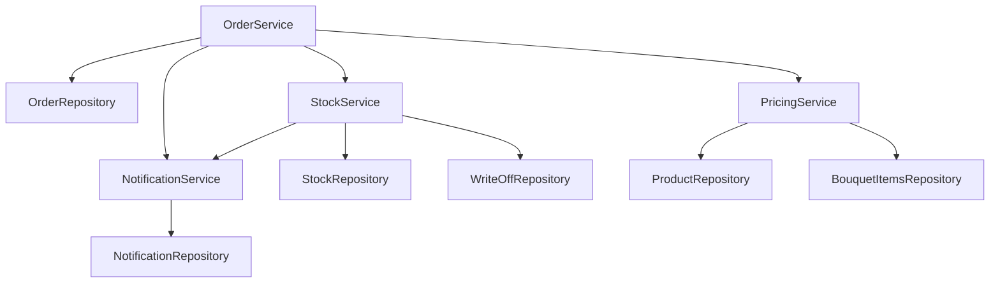

# Шаг 09. Слой сервисов — правила магазина

> **Цель шага:** написать «мозг» нашей системы — слой **сервисов**. Репозитории (шаг 07)
> умеют только читать и писать строки в базу, они «тупые». Контроллеры (шаг 08) только
> принимают HTTP и отдают JSON. А вот **правила** — «нельзя оформить дубль заказа»,
> «хватает ли цветов на складе», «как посчитать цену букета», «что списать при сборке» —
> живут здесь, в сервисах. В конце вы поймёте, что такое **инъекция зависимостей**, и
> напишете `OrderService`, `StockService`, `PricingService`, `NotificationService`.

> Диаграммы — на языке **Mermaid**, рядом всегда ASCII-дубликат. Имена таблиц, полей и
> классов — строго из шагов 04, 06, 07 (`orders`, `order_items`, `stock`, `write_offs`,
> `notifications`, `products`, `bouquet_items`, `OrderRepository`, `StockRepository` и т.д.).

---

## 1. Зачем отдельный слой сервисов

Можно ведь сложить всю логику прямо в контроллер? Можно — и получить кашу. Сервис нужен,
чтобы **правила магазина жили в одном месте**, отдельно и от HTTP, и от SQL.

> **Бытовая аналогия (из шага 03).** Сервис — это **повар**. Официант (контроллер) принял
> заказ, но сам не готовит. Кладовщик (репозиторий) только приносит и уносит коробки. А
> повар знает **рецепты**: что с чем смешать, хватает ли продуктов, можно ли вообще
> приготовить это блюдо. Все знания «как правильно» — у повара.

Что попадает в сервис:

- проверки и запреты («дубль нельзя», «склад пуст — отказ»);
- расчёты (стоимость заказа);
- координация нескольких репозиториев в одной операции (заказ + позиции + остатки +
  уведомление — всё это один сценарий «оформить заказ»);
- работа в **транзакции** (всё-или-ничего, см. шаг 07).

Что в сервис **не** попадает: HTTP-коды и JSON (это контроллер) и текст SQL (это
репозиторий).

---

## 2. Инъекция зависимостей (Dependency Injection) — простыми словами

Сервису, чтобы работать, нужны помощники: `OrderService` не может ничего сохранить без
`OrderRepository`, не проверит склад без `StockService`. Эти помощники называются
**зависимостями**.

Есть два способа их получить:

1. **Плохо:** сервис сам внутри себя создаёт репозиторий (`OrderRepository repo(db);`
   прямо в методе). Тогда сервис намертво привязан к конкретному репозиторию — его не
   подменишь в тестах, не переиспользуешь.
2. **Хорошо (инъекция зависимостей):** помощников **передают сервису снаружи** — обычно в
   **конструкторе**. Сервис не создаёт их сам, а **получает готовыми**. «Инъекция» = «нам
   вкололи зависимость снаружи».

> **Аналогия.** Повар не идёт сам выращивать помидоры и ковать ножи. Ему **выдают** на
> кухне ножи и продукты. Захотели — выдали другой нож (в тестах — «поддельный» репозиторий,
> шаг 14). Повар работает с тем, что дали.

Технически мы передаём зависимости **по ссылке** (`OrderRepository&`), а не по копии:
репозитории живут в одном экземпляре на всё приложение (они держат `Database&`, шаг 07).
Ссылка (`&`) означает «тот же самый объект, не копия».

```cpp
// Простая ручная инъекция зависимостей через конструктор.
class OrderService {
public:
    // Сервису ВЫДАЮТ его помощников снаружи (ссылки на уже созданные объекты).
    OrderService(OrderRepository& orders,
                 StockService&    stock,
                 PricingService&  pricing,
                 NotificationService& notify)
        : orders_(orders), stock_(stock), pricing_(pricing), notify_(notify) {}
    // ...
private:
    OrderRepository&     orders_;   // & = ссылка: храним «тот же» объект, не копию
    StockService&        stock_;
    PricingService&      pricing_;
    NotificationService& notify_;
};
```

> В учебных примерах шага 08 мы для краткости писали `OrderService service(db_)` — это
> допустимый упрощённый вариант, где сервис сам собирает помощников из `Database&`. Здесь
> показываем «правильную» инъекцию, чтобы вы увидели понятие. Оба способа рабочие; инъекция
> — чище и тестируемее.

Картинка зависимостей:



**ASCII-дубликат:**

```
OrderService
  ├── OrderRepository        (сохранить заказ + позиции)
  ├── StockService           (проверить/списать склад)
  │     ├── StockRepository
  │     ├── WriteOffRepository
  │     └── NotificationService (уведомить закупщика)
  ├── PricingService         (посчитать цену)
  │     ├── ProductRepository
  │     └── BouquetItemsRepository
  └── NotificationService    (уведомить о статусе)
        └── NotificationRepository
```

---

## 3. `OrderService::createOrder` — сердце системы

Это самый важный метод проекта. Он собирает воедино все правила оформления заказа. Сценарий
(он же — sequence-диаграмма из шага 08, теперь со стороны сервиса):

```mermaid
flowchart TD
    A[createOrder(order)] --> B{позиции есть?}
    B -- нет --> E1[бросить ValidationError -> контроллер вернёт 400]
    B -- да --> C{есть недавний<br/>такой же заказ?}
    C -- да --> E2[бросить DuplicateOrderError -> 409]
    C -- нет --> D{хватает товара<br/>на складе?}
    D -- нет --> E3[бросить OutOfStockError -> 409]
    D -- да --> P[посчитать цену каждой позиции и сумму<br/>PricingService]
    P --> T[НАЧАТЬ ТРАНЗАКЦИЮ]
    T --> S1[сохранить заказ + позиции<br/>OrderRepository.save]
    S1 --> S2[статус = 'new']
    S2 --> S3[создать уведомление продавцу/флористу]
    S3 --> CM[COMMIT транзакции]
    CM --> R[вернуть созданный заказ -> контроллер отдаст 201]
```

**ASCII-дубликат:**

```
createOrder(order)
   │
   ├─ позиций нет? ───────────────► ValidationError (400)
   ├─ есть недавний дубль? ────────► DuplicateOrderError (409)
   ├─ не хватает на складе? ───────► OutOfStockError (409)
   │
   ▼ всё ок
   посчитать цены (PricingService)
   ┌─ BEGIN ──────────────────────────────────┐
   │  save(order)  -> id, статус 'new'         │
   │  создать уведомление                      │
   └─ COMMIT ─────────────────────────────────┘
   вернуть созданный заказ (201)
```

### 3.1. Что такое «защита от дублирования» (требование ТЗ)

ТЗ прямо требует «защиту от дублирования заказов». Бытовая причина: продавец нечаянно дважды
нажал «Создать», или клиент дважды отправил форму — и в системе появились **два одинаковых
заказа**. Это путаница и лишние списания со склада.

Наше правило (учебное, простое): **дубль — это заказ того же клиента, с тем же набором
позиций, оформленный за короткий промежуток времени** (например, последние 2 минуты). Если
такой уже есть — новый создавать нельзя, бросаем `DuplicateOrderError` → контроллер вернёт
`409 Conflict`.

### 3.2. Код `OrderService`

```cpp
// src/services/order_service.h
#pragma once
#include <optional>
#include "../domain/order.h"
#include "../repositories/order_repository.h"
#include "stock_service.h"
#include "pricing_service.h"
#include "notification_service.h"

namespace fs {

class OrderService {
public:
    // Инъекция зависимостей: все помощники переданы снаружи (ссылки).
    OrderService(OrderRepository& orders,
                 StockService& stock,
                 PricingService& pricing,
                 NotificationService& notify)
        : orders_(orders), stock_(stock), pricing_(pricing), notify_(notify) {}

    Order createOrder(Order order);                  // оформить (главный метод)
    std::optional<Order> findById(int64_t id);       // прочитать
    Order changeStatus(int64_t id, const std::string& newStatusCode); // сменить статус
    Order cancelOrder(int64_t id);                   // отменить (возврат на склад)
    Order returnOrder(int64_t id);                   // возврат после выполнения

private:
    bool looksLikeDuplicate(const Order& o);         // правило дубля
    OrderRepository&     orders_;
    StockService&        stock_;
    PricingService&      pricing_;
    NotificationService& notify_;
};

} // namespace fs
```

```cpp
// src/services/order_service.cpp
#include "order_service.h"
#include "service_errors.h"          // ValidationError, DuplicateOrderError, ... (шаг 08)
#include "../infra/database.h"       // Transaction (шаг 07)

namespace fs {

// Статусы из seed (шаг 04): id 1='new', 2='paid', 3='assembling',
// 4='ready', 5='delivering', 6='done', 7='cancelled', 8='returned'.
static constexpr int64_t ST_NEW = 1;

Order OrderService::createOrder(Order order) {
    // (1) Базовая валидация: позиции обязательны.
    if (order.items.empty())
        throw ValidationError("в заказе нет позиций");

    // (2) Защита от дублирования (требование ТЗ). Дубль -> 409.
    if (looksLikeDuplicate(order))
        throw DuplicateOrderError("дубль заказа: такой заказ уже оформлен только что");

    // (3) Проверка склада по КАЖДОЙ позиции. Не хватает -> 409.
    //     Сам StockService знает, как считать остатки (раздел 4).
    for (const OrderItem& it : order.items) {
        if (!stock_.hasEnough(it.product_id, it.quantity))
            throw OutOfStockError("недостаточно товара на складе (product_id="
                                  + std::to_string(it.product_id) + ")");
    }

    // (4) Расчёт цены каждой позиции и общей суммы (PricingService, раздел 5).
    //     Клиенту цены НЕ доверяем — считаем сами.
    double total = 0.0;
    for (OrderItem& it : order.items) {
        it.price_each = pricing_.priceOf(it.product_id);   // цена за штуку
        total += it.price_each * it.quantity;
    }
    order.total_price = total;
    order.status_id   = ST_NEW;     // новый заказ всегда стартует со статуса 'new'

    // (5) Сохранение. OrderRepository.save сам оборачивает запись в транзакцию
    //     (шапка + позиции атомарно, шаг 07). Здесь мы дополнительно хотим, чтобы
    //     и уведомление попало в ту же логическую операцию.
    int64_t newId = orders_.save(order);   // INSERT в orders + order_items (транзакция внутри)
    order.id = newId;

    // (6) Уведомление: продавцу/флористу «поступил новый заказ» (модуль notifications).
    if (order.seller_id)
        notify_.notify(*order.seller_id, "order.new",
                       "Поступил новый заказ #" + std::to_string(newId));

    return order;   // контроллер превратит в JSON и отдаст 201
}

// Правило дубля: тот же клиент + тот же набор позиций за последние ~2 минуты.
// Тяжёлую часть (поиск в БД) делегируем репозиторию: ему писать SQL, не нам.
bool OrderService::looksLikeDuplicate(const Order& o) {
    if (!o.client_id) return false;        // у анонимной продажи дубль не проверяем
    // findRecentSimilar: SELECT по client_id за окно времени, сравнение состава позиций.
    // (метод репозитория; см. примечание ниже)
    return orders_.findRecentSimilar(*o.client_id, o.items, /*windowSeconds=*/120).has_value();
}

std::optional<Order> OrderService::findById(int64_t id) {
    return orders_.findById(id);           // просто проксируем чтение
}

} // namespace fs
```

> Метод `findRecentSimilar` — это специализированный запрос репозитория (по образцу шага
> 07: `SELECT ... FROM orders WHERE client_id = ? AND created_at >= datetime('now','-120 seconds')`,
> затем сравнение `order_items`). **SQL — в репозитории, решение «это дубль» — в сервисе.**

---

## 4. `StockService` — склад, списания и сроки годности

Это второй по важности сервис. Он отвечает за всё, что ТЗ называет «авто-учёт остатков» и
«учёт сроков годности». Работает с таблицами `stock` и `write_offs` (шаг 04).

Напомним движение количества (из шага 04):

```
Поступление        -> +N в stock
Сборка флористом    -> -N из stock + write_offs (reason='использован')
Просрочка           -> -N из stock + write_offs (reason='просрочка')   [АВТО]
Нехватка при заказе -> уведомление закупщику
```

### 4.1. Диаграмма авто-списания просрочки

```mermaid
flowchart TD
    A[writeOffExpired() — запускается по расписанию/при старте] --> B[взять все партии stock]
    B --> C{expires_at < сегодня?}
    C -- нет --> B
    C -- да --> D[BEGIN транзакция]
    D --> E[write_offs: reason='просрочка', quantity=остаток]
    E --> F[stock.quantity = 0]
    F --> G[COMMIT]
    G --> H[уведомить закупщика: 'списана просрочка']
    H --> B
```

**ASCII-дубликат:**

```
для каждой партии в stock:
    expires_at < сегодня ?
        └─ да ─► BEGIN
                 write_offs (reason='просрочка', quantity = текущий остаток)
                 stock.quantity := 0
                 COMMIT
                 уведомить закупщика
```

### 4.2. Код `StockService`

```cpp
// src/services/stock_service.h
#pragma once
#include <string>
#include "../repositories/stock_repository.h"
#include "../repositories/write_off_repository.h"
#include "notification_service.h"

namespace fs {

class StockService {
public:
    StockService(StockRepository& stock,
                 WriteOffRepository& writeOffs,
                 NotificationService& notify)
        : stock_(stock), writeOffs_(writeOffs), notify_(notify) {}

    // Хватает ли товара product_id в количестве qty (суммарно по всем партиям)?
    bool hasEnough(int64_t productId, int qty);

    // Списать qty товара при сборке букета флористом (reason='использован').
    void consumeForAssembly(int64_t productId, int qty, int64_t byUserId);

    // Вернуть qty товара на склад (при отмене/возврате заказа).
    void returnToStock(int64_t productId, int qty);

    // АВТО-списание всех просроченных партий (expires_at < сегодня).
    int writeOffExpired(int64_t byUserId);   // вернёт число списанных партий

private:
    void warnPurchaserIfLow(int64_t productId);  // уведомить закупщика о нехватке
    StockRepository&     stock_;
    WriteOffRepository&  writeOffs_;
    NotificationService& notify_;
};

} // namespace fs
```

```cpp
// src/services/stock_service.cpp
#include "stock_service.h"
#include "service_errors.h"
#include "../infra/database.h"   // Transaction

namespace fs {

// Суммарный остаток по товару = сумма quantity по всем его партиям в stock.
bool StockService::hasEnough(int64_t productId, int qty) {
    int total = 0;
    for (const Stock& s : stock_.findByProduct(productId)) {  // findByProduct из шага 07
        total += static_cast<int>(s.quantity);
    }
    if (total < qty) {
        warnPurchaserIfLow(productId);   // не хватает -> сразу зовём закупщика
        return false;
    }
    return true;
}

// Списание при сборке: уменьшаем партии и пишем причину 'использован' в write_offs.
// Берём из партий с БЛИЖАЙШИМ сроком годности первыми (FEFO — first expired, first out).
void StockService::consumeForAssembly(int64_t productId, int qty, int64_t byUserId) {
    Transaction tx(/*db*/ stock_.database());   // всё списание — атомарно (шаг 07)
    int left = qty;
    // findByProduct возвращает партии; считаем, что отсортированы по expires_at.
    for (Stock s : stock_.findByProduct(productId)) {
        if (left <= 0) break;
        int take = std::min(left, static_cast<int>(s.quantity));

        WriteOff w;                       // запись о списании (домен из шага 06)
        w.stock_id   = s.id;
        w.quantity   = take;
        w.reason     = "использован";     // ровно как в CHECK схемы шага 04
        w.created_by = byUserId;
        writeOffs_.save(w);

        s.quantity -= take;               // уменьшаем остаток партии
        stock_.update(s);                 // UPDATE stock SET quantity=... (шаг 07)
        left -= take;
    }
    if (left > 0)
        throw OutOfStockError("не хватило товара при сборке (product_id="
                              + std::to_string(productId) + ")");
    tx.commit();
}

void StockService::returnToStock(int64_t productId, int qty) {
    // Упрощённо: кладём возврат в первую партию товара.
    auto batches = stock_.findByProduct(productId);
    if (batches.empty()) return;
    Stock s = batches.front();
    s.quantity += qty;
    stock_.update(s);
}

// АВТО-списание просрочки: ТЗ «учёт сроков годности».
int StockService::writeOffExpired(int64_t byUserId) {
    int count = 0;
    // findExpired: SELECT * FROM stock WHERE expires_at < date('now') AND quantity > 0
    for (Stock s : stock_.findExpired()) {
        Transaction tx(stock_.database());
        WriteOff w;
        w.stock_id   = s.id;
        w.quantity   = s.quantity;        // списываем весь остаток партии
        w.reason     = "просрочка";       // ровно как в схеме шага 04
        w.created_by = byUserId;
        writeOffs_.save(w);

        s.quantity = 0;
        stock_.update(s);
        tx.commit();

        notify_.notify(byUserId, "stock.expired",
                       "Списана просрочка: партия stock_id=" + std::to_string(s.id));
        ++count;
    }
    return count;
}

// Нехватка -> уведомить закупщика (роль purchaser), чтобы заказал поставку.
void StockService::warnPurchaserIfLow(int64_t productId) {
    // ID закупщика берём из users по роли 'purchaser' (упрощённо — первый найденный).
    notify_.notifyRole("purchaser", "stock.low",
                       "Заканчивается товар product_id=" + std::to_string(productId));
}

} // namespace fs
```

> `stock_.database()` — это вспомогательный доступ репозитория к своей `Database&` для
> открытия транзакции из сервиса. Если в вашем коде транзакцию удобнее держать в самом
> репозитории — переносите `Transaction` туда; правило одно: списание партии и запись в
> `write_offs` должны фиксироваться **вместе**.

---

## 5. `PricingService` — расчёт стоимости

ТЗ требует, чтобы стоимость считала **система**, а не вводил руками продавец (иначе ошибки и
злоупотребления). Сервис цен очень простой:

- цена **обычного товара** (цветок, расходник) = его `products.base_price`;
- цена **букета** — тоже из `base_price` товара-букета (готовая цена за букет);
- стоимость **позиции заказа** = `price_each * quantity`;
- стоимость **всего заказа** = сумма по позициям (это делает `OrderService`, раздел 3).

```cpp
// src/services/pricing_service.h
#pragma once
#include "../repositories/product_repository.h"

namespace fs {

class PricingService {
public:
    explicit PricingService(ProductRepository& products) : products_(products) {}

    // Цена за ЕДИНИЦУ товара (и цветка, и букета) — берём из products.base_price.
    double priceOf(int64_t productId);

private:
    ProductRepository& products_;
};

} // namespace fs
```

```cpp
// src/services/pricing_service.cpp
#include "pricing_service.h"
#include "service_errors.h"

namespace fs {

double PricingService::priceOf(int64_t productId) {
    std::optional<Product> p = products_.findById(productId);
    if (!p) throw NotFoundError("товар не найден для расчёта цены");
    // И для 'flower', и для 'bouquet' цена за единицу хранится в base_price (схема шага 04).
    // Для букета base_price — это готовая цена за весь букет (одна штука букета).
    return p->base_price;
}

} // namespace fs
```

> Почему так просто? Потому что состав букета (`bouquet_items`) нужен **складу** (что
> списывать при сборке), а не цене: цену букета владелец задаёт сразу в `base_price`. Если
> бы цена считалась «снизу» (сумма цен цветов + наценка), `PricingService` ходил бы в
> `bouquet_items` и `flower_types` — это естественное расширение, но мы его не усложняем.

> **Про деньги (важно).** Здесь `double`, как договорились в спецификации — учебно. В
> настоящем магазине деньги хранят в **целых копейках** (`int64_t`), потому что `double`
> накапливает ошибки округления (0.1 + 0.2 ≠ 0.3 в плавающей точке). Помните об этом.

---

## 6. Смена статуса, отмена и возврат заказа

### 6.1. Допустимые переходы статуса

Сервис обязан соблюдать диаграмму состояний из шага 08. Запрещённый переход (например, из
`new` сразу в `delivering`) — это `InvalidTransition` → контроллер вернёт `409`.

```cpp
// фрагмент order_service.cpp

// Карта разрешённых переходов: из какого кода в какой можно.
static bool transitionAllowed(const std::string& from, const std::string& to) {
    static const std::map<std::string, std::vector<std::string>> allowed = {
        {"new",        {"paid", "cancelled"}},
        {"paid",       {"assembling", "cancelled"}},
        {"assembling", {"ready"}},
        {"ready",      {"delivering", "done"}},
        {"delivering", {"done", "returned"}},
        {"done",       {"returned"}},
    };
    auto it = allowed.find(from);
    if (it == allowed.end()) return false;
    for (const std::string& s : it->second) if (s == to) return true;
    return false;
}

Order OrderService::changeStatus(int64_t id, const std::string& newCode) {
    std::optional<Order> opt = orders_.findById(id);
    if (!opt) throw NotFoundError("заказ не найден");
    Order o = *opt;

    std::string current = orders_.statusCode(o.status_id);   // id -> код ('new', ...)
    if (!transitionAllowed(current, newCode))
        throw InvalidTransition("нельзя перейти из '" + current + "' в '" + newCode + "'");

    o.status_id = orders_.statusId(newCode);                 // код -> id
    orders_.update(o);                                       // UPDATE orders (шаг 07)

    // Побочные эффекты на некоторых переходах:
    if (newCode == "assembling") {
        // Флорист начал сборку -> списываем цветы со склада (reason='использован').
        for (const OrderItem& it : o.items)
            stock_.consumeForAssembly(it.product_id, it.quantity, /*byUserId=*/o.seller_id.value_or(0));
    }
    if (o.client_id)
        notify_.notify(*o.client_id, "order.status",
                       "Статус заказа #" + std::to_string(id) + " изменён на '" + newCode + "'");
    return o;
}
```

### 6.2. Отмена и возврат

При **отмене** (`cancelled`) или **возврате** (`returned`) товар, если он уже был списан,
возвращаем на склад через `StockService::returnToStock`.

```cpp
Order OrderService::cancelOrder(int64_t id) {
    Order o = changeStatus(id, "cancelled");   // проверит, что переход разрешён
    // Если заказ уже собирали (списывали) — возвращаем цветы на склад.
    for (const OrderItem& it : o.items)
        stock_.returnToStock(it.product_id, it.quantity);
    if (o.client_id)
        notify_.notify(*o.client_id, "order.cancelled",
                       "Заказ #" + std::to_string(id) + " отменён");
    return o;
}

Order OrderService::returnOrder(int64_t id) {
    Order o = changeStatus(id, "returned");
    for (const OrderItem& it : o.items)
        stock_.returnToStock(it.product_id, it.quantity);
    return o;
}
```

---

## 7. `NotificationService` — кого и о чём оповещаем

Тонкий сервис: создаёт строки в таблице `notifications` (шаг 04: `user_id`, `type`,
`message`, `is_read`, `created_at`). Подробно — в шаге 12; здесь — интерфейс, чтобы другие
сервисы могли его звать.

```cpp
// src/services/notification_service.h
#pragma once
#include <string>
#include "../repositories/notification_repository.h"

namespace fs {

class NotificationService {
public:
    explicit NotificationService(NotificationRepository& repo) : repo_(repo) {}

    // Уведомить конкретного пользователя.
    void notify(int64_t userId, const std::string& type, const std::string& message);

    // Уведомить всех пользователей с указанной ролью (например, всех закупщиков).
    void notifyRole(const std::string& roleCode, const std::string& type,
                    const std::string& message);

private:
    NotificationRepository& repo_;
};

} // namespace fs
```

```cpp
// src/services/notification_service.cpp
#include "notification_service.h"

namespace fs {

void NotificationService::notify(int64_t userId, const std::string& type,
                                 const std::string& message) {
    Notification n;            // домен из шага 06
    n.user_id = userId;
    n.type    = type;          // 'order.new', 'stock.low', 'order.status', ...
    n.message = message;
    n.is_read = false;         // непрочитанное
    repo_.save(n);             // INSERT INTO notifications (шаг 07)
}

void NotificationService::notifyRole(const std::string& roleCode, const std::string& type,
                                     const std::string& message) {
    // Репозиторий найдёт user_id всех с этой ролью; шлём каждому.
    for (int64_t uid : repo_.userIdsByRole(roleCode))
        notify(uid, type, message);
}

} // namespace fs
```

---

## 8. Как всё это собирается вместе (сборка зависимостей)

Где-то один раз (в `main.cpp` или фабрике) мы создаём все объекты и «вкалываем» их друг в
друга. Это и есть ручная инъекция зависимостей в действии:

```cpp
fs::Database db("flowershop.db");

// Репозитории (держат Database&):
fs::OrderRepository        orderRepo(db);
fs::StockRepository        stockRepo(db);
fs::WriteOffRepository     writeOffRepo(db);
fs::ProductRepository      productRepo(db);
fs::NotificationRepository notifRepo(db);

// Сервисы — снизу вверх (зависимости создаём раньше тех, кто их использует):
fs::NotificationService notifSvc(notifRepo);
fs::StockService        stockSvc(stockRepo, writeOffRepo, notifSvc);
fs::PricingService      pricingSvc(productRepo);
fs::OrderService        orderSvc(orderRepo, stockSvc, pricingSvc, notifSvc);

// Дальше orderSvc передаётся в OrderController (шаг 08).
```

Прочитайте порядок снизу вверх: сначала появляются те, у кого нет зависимостей
(`NotificationService`), потом те, кто на них опирается. Это типичный «сборочный цех»
приложения.

---

## 9. Связь с ТЗ: «функция ТЗ → метод сервиса»

| Функция / требование ТЗ | Метод сервиса | Таблицы |
|--------------------------|---------------|---------|
| Защита от дублирования заказов | `OrderService::createOrder` → `looksLikeDuplicate` | `orders`, `order_items` |
| Расчёт стоимости системой (3.3) | `PricingService::priceOf` + сумма в `createOrder` | `products` |
| Авто-учёт остатков (3.3) | `StockService::hasEnough`, `consumeForAssembly` | `stock`, `write_offs` |
| Списание при сборке флористом | `StockService::consumeForAssembly` (`reason='использован'`) | `stock`, `write_offs` |
| Авто-списание просрочки, сроки годности (3.3) | `StockService::writeOffExpired` (`reason='просрочка'`) | `stock`, `write_offs` |
| Уведомление о нехватке закупщику | `StockService::warnPurchaserIfLow` → `notifyRole` | `notifications`, `users`, `roles` |
| Уведомления о событиях заказа (3.3) | `NotificationService::notify` | `notifications` |
| Жизненный цикл/статусы заказа | `OrderService::changeStatus` (карта переходов) | `orders`, `order_statuses` |
| Отмена/возврат с возвратом на склад | `OrderService::cancelOrder` / `returnOrder` → `returnToStock` | `orders`, `stock` |
| Атомарность операций (3.5) | `Transaction` в `save`/`consumeForAssembly`/`writeOffExpired` | все |

---

## Проверь себя

1. Что такое инъекция зависимостей? Почему лучше передать `OrderRepository&` в конструктор,
   чем создавать репозиторий внутри метода?
2. По какому правилу `OrderService` считает заказ дублем? Какой код вернёт API?
3. В каком порядке `createOrder` делает проверки (дубль, склад, цена)? Почему цену считаем
   сами, а не берём из запроса клиента?
4. Чем отличаются причины списания `'использован'` и `'просрочка'` в `write_offs`? Какой
   метод какую ставит?
5. Можно ли перейти из статуса `ready` сразу в `returned`? А из `new` в `paid`? Где это
   правило записано?
6. Почему `consumeForAssembly` обёрнут в транзакцию? Что плохого случится без неё?

---

## Промпт для ИИ-агента

> Я изучаю C++ и пишу учебный проект «Цветочный магазин» (C++17, SQLite, namespace `fs`,
> архитектура из 4 слоёв). Ниже — документ про слой сервисов (бизнес-логику): `OrderService`
> (создание заказа, защита от дубля, смена статуса, отмена/возврат), `StockService` (учёт
> остатков, списание при сборке, авто-списание просрочки, уведомление закупщика),
> `PricingService`, `NotificationService`, и инъекция зависимостей через конструктор.
> Прочитай его и: (1) погоняй меня по вопросам «в каком слое лежит это правило» и «что
> вернёт API в такой ситуации»; (2) проверь, что в сервисах нет ни SQL, ни HTTP-кодов —
> укажи нарушения, если найдёшь; (3) предложи по образцу реализацию ещё одного сценария
> (например, `DeliveryService::assign` — назначить курьера на готовый заказ), соблюдая
> инъекцию зависимостей, транзакции и смысловые исключения (`ValidationError`,
> `NotFoundError`, `InvalidTransition`). Имена таблиц/полей (`stock`, `write_offs`,
> `order_statuses`, `notifications`, причины `'использован'`/`'просрочка'`) не меняй — они
> зафиксированы. Документ: [вставьте содержимое этого файла].

---

Назад → [08-rest-api.md](08-rest-api.md)  Дальше → [10-аутентификация-и-безопасность.md](10-аутентификация-и-безопасность.md)
