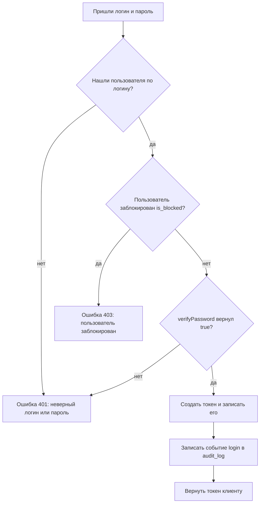
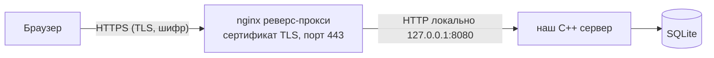

# Шаг 10. Аутентификация и безопасность

> **Цель шага:** научить систему **узнавать пользователя** (вход по логину и паролю) и
> **безопасно хранить** его данные. К концу шага у вас будет файл `infra/security.h/.cpp`
> с честным хешированием паролей, сервис входа `AuthService` с выдачей токена, понимание,
> что такое токен `Authorization: Bearer`, и middleware (привратник) в API, который не
> пускает незваных гостей. Всё это закрывает требование ТЗ **3.4 — безопасность по
> ГОСТ 17799** (авторизация, контроль доступа, шифрование, защита передачи).

> Диаграммы написаны на языке **Mermaid**. Если ваш редактор их не рисует — рядом всегда
> есть ASCII-версия и текстовое описание.

---

## 1. Зачем вообще нужна безопасность (и что требует ТЗ)

В магазине крутятся **деньги и личные данные людей**: телефоны клиентов, адреса доставки,
кто сколько заработал. Если в систему войдёт кто попало — он сможет менять заказы, читать
чужие адреса, обнулять остатки. Поэтому ТЗ (раздел 3.4, ГОСТ 17799) прямо требует четыре
вещи, и мы пройдём их по очереди:

| № | Требование ТЗ (3.4) | Простыми словами | Где в этом шаге |
|---|---------------------|------------------|-----------------|
| 1 | Авторизация (вход) | «Докажи, что ты — это ты» | раздел 2, 5 |
| 2 | Контроль доступа | «А что тебе вообще разрешено?» | раздел 2, 8 (детали — шаг `11`) |
| 3 | Шифрование данных | «Чтобы украденную базу нельзя было прочитать» | раздел 7 |
| 4 | Защита передачи | «Чтобы по дороге письмо не подслушали» | раздел 9 |

> **Бытовая аналогия на весь шаг.** Представьте офис. **Аутентификация** — охранник на входе
> сверяет ваше лицо с пропуском. **Авторизация** — ваш пропуск открывает не все двери, а
> только разрешённые. **Шифрование** — документы в сейфе лежат на языке, который без ключа
> не прочитать. **Защита передачи** — курьер везёт письмо в опечатанном бронированном
> конверте, а не открыткой.

---

## 2. Аутентификация против авторизации — НЕ путать

Это два разных слова, и новички их постоянно смешивают. Запомните разницу раз и навсегда:

- **Аутентификация** (authentication) — *«кто ты?»*. Проверка личности. Вы вводите логин и
  пароль, система убеждается: да, это пользователь №42, продавец Иванов.
- **Авторизация** (authorization) — *«что тебе можно?»*. Проверка прав. Иванов вошёл — но
  можно ли ему смотреть отчёты о прибыли? Это уже про роли и права.

```
АУТЕНТИФИКАЦИЯ  →  "Ты кто?"        →  логин + пароль   →  выдаём токен
АВТОРИЗАЦИЯ     →  "Тебе можно?"    →  роль + права     →  пускаем/403
```

Порядок всегда такой: **сначала аутентификация, потом авторизация**. Сначала охранник
узнаёт лицо, и только потом смотрит, какие двери открывает ваш пропуск.

В этом шаге (`10`) мы делаем **аутентификацию** и общую инфраструктуру безопасности.
Подробную **авторизацию** (роли и права, RBAC) разберём в следующем шаге (`11`).

---

## 3. Хранение паролей: главное правило безопасности

> **Правило №1, железное:** пароли **НИКОГДА** не хранятся в открытом виде. Никогда.
> Ни в БД, ни в логах, ни в файле.

Почему? Представьте, что в таблице `users` пароль лежит как есть: `password = "qwerty123"`.
Что будет, если базу украдут (а базы крадут регулярно)?

1. Злоумышленник сразу видит все пароли всех пользователей.
2. Люди используют один и тот же пароль везде — значит, он получит доступ и к их почте, и
   к банку.
3. Даже сам администратор магазина не должен иметь возможности подсмотреть чужой пароль.

Решение: мы храним не сам пароль, а его **необратимый отпечаток** — хеш.

### 3.1. Что такое хеш

**Хеш** — это результат работы математической функции, которая превращает любой текст в
строку фиксированной длины, причём **обратно восстановить исходный текст нельзя**.

```
"qwerty123"  --[функция SHA-256]-->  "65e84be33532fb784c48129675f9eff3a682b27168c0ea744b2cf58ee02337c5"
```

Свойства хорошей хеш-функции:

- **Односторонняя.** Из хеша нельзя вычислить пароль (только перебором).
- **Детерминированная.** Один и тот же пароль всегда даёт один и тот же хеш — иначе мы бы
  не смогли проверить вход.
- **Лавинная.** Поменяли одну букву в пароле — хеш меняется целиком.

> **Аналогия.** Хеш — это как фарш из мяса. Из мяса легко сделать фарш, но из фарша обратно
> кусок мяса не соберёшь. Мы храним «фарш» пароля. При входе делаем «фарш» из введённого
> пароля и сравниваем два фарша.

### 3.2. Зачем нужна соль (salt)

Один хеш — это ещё не безопасно. Проблема: одинаковые пароли дают **одинаковые хеши**.
Злоумышленники заранее насчитали огромные таблицы «пароль → хеш» (они называются *радужными
таблицами*, rainbow tables). Увидел знакомый хеш — узнал пароль.

**Соль** — это случайная строка, **уникальная для каждого пользователя**, которую мы
подмешиваем к паролю **перед** хешированием:

```
хеш = SHA-256( соль + пароль )
```

Что это даёт:

- У двух пользователей с паролем `"qwerty123"` будут **разные** хеши (потому что соли
  разные). Радужные таблицы бесполезны.
- Соль не секрет — её можно хранить рядом в БД (поле `password_salt`). Её задача не в
  скрытности, а в **уникальности**.

```
Пользователь A: соль="x9f2"  пароль="qwerty"  →  хеш SHA-256("x9f2qwerty") = abc...
Пользователь B: соль="k4m1"  пароль="qwerty"  →  хеш SHA-256("k4m1qwerty") = zzz...
                                                  ↑ хеши РАЗНЫЕ, хотя пароль один!
```

Именно поэтому в схеме БД (шаг `04`) у таблицы `users` есть **два** поля: `password_hash`
и `password_salt`.

### 3.3. ЧЕСТНОЕ предупреждение: SHA-256 — это учебно, в проде так нельзя

Мы используем `SHA-256` потому, что это просто и помогает понять идею. Но вы должны знать
правду:

> **В настоящем продакшене для паролей SHA-256 НЕ применяют.** Нужны специальные «медленные»
> алгоритмы: **bcrypt**, **argon2** (или scrypt, PBKDF2).

Почему? Звучит парадоксально: «медленный — это хорошо?». Да!

- `SHA-256` создана быть **быстрой**. Современная видеокарта считает **миллиарды** хешей в
  секунду. Если базу украдут, злоумышленник переберёт короткие пароли за минуты.
- `bcrypt`/`argon2` специально сделаны **медленными и прожорливыми по памяти**. Один хеш
  считается, скажем, 0.1 секунды. Для одного входа пользователя это незаметно. А для
  перебора миллиардов вариантов — это превращается в годы и делает атаку невыгодной.
- Кроме того, они **встраивают соль внутрь** и имеют настраиваемую «стоимость» (cost
  factor), которую повышают по мере роста мощности компьютеров.

**Вывод для учебного проекта:** мы пишем SHA-256+соль, чтобы понять механику, но в комментариях
кода и в этом тексте честно фиксируем: для реального магазина нужно заменить функцию
хеширования на `bcrypt` или `argon2` (например, через библиотеку `libsodium` для argon2).
Архитектура у нас правильная — менять придётся **только тело двух функций** в `security.cpp`,
потому что весь остальной код зовёт их через имена `hashPassword` / `verifyPassword`.

---

## 4. Реализация: `infra/security.h` и `infra/security.cpp`

Кладём безопасность в **инфраструктуру** (`src/infra/`), потому что это техническая
служба, не привязанная к конкретному модулю (см. слои в шаге `03`).

### 4.1. Заголовок `src/infra/security.h`

```cpp
#pragma once
// #pragma once — говорит компилятору: подключи этот файл только один раз,
// даже если #include на него встретится в десяти местах. Защита от повторов.

#include <string>   // std::string — строка переменной длины (текст)

namespace fs {  // fs = flowershop. Весь наш код живёт в этом пространстве имён,
                // чтобы наши имена не столкнулись с чужими (например, чужим Security).

// Класс-помощник для работы с паролями.
// Все методы static — это значит, что их можно звать без создания объекта:
//   fs::Security::hashPassword(...), а не security.hashPassword(...).
// Так удобно для «утилит без состояния»: класс просто группирует функции.
class Security {
public:
    // Сгенерировать новую случайную соль (например, 16 байт в hex-виде).
    // Возвращает строку, которую мы сохраним в users.password_salt.
    static std::string generateSalt();

    // Превратить пароль + соль в хеш (то, что ляжет в users.password_hash).
    // const std::string& — принимаем строку ПО ССЫЛКЕ и обещаем НЕ менять её.
    //   & означает «не копируй строку, дай мне на неё ссылку» (быстрее).
    //   const означает «я только читаю, портить не буду» (безопаснее).
    static std::string hashPassword(const std::string& password,
                                    const std::string& salt);

    // Проверить введённый пароль против сохранённых хеша и соли.
    // Возвращает true, если пароль верный. bool — логический тип: true/false.
    static bool verifyPassword(const std::string& password,
                               const std::string& salt,
                               const std::string& expectedHash);
};

}  // namespace fs
```

### 4.2. Реализация `src/infra/security.cpp`

> Чтобы не тянуть тяжёлую криптобиблиотеку, для учебного проекта мы возьмём компактную
> header-only реализацию SHA-256 (один файл `third_party/sha256.h` — таких в сети много под
> свободной лицензией). Если вы соберёте проект с OpenSSL, можно заменить на `SHA256()`
> оттуда — интерфейс наших функций при этом не изменится. Это и есть сила инкапсуляции:
> снаружи всё зовётся одинаково.

```cpp
#include "security.h"        // наш заголовок (объявления функций)
#include "../../third_party/sha256.h"  // компактная SHA-256 (учебно)

#include <random>            // генератор случайных чисел (для соли)
#include <sstream>           // std::ostringstream — собирать строку из кусочков
#include <iomanip>           // std::setw, std::setfill — форматирование hex

namespace fs {

// ---- 1. Генерация соли -----------------------------------------------------
std::string Security::generateSalt() {
    // random_device — источник «настоящей» случайности от операционной системы.
    std::random_device rd;
    // mt19937 — качественный генератор псевдослучайных чисел, засеянный от rd.
    std::mt19937 gen(rd());
    // Будем генерировать байты 0..255.
    std::uniform_int_distribution<int> dist(0, 255);

    std::ostringstream oss;  // сюда будем «складывать» hex-символы
    for (int i = 0; i < 16; ++i) {            // 16 байт = 128 бит случайности
        int byte = dist(gen);
        // Печатаем байт как две hex-цифры: setw(2) + setfill('0') = "0f", "a3"...
        oss << std::hex << std::setw(2) << std::setfill('0') << byte;
    }
    return oss.str();  // вернётся строка вида "9f2ca0...", длиной 32 символа
}

// ---- 2. Хеширование пароля -------------------------------------------------
std::string Security::hashPassword(const std::string& password,
                                   const std::string& salt) {
    // КЛЮЧЕВАЯ СТРОКА: подмешиваем соль К паролю перед хешированием.
    // Порядок (соль+пароль) должен быть одинаков и тут, и в verifyPassword.
    const std::string salted = salt + password;

    // sha256() из third_party — возвращает hex-строку фиксированной длины (64 символа).
    return sha256(salted);

    // !!! ВНИМАНИЕ (честное предупреждение для прода) !!!
    // SHA-256 — быстрый алгоритм. Для реального магазина ЗАМЕНИТЕ тело этой
    // функции на bcrypt или argon2 (медленные хеши). Например, через libsodium:
    //     crypto_pwhash_str(...);  // argon2, сам генерирует и хранит соль
    // Тогда функция generateSalt() станет не нужна, а verifyPassword будет
    // звать crypto_pwhash_str_verify(...). Остальной код менять НЕ придётся.
}

// ---- 3. Проверка пароля ----------------------------------------------------
bool Security::verifyPassword(const std::string& password,
                              const std::string& salt,
                              const std::string& expectedHash) {
    // Повторяем тот же путь: хешируем введённый пароль с той же солью...
    const std::string actualHash = hashPassword(password, salt);
    // ...и сравниваем с тем, что лежит в БД.
    return actualHash == expectedHash;

    // Замечание для прода: сравнение хешей лучше делать "constant-time"
    // (за одинаковое время независимо от того, где строки разошлись), чтобы
    // не дать атаку по времени. В учебном проекте обычным == достаточно.
}

}  // namespace fs
```

> **Что нового в C++ вы тут встретили:**
> - `static` методы — функции, привязанные к классу, а не к объекту.
> - `const std::string&` — приём аргумента по константной ссылке (быстро + безопасно).
> - `std::ostringstream` — «строка-копилка», в неё удобно складывать кусочки через `<<`.
> - `namespace fs { ... }` — пространство имён, чтобы наши имена не конфликтовали.

---

## 5. Вход в систему: `AuthService::login`

Теперь соберём логику входа в **сервисе** (`src/services/auth_service.*`). Напомню правило
слоёв из шага `03`: сервис содержит бизнес-логику, а в БД лезет через **репозиторий**
(`UserRepository` из шага `07`). Сам сервис SQL не пишет.

### 5.1. Что делает login по шагам



**ASCII-версия:**

```
логин+пароль -> найти юзера -> заблокирован? -> пароль верный? -> создать токен -> лог -> отдать токен
                    |нет             |да              |нет
                    v                v                v
                  401            403 блок           401
```

> **Важно про сообщение об ошибке.** Когда логин не найден ИЛИ пароль неверный — мы
> возвращаем **одинаковую** ошибку «неверный логин или пароль». Если бы мы говорили
> «такого логина нет» отдельно — злоумышленник смог бы перебором узнать, какие логины
> существуют. Это называется *защита от перечисления пользователей (user enumeration)*.

### 5.2. Заголовок `src/services/auth_service.h`

```cpp
#pragma once
#include <string>
#include <optional>            // std::optional — «значение, которое может отсутствовать»
#include "../domain/user.h"    // структура User (из шага 06)
#include "../repositories/user_repository.h"  // доступ к таблице users

namespace fs {

// Результат успешного входа: токен + кто вошёл.
struct LoginResult {
    std::string token;   // что клиент будет присылать в заголовке Authorization
    int64_t     user_id; // id вошедшего (int64_t — целое 64 бита, для id)
    int64_t     role_id; // его роль (понадобится для авторизации в шаге 11)
};

class AuthService {
public:
    // Конструктор получает ссылку на репозиторий пользователей.
    // Это "внедрение зависимости": сервис не создаёт репозиторий сам,
    // ему его дают снаружи. Так сервис легко тестировать (шаг 14).
    explicit AuthService(UserRepository& users) : users_(users) {}

    // Попытка входа. Возвращает:
    //   - заполненный LoginResult, если всё хорошо;
    //   - std::nullopt (пусто), если логин/пароль неверны.
    // Для случая "заблокирован" бросим исключение (см. .cpp) — это другая ситуация.
    std::optional<LoginResult> login(const std::string& login,
                                     const std::string& password);

    // Проверить токен и вернуть id пользователя, если токен валиден.
    std::optional<int64_t> userIdByToken(const std::string& token);

private:
    UserRepository& users_;  // & — храним ССЫЛКУ на чужой объект, не копию

    // Хранилище активных токенов прямо в памяти: токен -> user_id.
    // (Почему в памяти — объяснено в разделе 6.)
    std::unordered_map<std::string, int64_t> activeTokens_;
};

}  // namespace fs
```

### 5.3. Реализация `src/services/auth_service.cpp`

```cpp
#include "auth_service.h"
#include "../infra/security.h"   // hashPassword/verifyPassword
#include <stdexcept>             // std::runtime_error для исключений
#include <random>
#include <sstream>
#include <iomanip>

namespace fs {

// Маленький помощник: сгенерировать случайный токен (32 hex-символа).
static std::string makeToken() {
    std::random_device rd; std::mt19937 gen(rd());
    std::uniform_int_distribution<int> dist(0, 255);
    std::ostringstream oss;
    for (int i = 0; i < 16; ++i)
        oss << std::hex << std::setw(2) << std::setfill('0') << dist(gen);
    return oss.str();
}

std::optional<LoginResult> AuthService::login(const std::string& login,
                                              const std::string& password) {
    // 1. Найти пользователя по логину (репозиторий делает SELECT ... WHERE login=?).
    //    findByLogin вернёт std::optional<User>: либо нашёл, либо пусто.
    std::optional<User> maybeUser = users_.findByLogin(login);
    if (!maybeUser) {
        // Логина нет. Возвращаем "пусто" — НЕ уточняем причину (см. защиту выше).
        return std::nullopt;
    }
    const User& user = *maybeUser;  // достаём User из optional (разыменование *)

    // 2. Проверка блокировки. Заблокированного НЕ пускаем, даже с верным паролем.
    if (user.is_blocked) {
        throw std::runtime_error("Пользователь заблокирован");
    }

    // 3. Проверка пароля через нашу инфраструктуру безопасности.
    bool ok = Security::verifyPassword(password,
                                       user.password_salt,
                                       user.password_hash);
    if (!ok) {
        return std::nullopt;  // пароль неверный — та же безликая ошибка
    }

    // 4. Всё верно — выдаём токен и запоминаем его (токен -> user_id).
    std::string token = makeToken();
    activeTokens_[token] = user.id;

    // 5. (Аудит) запись события login в audit_log делаем в шаге 12 — там же,
    //    где разберём AuditService. Здесь оставим место: auditService_.log(...).

    // 6. Вернуть результат. {token, user.id, user.role_id} — создание LoginResult.
    return LoginResult{ token, user.id, user.role_id };
}

std::optional<int64_t> AuthService::userIdByToken(const std::string& token) {
    // Ищем токен в нашей карте активных токенов.
    auto it = activeTokens_.find(token);
    if (it == activeTokens_.end()) {
        return std::nullopt;       // токена нет — значит невалиден
    }
    return it->second;             // нашли — вернуть user_id
}

}  // namespace fs
```

> **`std::optional<T>`** — важная штука для новичка. Это «коробка», в которой либо лежит
> значение типа `T`, либо ничего (`std::nullopt`). Так мы честно выражаем «пользователь
> может не найтись», не прибегая к спецзначениям вроде `-1`. Проверяем через `if (opt)`,
> достаём через `*opt`.

---

## 6. Токены: что это и почему мы выбрали токен в памяти/таблице

После успешного входа мы выдаём **токен**. Что это и зачем?

HTTP не помнит, кто вы. Каждый запрос — как первый разговор с незнакомцем. Если бы клиент
присылал логин и пароль в **каждом** запросе — это и медленно (хеш считать каждый раз), и
опасно. Вместо этого после входа мы выдаём **временный пропуск — токен**. Дальше клиент
показывает его при каждом запросе.

> **Аналогия.** Вы пришли в отель, на ресепшене показали паспорт (логин/пароль — один раз).
> Вам выдали электронную карту-ключ (токен). Дальше вы открываете номер картой, а не
> размахиваете паспортом у каждой двери.

### 6.1. Два популярных вида токенов

| | Токен в БД/памяти (мы выбираем это) | JWT (подписанный токен) |
|--|--------------------------------------|--------------------------|
| Что это | случайная строка, сервер помнит «токен → юзер» | строка, внутри которой зашит сам юзер + подпись |
| Где хранится | в памяти сервера или в таблице | только у клиента, сервер ничего не хранит |
| Отозвать (logout) | легко: удалить запись | сложно: токен живёт сам по себе до истечения |
| Проверка | поиск в карте/таблице | проверка подписи (без обращения к БД) |
| Сложность | проще для новичка | сложнее: надо разобраться с подписью HMAC |

**Что такое JWT простыми словами:** это строка из трёх частей через точку
(`заголовок.данные.подпись`). В «данных» прямо записано «я пользователь №42, продавец,
истекаю в 18:00». «Подпись» — это печать сервера секретным ключом: подделать данные нельзя,
не зная ключа. Сервер проверяет подпись и верит содержимому, ничего не храня у себя. Это
удобно для больших систем с множеством серверов, но **избыточно для учебного проекта**.

### 6.2. Наш выбор: токен в памяти сервера

Для учебного магазина мы храним токены **в памяти** сервера (`unordered_map` в `AuthService`,
см. раздел 5). Почему так:

- **Просто.** Никакой криптографии подписи, никаких новых таблиц.
- **Легко выйти из системы.** logout = удалить строку из карты.
- Минус — при перезапуске сервера все токены теряются, и всем придётся войти заново. Для
  учебного проекта это абсолютно нормально.

> **Альтернатива для самостоятельной практики:** добавить таблицу `sessions(token,
> user_id, expires_at)` и хранить токены там — тогда они переживут перезапуск. Это та же
> идея, просто хранилище — БД вместо памяти. Решайте сами; в нашей основной версии — память.

### 6.3. Заголовок `Authorization: Bearer`

Клиент присылает токен в стандартном HTTP-заголовке:

```
Authorization: Bearer 9f2ca0b73e...токен...
```

Слово `Bearer` («предъявитель») — стандарт. Оно значит «тот, кто предъявил этот токен,
считается его владельцем». Поэтому токен — как наличные деньги: кто его держит, тот и
«хозяин». Отсюда вывод — токен надо беречь (и передавать только по HTTPS, см. раздел 9).

---

## 7. Шифрование данных в БД (что требует ТЗ и что делаем мы)

ТЗ требует «шифрование данных». Важно понимать **уровни** шифрования — их несколько, и
путать их нельзя:

1. **Хеширование паролей** (уровень: отдельные секретные поля). Это **не** обратимое
   шифрование, а необратимый отпечаток — мы его уже сделали (разделы 3–4). Для паролей
   это **правильный** подход: расшифровывать их никто не должен.
2. **Шифрование отдельных чувствительных полей** (например, телефон клиента) — данные
   шифруются обратимым алгоритмом и расшифровываются при чтении. Нужен секретный ключ.
   Сложно и для учебного проекта избыточно — только **упоминаем**.
3. **Шифрование всего файла БД** через **SQLCipher** — это расширение SQLite, которое
   прозрачно шифрует **весь файл** `flowershop.db` одним ключом. Программа работает как
   обычно, но укравший файл без ключа увидит «кашу». Это самый практичный вариант «как в
   проде» — упоминаем как **опцию** (подключается заменой обычного sqlite3 на сборку с
   SQLCipher, код почти не меняется).

```
                ┌─ хеш паролей (необратимо)        ← ДЕЛАЕМ (security.cpp)
Шифрование в БД ─┼─ шифрование отдельных полей       ← упоминаем
                └─ SQLCipher: весь файл .db          ← упоминаем как опцию
```

> **Что достаточно для учебного проекта:** надёжный **хеш паролей** (сделали) + **упоминание**
> SQLCipher и TLS. Этого хватит, чтобы честно закрыть пункт ТЗ и показать, что вы понимаете
> разницу между уровнями. Полное шифрование полей — задача со звёздочкой.

---

## 8. Контроль доступа: middleware-привратник в API

ТЗ требует «контроль доступа». Базовый кирпич — **middleware** (промежуточный обработчик),
который стоит «на входе» в защищённые эндпоинты и проверяет токен **до** того, как запрос
попадёт в контроллер.

> **Аналогия.** Middleware — это охранник в коридоре. Любой, кто идёт к защищённым дверям,
> сначала проходит мимо него. Нет пропуска (токена) — дальше не пройдёшь, разворот на 401.

Здесь, в шаге `10`, middleware проверяет только **аутентификацию** (есть ли валидный токен →
кто пользователь). Проверку **прав** (можно ли ему именно это действие) добавим в шаге `11`.

### 8.1. Извлечение токена и проверка в `src/api/server.*`

Мы используем `cpp-httplib` (см. стек в спецификации). Покажем функцию-помощник, которую
контроллеры будут звать в начале защищённого обработчика.

```cpp
#include "../../third_party/httplib.h"  // header-only HTTP-сервер
#include "../services/auth_service.h"
#include <optional>
#include <string>

namespace fs {

// Достаёт токен из заголовка "Authorization: Bearer <токен>".
// Возвращает сам токен или std::nullopt, если заголовка нет/формат не тот.
static std::optional<std::string> extractBearer(const httplib::Request& req) {
    // get_header_value вернёт пустую строку, если заголовка нет.
    std::string h = req.get_header_value("Authorization");
    const std::string prefix = "Bearer ";
    // rfind(prefix, 0) == 0 означает "строка начинается с prefix".
    if (h.rfind(prefix, 0) != 0) {
        return std::nullopt;  // нет нужного префикса
    }
    return h.substr(prefix.size());  // вернуть всё после "Bearer "
}

// MIDDLEWARE: проверяет токен. Если ок — кладёт user_id в out и возвращает true.
// Если нет — сам отвечает клиенту 401 и возвращает false (контроллер прерывается).
bool requireAuth(const httplib::Request& req, httplib::Response& res,
                 AuthService& auth, int64_t& outUserId) {
    auto token = extractBearer(req);
    if (!token) {
        res.status = 401;  // 401 = не авторизован (нет пропуска вообще)
        res.set_content(R"({"error":"Требуется авторизация"})", "application/json");
        return false;
    }
    auto userId = auth.userIdByToken(*token);
    if (!userId) {
        res.status = 401;  // токен есть, но он не валиден (просрочен/выдуман)
        res.set_content(R"({"error":"Неверный или истёкший токен"})", "application/json");
        return false;
    }
    outUserId = *userId;   // отдаём наверх id пользователя
    return true;           // путь свободен — контроллер продолжает работу
}

}  // namespace fs
```

> `R"(...)"` — это **сырой строковый литерал** C++. Внутри него не нужно экранировать
> кавычки, что удобно для JSON. То есть `R"({"error":"..."})"` — это просто строка с
> кавычками внутри.

### 8.2. Как контроллер использует middleware

```cpp
// Пример: защищённый эндпоинт "мои заказы".
// (Полные контроллеры — в шагах 08/09; здесь — только проверка доступа.)
server.Get("/api/orders/my", [&](const httplib::Request& req, httplib::Response& res) {
    int64_t userId = 0;
    // ПЕРВАЯ строка любого защищённого обработчика — проверка токена:
    if (!fs::requireAuth(req, res, authService, userId)) {
        return;  // requireAuth уже выставил 401 и текст — просто выходим
    }
    // Сюда дошли только аутентифицированные. userId — кто спрашивает.
    // ... достать заказы этого userId и вернуть JSON ...
});
```

А единственный **публичный** (без токена) эндпоинт — это вход:

```cpp
// POST /api/auth/login — токен ещё не нужен, мы его тут и выдаём.
server.Post("/api/auth/login", [&](const httplib::Request& req, httplib::Response& res) {
    // распарсить JSON {"login": "...", "password": "..."}
    auto body = nlohmann::json::parse(req.body, nullptr, false);
    if (body.is_discarded()) { res.status = 400; return; }  // битый JSON

    auto result = authService.login(body.value("login", ""),
                                    body.value("password", ""));
    if (!result) {
        res.status = 401;  // неверный логин или пароль (без уточнений!)
        res.set_content(R"({"error":"Неверный логин или пароль"})", "application/json");
        return;
    }
    // Успех: отдаём токен. Клиент сохранит его и будет слать в Authorization.
    nlohmann::json out = { {"token", result->token}, {"user_id", result->user_id} };
    res.status = 200;
    res.set_content(out.dump(), "application/json");
});
```

---

## 9. Защита передачи: HTTPS/TLS

Последний пункт ГОСТ из ТЗ — **защита передачи данных**. Токен, логин, пароль летят по
сети. Если они идут по обычному `http://`, их можно подслушать (особенно в открытом Wi-Fi).

**TLS** (раньше назывался SSL) — это «бронированный конверт» для трафика. С ним адрес
становится `https://`, и весь обмен шифруется: подслушать нельзя.

> **Аналогия.** `http` — это открытка: любой почтальон прочитает. `https` (TLS) — это
> запечатанное письмо в непрозрачном конверте.

### Как это устроено на практике (и что делаем мы)

- **В проде** перед нашим C++-сервером ставят **реверс-прокси** — обычно **nginx**. Nginx
  «слушает» интернет на `https://` (443-й порт), расшифровывает TLS и передаёт уже
  расшифрованный запрос нашему серверу на локальный `http://127.0.0.1:8080`. Сертификат
  (например, бесплатный от Let's Encrypt) настраивается в nginx. Так наш C++-код вообще не
  знает про шифрование — этим занимается специально обученный nginx.



**ASCII:**

```
Браузер  --HTTPS/TLS-->  [nginx :443]  --локально http-->  [C++ сервер :8080]  -->  (SQLite)
          (шифр снаружи)                (внутри уже расшифровано, никто не подслушает)
```

- **Локально (при разработке)** мы спокойно работаем по `http://localhost:8080` без TLS —
  трафик не выходит за пределы вашего компьютера, подслушивать некому. Это нормально и так
  и принято.

> **Вывод по защите передачи:** код TLS мы не пишем. Мы фиксируем архитектурное решение:
> «в продакшене перед сервером стоит nginx с TLS-сертификатом; локально — http». Этого
> достаточно, чтобы закрыть требование ТЗ осознанно.

---

## 10. Связь с ТЗ (требование → где реализовано)

| Требование ТЗ (3.4, ГОСТ 17799) | Где реализовано в этом шаге |
|---------------------------------|------------------------------|
| Авторизация / вход по паролю | `AuthService::login`, `POST /api/auth/login` (разделы 5, 8) |
| Хранение паролей в безопасном виде | `Security::hashPassword/verifyPassword`, SHA-256+соль (разделы 3, 4) |
| Контроль доступа | middleware `requireAuth` + 401 (раздел 8); права — шаг `11` |
| Блокировка пользователей | проверка `is_blocked` в `login` (раздел 5) |
| Шифрование данных | хеш паролей; упоминание SQLCipher / шифрования полей (раздел 7) |
| Защита передачи | HTTPS/TLS через nginx (прод), http локально (раздел 9) |

---

## Проверь себя

1. Чем отличается **аутентификация** от **авторизации**? Что идёт первым?
2. Почему пароли нельзя хранить в открытом виде и что мы храним вместо них?
3. Что такое **соль** и зачем у каждого пользователя она своя?
4. Почему для прода SHA-256 не подходит, а нужны bcrypt/argon2 — что значит «медленный
   хеш — это хорошо»?
5. Что такое **токен** и зачем заголовок `Authorization: Bearer`? Почему мы выбрали токен
   в памяти, а не JWT?
6. Что делает middleware `requireAuth` и какой HTTP-код вернёт при отсутствии токена?

---

## Промпт для ИИ-агента

> Я изучаю C++ и делаю учебную систему цветочного магазина (слоистая архитектура, SQLite,
> cpp-httplib). Ниже — документ про аутентификацию и безопасность (шаг 10). Прочитай его и:
> (1) погоняй меня вопросами на разницу аутентификация/авторизация и на тему хеш+соль
> (5 вопросов по очереди); (2) проверь, понимаю ли я, почему SHA-256 учебно, а в проде нужен
> bcrypt/argon2; (3) предложи, как аккуратно заменить тело `hashPassword/verifyPassword` на
> argon2 через libsodium, не трогая остальной код; (4) укажи, если в моём `login` есть утечка
> информации (user enumeration). Схему БД не меняй — она зафиксирована. Документ:
> [вставьте содержимое этого файла].

---

Назад → [09-бизнес-логика-сервисы.md](09-бизнес-логика-сервисы.md)  Дальше → [11-роли-и-права-доступа.md](11-роли-и-права-доступа.md)
