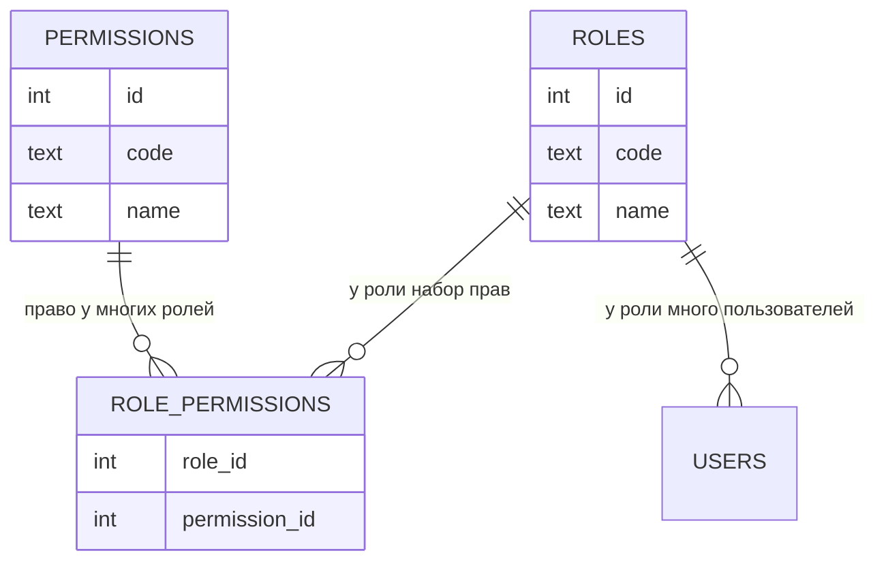
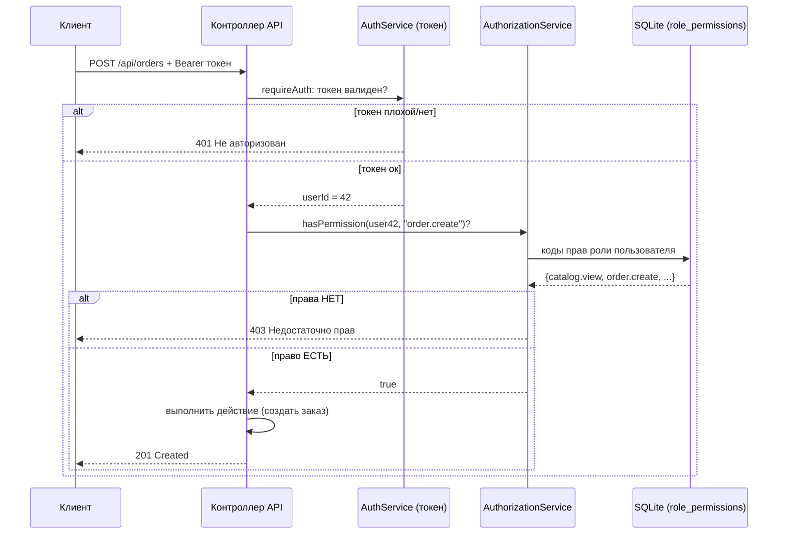

# Шаг 11. Роли и права доступа (RBAC)

> **Цель шага:** научить систему отвечать на вопрос **«а можно ли этому пользователю это
> делать?»**. К концу шага у вас будет: справочник прав (`permissions`), заполненная связь
> «роль → права» (`role_permissions`) готовым SQL, сервис `AuthorizationService` с функцией
> `hasPermission(user, "order.create")`, проверки прав в контроллерах API с кодом **403** при
> отказе и блокировка пользователей через `is_blocked`. Это закрывает требование ТЗ:
> **администратор управляет ролями и правами**.

> Диаграммы написаны на **Mermaid**; рядом всегда ASCII-версия и текст.

---

## 1. Зачем нужен RBAC и что это такое

В прошлом шаге (`10`) мы научились **узнавать** пользователя (аутентификация) и выдавать
токен. Но узнать «кто ты» — это полдела. Дальше встаёт вопрос **«что тебе можно?»** — это
**авторизация**. Курьер не должен смотреть отчёты о прибыли, клиент не должен списывать
товар со склада, продавец не должен управлять ролями. Каждому — своё.

Можно было бы в каждом месте кода писать `if (роль == "продавец") ...`. Но это кошмар:
ролей семь, действий — десятки, и при любом изменении пришлось бы править сотни мест.

**RBAC** (Role-Based Access Control, управление доступом на основе ролей) решает это
красиво через **три уровня**:

```
Пользователь  ──имеет──>  Роль  ──имеет набор──>  Прав (permissions)
  Иванов                  Продавец               order.create, client.create, ...
```

Идея: мы не привязываем права к человеку напрямую. Человеку даём **роль**, а у роли есть
**набор прав**. Хотим разрешить продавцам новое действие — добавляем право роли «продавец»
**в одном месте**, и оно появляется у всех продавцов сразу.

> **Аналогия.** В компании не выдают каждому сотруднику свой уникальный набор ключей. Есть
> **должности** (роли): «бухгалтер», «охранник». К должности привязан набор ключей (права).
> Принял человека бухгалтером — он автоматически получил все «бухгалтерские» ключи. RBAC —
> это ровно эта система должностей и ключей.

ТЗ прямо требует, чтобы **администратор управлял ролями и правами** — то есть мог менять,
у какой роли какие права. RBAC даёт для этого естественную модель.

---

## 2. Модель данных: три таблицы (из шага 04)

Мы НЕ придумываем новых таблиц — всё уже спроектировано в шаге `04`. Напомню их:

- **roles** (`id`, `code`, `name`) — справочник ролей. Заполнен в `seed.sql` (шаг `04`):
  `admin`, `florist`, `seller`, `courier`, `purchaser`, `client`, `owner`.
- **permissions** (`id`, `code`, `name`) — справочник прав вида `order.create`. **Заполним
  в этом шаге.**
- **role_permissions** (`role_id`, `permission_id`) — какая роль имеет какие права. Это
  таблица связи **много-ко-многим**. **Заполним в этом шаге.**

### Почему «много-ко-многим» и зачем отдельная таблица связи

У одной роли — много прав. И одно право (например, `order.view`) есть у нескольких ролей.
Это и есть связь **многие-ко-многим**. В реляционной БД её нельзя выразить полем в одной из
таблиц — нужна **третья, связующая таблица**, где каждая строка = одна пара «роль + право».



**ASCII:**

```
   roles                role_permissions                permissions
 +--------+            +---------+----------+          +----------------+
 | id code|<-----------| role_id | perm_id  |--------->| id  code       |
 +--------+   1     M   +---------+----------+   M   1  +----------------+
                         (каждая строка = одна пара "роль имеет право")
```

---

## 3. Полный список прав (коды permissions)

Право — это короткий машинный код вида `сущность.действие`. Такой формат читается легко и
легко группируется. Ниже — **полный связный список** прав, выведенный из ТЗ по каждой роли.

| Код права | Что разрешает |
|-----------|---------------|
| `catalog.view` | Смотреть каталог товаров |
| `order.create` | Создавать заказы |
| `order.view` | Видеть заказы |
| `order.view_own` | Видеть **только свои** заказы (для клиента) |
| `order.update_status` | Менять статус заказа / отмечать этапы сборки |
| `order.return` | Оформлять возврат заказа |
| `client.create` | Заводить карточку клиента |
| `client.view` | Смотреть клиентов |
| `payment.pay` | Производить оплату |
| `review.create` | Оставлять оценку заказа |
| `stock.view` | Смотреть остатки на складе |
| `stock.receive` | Регистрировать поступление товара |
| `stock.quality` | Оценивать качество и ставить срок годности |
| `stock.write_off` | Списывать товар (брак/использование/просрочка) |
| `delivery.view` | Видеть доставки и адреса |
| `delivery.update` | Менять статус доставки |
| `report.view` | Смотреть отчёты (продажи, прибыль, популярное) |
| `user.manage` | Управлять пользователями (создавать, блокировать) |
| `role.manage` | Управлять ролями и их правами |
| `audit.view` | Смотреть журнал действий (логи) |

> **Принцип именования:** `сущность.действие`. Это удобно: можно по префиксу понять, к чему
> относится право (`stock.*` — про склад). В коде мы будем сверять именно эти строки.

---

## 4. Раскладка «роль → права» (из ТЗ)

Теперь распределим права по семи ролям ровно так, как описывает ТЗ (роли — из шага `00`).

| Роль | Права |
|------|-------|
| **admin** (Администратор) | **ВСЕ** права (полный доступ, управление ролями/правами/пользователями, логи) |
| **florist** (Флорист) | `catalog.view`, `order.view`, `order.update_status`, `stock.view`, `stock.write_off` |
| **seller** (Продавец) | `catalog.view`, `order.create`, `order.view`, `order.update_status`, `order.return`, `client.create`, `client.view`, `payment.pay` |
| **courier** (Курьер) | `delivery.view`, `delivery.update`, `order.view` |
| **purchaser** (Закупщик/склад) | `stock.view`, `stock.receive`, `stock.quality`, `stock.write_off`, `catalog.view` |
| **client** (Клиент) | `catalog.view`, `order.create`, `order.view_own`, `payment.pay`, `review.create` |
| **owner** (Владелец) | `report.view` (плюс по желанию `order.view`, чтобы видеть заказы в отчётах) |

Читать так: «продавец может смотреть каталог, создавать/видеть/менять статус заказов,
оформлять возвраты, заводить и смотреть клиентов, проводить оплату». Сверьте с описанием
ролей в шаге `00` — соответствие один-в-один.

---

## 5. Готовый SQL: заполняем `permissions` и `role_permissions`

Добавьте это в `db/seed.sql` (ниже уже имеющихся вставок ролей и статусов из шага `04`).
Код написан так, чтобы НЕ зависеть от конкретных числовых `id`: мы находим id по `code`
через подзапросы — это надёжно и читаемо.

### 5.1. Справочник прав

```sql
-- ===== Права (permissions) — полный список из шага 11 =====
INSERT INTO permissions (code, name) VALUES
 ('catalog.view',        'Просмотр каталога'),
 ('order.create',        'Создание заказа'),
 ('order.view',          'Просмотр заказов'),
 ('order.view_own',      'Просмотр своих заказов'),
 ('order.update_status', 'Изменение статуса заказа'),
 ('order.return',        'Оформление возврата'),
 ('client.create',       'Создание клиента'),
 ('client.view',         'Просмотр клиентов'),
 ('payment.pay',         'Проведение оплаты'),
 ('review.create',       'Оценка заказа'),
 ('stock.view',          'Просмотр остатков'),
 ('stock.receive',       'Регистрация поступления'),
 ('stock.quality',       'Оценка качества и срока'),
 ('stock.write_off',     'Списание товара'),
 ('delivery.view',       'Просмотр доставок'),
 ('delivery.update',     'Изменение статуса доставки'),
 ('report.view',         'Просмотр отчётов'),
 ('user.manage',         'Управление пользователями'),
 ('role.manage',         'Управление ролями и правами'),
 ('audit.view',          'Просмотр журнала действий');
```

### 5.2. Связь «роль → права»

```sql
-- ===== admin: ВСЕ права =====
-- Хитрый приём: связываем роль admin с КАЖДЫМ правом из permissions сразу.
INSERT INTO role_permissions (role_id, permission_id)
SELECT (SELECT id FROM roles WHERE code = 'admin'), p.id
FROM permissions p;

-- Дальше — вспомогательный шаблон: для роли и списка кодов прав вставляем пары.
-- Подзапрос (SELECT id FROM roles WHERE code=...) находит role_id по коду.
-- IN (...) выбирает нужные права из permissions по их кодам.

-- ===== florist (Флорист) =====
INSERT INTO role_permissions (role_id, permission_id)
SELECT (SELECT id FROM roles WHERE code = 'florist'), p.id
FROM permissions p
WHERE p.code IN ('catalog.view','order.view','order.update_status',
                 'stock.view','stock.write_off');

-- ===== seller (Продавец) =====
INSERT INTO role_permissions (role_id, permission_id)
SELECT (SELECT id FROM roles WHERE code = 'seller'), p.id
FROM permissions p
WHERE p.code IN ('catalog.view','order.create','order.view','order.update_status',
                 'order.return','client.create','client.view','payment.pay');

-- ===== courier (Курьер) =====
INSERT INTO role_permissions (role_id, permission_id)
SELECT (SELECT id FROM roles WHERE code = 'courier'), p.id
FROM permissions p
WHERE p.code IN ('delivery.view','delivery.update','order.view');

-- ===== purchaser (Закупщик/склад) =====
INSERT INTO role_permissions (role_id, permission_id)
SELECT (SELECT id FROM roles WHERE code = 'purchaser'), p.id
FROM permissions p
WHERE p.code IN ('stock.view','stock.receive','stock.quality',
                 'stock.write_off','catalog.view');

-- ===== client (Клиент) =====
INSERT INTO role_permissions (role_id, permission_id)
SELECT (SELECT id FROM roles WHERE code = 'client'), p.id
FROM permissions p
WHERE p.code IN ('catalog.view','order.create','order.view_own',
                 'payment.pay','review.create');

-- ===== owner (Владелец) =====
INSERT INTO role_permissions (role_id, permission_id)
SELECT (SELECT id FROM roles WHERE code = 'owner'), p.id
FROM permissions p
WHERE p.code IN ('report.view','order.view');
```

> **Почему через подзапросы, а не «role_id=1»?** Если завтра порядок строк в `roles`
> изменится, числовые id «поплывут», и жёстко прописанные числа сломаются. А `code` —
> стабильный. Это хорошая привычка: **связывать по смысловому коду, а не по случайному id**.

---

## 6. Проверка прав в коде: `AuthorizationService`

Теперь — C++. Сервис авторизации живёт в `src/services/` (бизнес-правило «кому что можно»),
а в БД лезет через репозиторий (правило слоёв из шага `03`).

### 6.1. Идея функции `hasPermission`

```
hasPermission(user, "order.create")  →  true / false
        |
        └─ берём role_id пользователя
           берём все коды прав этой роли (через role_permissions)
           есть ли среди них "order.create"?
```

Чтобы не дёргать БД на каждый вопрос, мы один раз загрузим набор прав роли в память
(в `std::unordered_set<std::string>` — «множество строк», быстрый поиск по значению).

### 6.2. Заголовок `src/services/authorization_service.h`

```cpp
#pragma once
#include <string>
#include <unordered_set>      // множество уникальных значений с быстрым поиском
#include <unordered_map>      // карта ключ->значение (кэш прав по роли)
#include "../domain/user.h"   // структура User (есть поля id, role_id, is_blocked)
#include "../repositories/permission_repository.h"  // SQL по правам (шаг 07)

namespace fs {

class AuthorizationService {
public:
    // Конструктор получает репозиторий прав (внедрение зависимости).
    explicit AuthorizationService(PermissionRepository& perms) : perms_(perms) {}

    // Главный вопрос: есть ли у пользователя право с таким кодом?
    // user — по константной ссылке (не копируем, не меняем).
    // permissionCode — например "order.create".
    bool hasPermission(const User& user, const std::string& permissionCode);

private:
    PermissionRepository& perms_;

    // Кэш: role_id -> набор кодов прав этой роли. Чтобы не ходить в БД каждый раз.
    std::unordered_map<int64_t, std::unordered_set<std::string>> cache_;

    // Загрузить (и закэшировать) права для роли, вернуть ссылку на набор.
    const std::unordered_set<std::string>& permsForRole(int64_t role_id);
};

}  // namespace fs
```

### 6.3. Реализация `src/services/authorization_service.cpp`

```cpp
#include "authorization_service.h"

namespace fs {

const std::unordered_set<std::string>&
AuthorizationService::permsForRole(int64_t role_id) {
    // Уже загружали права этой роли? Тогда вернём из кэша.
    auto it = cache_.find(role_id);
    if (it != cache_.end()) {
        return it->second;
    }
    // Иначе спросим репозиторий: SELECT p.code FROM role_permissions ... WHERE role_id=?
    // Репозиторий вернёт std::vector<std::string> — список кодов прав.
    std::vector<std::string> codes = perms_.permissionCodesForRole(role_id);

    // Переложим вектор в множество (set) — так проверка "есть ли код" будет мгновенной.
    std::unordered_set<std::string> set(codes.begin(), codes.end());

    // Сохраним в кэш и вернём ссылку на сохранённое.
    auto [pos, _] = cache_.emplace(role_id, std::move(set));
    return pos->second;
}

bool AuthorizationService::hasPermission(const User& user,
                                         const std::string& permissionCode) {
    // Заблокированному не разрешено НИЧЕГО (двойная защита; основная — при входе).
    if (user.is_blocked) {
        return false;
    }
    // Берём набор прав роли пользователя и ищем в нём нужный код.
    // count(x) у множества вернёт 1, если элемент есть, иначе 0.
    const auto& codes = permsForRole(user.role_id);
    return codes.count(permissionCode) > 0;
}

}  // namespace fs
```

> **Новые конструкции C++:**
> - `std::unordered_set<std::string>` — множество строк; `.count("x")` отвечает «есть/нет»
>   почти мгновенно.
> - `std::move(set)` — «перемещение»: отдаём содержимое в кэш без копирования (быстро).
> - `auto [pos, _] = ...` — *структурное связывание*: распаковываем пару, что вернул
>   `emplace`, в две переменные; `_` — то, что нам не нужно.

---

## 7. Проверка прав в контроллерах API → 403 при отказе

В шаге `10` middleware `requireAuth` проверял **аутентификацию** (есть ли валидный токен).
Теперь добавим проверку **прав**. Различие в кодах ответа важно:

- **401** (Unauthorized) — «ты вообще не представился» (нет/плохой токен) → из шага `10`.
- **403** (Forbidden) — «я знаю, кто ты, но **тебе это нельзя**» → добавляем здесь.

> **Аналогия.** 401 — охранник не пустил, потому что у вас нет пропуска вообще. 403 —
> пропуск есть, охранник вас узнал, но именно эта дверь вам не открывается.

### 7.1. Middleware `requirePermission`

```cpp
#include "../../third_party/httplib.h"
#include "../services/authorization_service.h"
#include "../repositories/user_repository.h"

namespace fs {

// Предполагаем, что requireAuth (шаг 10) уже дал нам userId.
// Эта функция проверяет КОНКРЕТНОЕ право. Если права нет — сама отвечает 403.
bool requirePermission(httplib::Response& res,
                       AuthorizationService& authz,
                       UserRepository& users,
                       int64_t userId,
                       const std::string& permissionCode) {
    // Достаём пользователя (нужны role_id и is_blocked).
    auto user = users.findById(userId);
    if (!user) {                       // на всякий случай: вдруг удалён
        res.status = 401;
        res.set_content(R"({"error":"Пользователь не найден"})", "application/json");
        return false;
    }
    if (!authz.hasPermission(*user, permissionCode)) {
        res.status = 403;              // <-- ОТКАЗ: знаем кто ты, но нельзя
        res.set_content(R"({"error":"Недостаточно прав"})", "application/json");
        return false;
    }
    return true;                       // право есть — пропускаем
}

}  // namespace fs
```

### 7.2. Пример защищённого эндпоинта

```cpp
// POST /api/orders — создать заказ. Нужны: валидный токен + право order.create.
server.Post("/api/orders", [&](const httplib::Request& req, httplib::Response& res) {
    int64_t userId = 0;
    // Шаг 1 (из шага 10): аутентификация. Нет токена -> 401.
    if (!fs::requireAuth(req, res, authService, userId)) return;
    // Шаг 2 (этот шаг): авторизация. Нет права -> 403.
    if (!fs::requirePermission(res, authzService, userRepo, userId, "order.create")) return;

    // Сюда дошли только те, кому МОЖНО создавать заказы.
    // ... разобрать JSON, позвать OrderService::createOrder(...) ...
});
```

Запомните этот шаблон из двух строк — он повторяется почти в каждом защищённом обработчике:
**сначала `requireAuth`, потом `requirePermission`.**

---

## 8. Блокировка пользователей (`is_blocked`)

ТЗ требует, чтобы администратор мог **блокировать пользователей** (например, уволенного
сотрудника). У таблицы `users` для этого есть поле `is_blocked` (0/1), которое в C++ мы
храним как `bool` (см. соглашения в спецификации).

Защита от заблокированного работает на **двух рубежах**:

1. **При входе** (`AuthService::login`, шаг `10`): заблокированному не выдаём токен вовсе —
   возвращаем «пользователь заблокирован» (403). Он не сможет даже войти.
2. **При проверке прав** (`hasPermission`, раздел 6): даже если у него каким-то образом
   остался старый токен, `hasPermission` для заблокированного вернёт `false` → 403 на любое
   действие. Это «ремень безопасности» на случай, если человека заблокировали уже после
   входа.

Само управление блокировкой — это эндпоинт администратора (нужно право `user.manage`):

```cpp
// PATCH /api/users/{id}/block — заблокировать/разблокировать. Только с правом user.manage.
server.Patch(R"(/api/users/(\d+)/block)",
  [&](const httplib::Request& req, httplib::Response& res) {
    int64_t adminId = 0;
    if (!fs::requireAuth(req, res, authService, adminId)) return;
    if (!fs::requirePermission(res, authzService, userRepo, adminId, "user.manage")) return;

    int64_t targetId = std::stoll(req.matches[1]);  // id из URL
    // body: {"blocked": true/false}
    auto body = nlohmann::json::parse(req.body, nullptr, false);
    bool blocked = body.value("blocked", true);

    userRepo.setBlocked(targetId, blocked);  // UPDATE users SET is_blocked=? WHERE id=?
    res.status = 200;
    res.set_content(R"({"ok":true})", "application/json");
});
```

---

## 9. Поток проверки прав в одном запросе (диаграмма)

Соберём всё воедино: как один запрос проходит оба рубежа.



**ASCII:**

```
запрос+токен
   │
   ▼
[requireAuth] --нет токена--> 401
   │ ok (userId)
   ▼
[hasPermission(user,"order.create")]
   │   └─ читает role_permissions из БД
   ├── нет права --> 403 Недостаточно прав
   ▼ есть право
[выполнить действие] --> 201 / 200
```

---

## 10. Связь с ТЗ (требование → где реализовано)

| Требование ТЗ | Где реализовано в этом шаге |
|---------------|------------------------------|
| Администратор управляет ролями и правами | модель `role_permissions` + право `role.manage`; SQL (разделы 2, 5) |
| Контроль доступа по ролям (RBAC) | `AuthorizationService::hasPermission` (раздел 6) |
| Отказ при отсутствии прав | middleware `requirePermission` → 403 (раздел 7) |
| Блокировка пользователей | поле `is_blocked`, проверка при входе и при правах (раздел 8) |
| Разные возможности у разных ролей | таблица «роль → права» (раздел 4) |
| Просмотр логов администратором | право `audit.view` (журнал — в шаге `12`) |

---

## Проверь себя

1. Что такое RBAC и почему права привязывают к **роли**, а не к человеку напрямую?
2. Зачем нужна отдельная таблица `role_permissions` и что такое связь «много-ко-многим»?
3. Чем отличается код ответа **401** от **403**? Приведите пример для каждого.
4. Что делает функция `hasPermission(user, "order.create")` по шагам?
5. На каких двух рубежах срабатывает блокировка `is_blocked`?
6. Почему в SQL мы связываем роли и права через `code` (подзапросы), а не через числовые `id`?

---

## Промпт для ИИ-агента

> Я изучаю C++ и делаю учебную систему цветочного магазина (SQLite, cpp-httplib, слоистая
> архитектура). Ниже — документ про RBAC: роли, права, проверка доступа (шаг 11). Прочитай
> его и: (1) проверь мой список прав и раскладку «роль → права» на соответствие ролям из
> ТЗ — задай 5 проверочных вопросов; (2) объясни на примерах разницу 401 и 403; (3) проверь
> мой `hasPermission` и предложи, как добавить кэширование с инвалидацией, если админ поменял
> права роли; (4) укажи риски, если забыть `requirePermission` на каком-то эндпоинте. Схему
> БД не меняй — она зафиксирована (шаг 04). Документ: [вставьте содержимое этого файла].

---

Назад → [10-аутентификация-и-безопасность.md](10-аутентификация-и-безопасность.md)  Дальше → [12-уведомления.md](12-уведомления.md)
