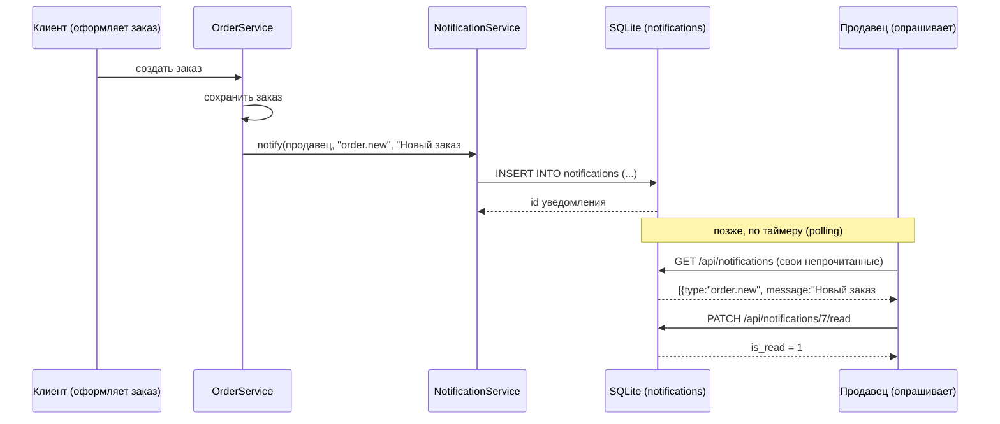

# Шаг 12. Уведомления и журнал действий

> **Цель шага:** научить систему **сообщать людям о событиях** (новый заказ, дубль, оплата,
> доставка, нехватка товара) и **записывать в журнал, кто что сделал**. К концу шага у вас
> будет: сервис `NotificationService` с методами `notify` / получения непрочитанных /
> пометки прочитанным, эндпоинты `GET /api/notifications` и `PATCH
> /api/notifications/{id}/read`, а также `AuditService`, пишущий действия в таблицу
> `audit_log`, и эндпоинт администратора `GET /api/admin/logs`. Это закрывает требования ТЗ:
> **уведомления о событиях** и **просмотр логов администратором**.

> Диаграммы — на **Mermaid**; рядом ASCII-версия и описание.

---

## 1. Зачем нужны уведомления

Система живёт сама по себе: клиент оформил заказ ночью, товар закончился во время продажи.
Если бы сотрудники узнавали об этом, только случайно заглянув в нужный экран, — половина
событий проходила бы мимо. **Уведомление** — это способ системы «постучаться» к нужному
человеку: «эй, появился новый заказ — собери букет».

ТЗ требует уведомлять о пяти типах событий:

| Событие | Кого уведомляем | Тип (`type`) |
|---------|-----------------|--------------|
| Новый заказ | продавца и флориста | `order.new` |
| Дубль заказа (подозрение) | продавца | `order.duplicate` |
| Оплата прошла | клиента | `payment.done` |
| Статус доставки изменился | клиента | `delivery.update` |
| Нехватка товара на складе | закупщика | `stock.low` |

> **Аналогия.** Уведомление — это записка на стол сотруднику. Она лежит и ждёт, пока человек
> подойдёт и прочитает. Прочитал — отметил галочкой «прочитано», чтобы не путать со свежими.

---

## 2. Как устроено уведомление в учебном проекте (и как в проде)

Здесь важно честно объяснить нашу упрощённую модель.

> **В нашем учебном проекте уведомление = строка в таблице `notifications`.** Сервер просто
> записывает её в БД. А клиент **периодически опрашивает** сервер: «есть для меня новые
> уведомления?» (запрос `GET /api/notifications`). Этот подход называется **polling**
> (опрос).

```
СОБЫТИЕ -> сервис записал строку в notifications -> клиент РАЗ В N СЕКУНД спрашивает -> показывает
```

- **Плюс:** очень просто, никакой дополнительной инфраструктуры. Отлично для учёбы.
- **Минус:** уведомление появляется не мгновенно, а с задержкой до следующего опроса; и
  лишние запросы, даже когда ничего нового нет.

> **Как делают в проде (упоминаем, не реализуем):**
> - **WebSocket** — постоянное «открытое» соединение: сервер сам **сразу** толкает
>   уведомление клиенту, без опроса.
> - **Push-уведомления** — всплывают на телефоне даже при закрытом приложении.
> - **Email / SMS** — для важных событий (оплата, доставка).
>
> Наша архитектура к этому готова: само **порождение** уведомления (запись в БД через
> `NotificationService::notify`) останется тем же. Поменяется только «доставка до клиента» —
> добавится отправка через WebSocket/почту рядом с записью в БД. Это и есть смысл вынести
> логику в сервис: способ доставки можно менять, не трогая места, где уведомления создаются.

---

## 3. Доменная модель `Notification`

Таблица `notifications` уже есть в схеме (шаг `04`): поля `id`, `user_id`, `type`,
`message`, `is_read`, `created_at`. Соответствующая C++-структура (`src/domain/notification.h`):

```cpp
#pragma once
#include <string>
#include <cstdint>   // int64_t

namespace fs {

// Доменная модель: ровно повторяет колонки таблицы notifications (шаг 04).
// struct с публичными полями — "данные без поведения" (см. шаг 03).
struct Notification {
    int64_t     id = 0;          // PRIMARY KEY
    int64_t     user_id = 0;     // КОМУ уведомление (ссылка на users.id)
    std::string type;            // 'order.new', 'payment.done', ...
    std::string message;         // текст для человека на русском
    bool        is_read = false; // прочитано? в БД хранится как 0/1
    std::string created_at;      // когда создано (дата-время строкой)
};

}  // namespace fs
```

---

## 4. Сервис уведомлений `NotificationService`

Сервис живёт в `src/services/notification_service.*`, в БД ходит через
`NotificationRepository` (шаг `07`) — правило слоёв из шага `03`.

### 4.1. Заголовок `src/services/notification_service.h`

```cpp
#pragma once
#include <string>
#include <vector>     // std::vector — динамический массив (список) уведомлений
#include <cstdint>
#include "../domain/notification.h"
#include "../repositories/notification_repository.h"

namespace fs {

class NotificationService {
public:
    explicit NotificationService(NotificationRepository& repo) : repo_(repo) {}

    // ГЛАВНЫЙ метод: создать уведомление для пользователя.
    // user_id — кому; type — машинный тип события; message — текст для человека.
    // Возвращает id созданного уведомления.
    int64_t notify(int64_t user_id,
                   const std::string& type,
                   const std::string& message);

    // Получить НЕпрочитанные уведомления пользователя (для опроса клиентом).
    // std::vector<Notification> — список структур.
    std::vector<Notification> unreadFor(int64_t user_id);

    // Получить все уведомления пользователя (история).
    std::vector<Notification> allFor(int64_t user_id);

    // Пометить одно уведомление прочитанным. Возвращает true, если получилось.
    bool markRead(int64_t notification_id, int64_t user_id);

private:
    NotificationRepository& repo_;
};

}  // namespace fs
```

### 4.2. Реализация `src/services/notification_service.cpp`

```cpp
#include "notification_service.h"

namespace fs {

int64_t NotificationService::notify(int64_t user_id,
                                    const std::string& type,
                                    const std::string& message) {
    // Собираем доменный объект...
    Notification n;
    n.user_id = user_id;
    n.type    = type;
    n.message = message;
    n.is_read = false;            // только что созданное — непрочитано
    // created_at проставит БД (DEFAULT datetime('now') в схеме, шаг 04).

    // ...и просим репозиторий вставить строку (INSERT) и вернуть новый id.
    return repo_.insert(n);
}

std::vector<Notification> NotificationService::unreadFor(int64_t user_id) {
    // Репозиторий делает: SELECT * FROM notifications
    //                     WHERE user_id=? AND is_read=0 ORDER BY created_at DESC
    return repo_.findUnreadByUser(user_id);
}

std::vector<Notification> NotificationService::allFor(int64_t user_id) {
    return repo_.findByUser(user_id);
}

bool NotificationService::markRead(int64_t notification_id, int64_t user_id) {
    // user_id передаём ВАЖНО: чтобы пользователь не пометил ЧУЖОЕ уведомление.
    // Репозиторий: UPDATE notifications SET is_read=1
    //              WHERE id=? AND user_id=?  -> вернёт число изменённых строк.
    return repo_.markRead(notification_id, user_id);
}

}  // namespace fs
```

> **`std::vector<Notification>`** — это «список уведомлений», динамический массив, который
> сам растёт. Его удобно перебирать циклом `for (const auto& n : list) { ... }` и
> превращать в JSON-массив для ответа клиенту.

---

## 5. Кто и когда вызывает `notify` (события → уведомления)

`NotificationService::notify` сам по себе ничего не знает о бизнесе. Его **зовут другие
сервисы** в момент важного события. Вот где именно:

| Событие (где в коде) | Вызов |
|----------------------|-------|
| `OrderService::createOrder` создал заказ | `notify(sellerId, "order.new", "Новый заказ #1001")` и `notify(floristId, "order.new", ...)` |
| `OrderService` заподозрил дубль | `notify(sellerId, "order.duplicate", "Возможный дубль заказа")` |
| `PaymentService` подтвердил оплату | `notify(clientId, "payment.done", "Оплата заказа #1001 принята")` |
| `DeliveryService` сменил статус доставки | `notify(clientId, "delivery.update", "Заказ #1001 в пути")` |
| `StockService` увидел остаток ниже порога | `notify(purchaserId, "stock.low", "Заканчиваются розы")` |

> **Принцип (из шага `03`):** уведомление — это **побочное следствие** бизнес-действия.
> Поэтому `notify` зовётся **внутри сервиса, который совершает действие** (заказ, оплата,
> склад), а не в контроллере. Контроллер не должен знать, что «при создании заказа кому-то
> приходит записка» — это бизнес-правило, его место в сервисе.

Пример встраивания (фрагмент `OrderService::createOrder`, полностью — шаг `09`):

```cpp
int64_t newId = orderRepo_.save(order);     // заказ сохранён
// Уведомляем продавца и флориста о новом заказе:
notifications_.notify(order.seller_id, "order.new",
                      "Новый заказ #" + std::to_string(newId));
notifications_.notify(floristId, "order.new",
                      "Новый заказ #" + std::to_string(newId) + " — нужна сборка");
return newId;
```

---

## 6. Эндпоинты уведомлений

Клиент опрашивает свои уведомления и помечает их прочитанными. Оба эндпоинта защищены
токеном (middleware `requireAuth` из шага `10`): пользователь видит **только свои**
уведомления — его `user_id` берётся из токена, а не из запроса (чтобы нельзя было читать
чужое).

### 6.1. `GET /api/notifications` — получить свои непрочитанные

```cpp
server.Get("/api/notifications", [&](const httplib::Request& req, httplib::Response& res) {
    int64_t userId = 0;
    if (!fs::requireAuth(req, res, authService, userId)) return;  // 401 если нет токена

    // Берём непрочитанные именно ЭТОГО пользователя.
    std::vector<fs::Notification> list = notifService.unreadFor(userId);

    // Превращаем список структур в JSON-массив (JSON<->объект только в слое API!).
    nlohmann::json arr = nlohmann::json::array();
    for (const auto& n : list) {
        arr.push_back({
            {"id",         n.id},
            {"type",       n.type},
            {"message",    n.message},
            {"is_read",    n.is_read},
            {"created_at", n.created_at}
        });
    }
    res.status = 200;
    res.set_content(arr.dump(), "application/json");
});
```

### 6.2. `PATCH /api/notifications/{id}/read` — пометить прочитанным

```cpp
// (\d+) в маршруте — это "одна или больше цифр", id уведомления из URL.
server.Patch(R"(/api/notifications/(\d+)/read)",
  [&](const httplib::Request& req, httplib::Response& res) {
    int64_t userId = 0;
    if (!fs::requireAuth(req, res, authService, userId)) return;

    int64_t notifId = std::stoll(req.matches[1]);  // достаём id из URL, текст -> число

    // Передаём userId, чтобы пометить можно было ТОЛЬКО своё уведомление.
    bool ok = notifService.markRead(notifId, userId);
    if (!ok) {
        res.status = 404;  // не нашлось такого уведомления у этого пользователя
        res.set_content(R"({"error":"Уведомление не найдено"})", "application/json");
        return;
    }
    res.status = 200;
    res.set_content(R"({"ok":true})", "application/json");
});
```

> `PATCH` (а не `PUT`/`POST`) выбран потому, что мы меняем **часть** объекта — только поле
> `is_read`. Это семантически правильный HTTP-метод для частичного изменения.

---

## 7. Журнал действий (AuditLog): кто что сделал

Вторая половина шага — **журнал действий**. ТЗ требует, чтобы администратор мог **смотреть
логи**: кто вошёл, кто создал заказ, кто списал товар. Это нужно для разбора спорных
ситуаций («куда делись 10 роз?») и для безопасности.

Не путайте журнал с уведомлениями:

| | Уведомления | Журнал действий (audit_log) |
|--|-------------|------------------------------|
| Зачем | сообщить человеку «сделай что-то» | зафиксировать «кто что сделал» для истории |
| Кто читает | конкретный пользователь | только администратор |
| Можно удалить/пометить | да (is_read) | нет, это неизменяемая летопись |

Таблица `audit_log` уже в схеме (шаг `04`): `id`, `user_id`, `action`, `entity`,
`entity_id`, `created_at`.

### 7.1. Сервис `src/services/audit_service.h`

```cpp
#pragma once
#include <string>
#include <vector>
#include <cstdint>
#include "../domain/audit_log.h"               // структура AuditLog
#include "../repositories/audit_repository.h"  // SQL по audit_log

namespace fs {

class AuditService {
public:
    explicit AuditService(AuditRepository& repo) : repo_(repo) {}

    // Записать действие в журнал.
    //   user_id   — кто совершил (может быть 0, если неизвестно);
    //   action    — что: 'login', 'order.create', 'stock.write_off';
    //   entity    — над чем: 'order', 'stock' (можно пусто);
    //   entity_id — id объекта (можно 0).
    void log(int64_t user_id,
             const std::string& action,
             const std::string& entity = "",
             int64_t entity_id = 0);

    // Прочитать журнал (для администратора). limit — сколько последних записей.
    std::vector<AuditLog> recent(int limit = 100);

private:
    AuditRepository& repo_;
};

}  // namespace fs
```

### 7.2. Реализация `src/services/audit_service.cpp`

```cpp
#include "audit_service.h"

namespace fs {

void AuditService::log(int64_t user_id,
                       const std::string& action,
                       const std::string& entity,
                       int64_t entity_id) {
    AuditLog rec;
    rec.user_id   = user_id;
    rec.action    = action;
    rec.entity    = entity;
    rec.entity_id = entity_id;
    // created_at проставит БД (DEFAULT datetime('now'), шаг 04).
    repo_.insert(rec);   // INSERT INTO audit_log (...)
}

std::vector<AuditLog> AuditService::recent(int limit) {
    // SELECT * FROM audit_log ORDER BY created_at DESC LIMIT ?
    return repo_.findRecent(limit);
}

}  // namespace fs
```

### 7.3. Где вызывать `audit.log` (в сервисах, рядом с действием)

Как и уведомления, запись в журнал — побочное следствие действия, поэтому зовётся **в
сервисах**:

| Действие | Вызов в коде |
|----------|--------------|
| Вход в систему (`AuthService::login`, шаг `10`) | `audit_.log(user.id, "login")` |
| Создание заказа (`OrderService::createOrder`) | `audit_.log(sellerId, "order.create", "order", newId)` |
| Списание товара (`StockService`) | `audit_.log(userId, "stock.write_off", "stock", stockId)` |
| Блокировка пользователя (шаг `11`) | `audit_.log(adminId, "user.block", "user", targetId)` |
| Изменение прав роли (шаг `11`) | `audit_.log(adminId, "role.update", "role", roleId)` |

> Так логируются именно **значимые** действия (вход, изменения данных), а не каждое чтение
> каталога — иначе журнал захлебнётся. Правило: логируем то, что **меняет данные** или важно
> для безопасности (вход).

### 7.4. Эндпоинт администратора `GET /api/admin/logs`

Доступ — только с правом `audit.view` (из шага `11`), то есть фактически админу.

```cpp
server.Get("/api/admin/logs", [&](const httplib::Request& req, httplib::Response& res) {
    int64_t userId = 0;
    if (!fs::requireAuth(req, res, authService, userId)) return;                 // 401
    if (!fs::requirePermission(res, authzService, userRepo, userId, "audit.view"))
        return;                                                                  // 403

    std::vector<fs::AuditLog> logs = auditService.recent(100);
    nlohmann::json arr = nlohmann::json::array();
    for (const auto& l : logs) {
        arr.push_back({
            {"user_id",    l.user_id},
            {"action",     l.action},
            {"entity",     l.entity},
            {"entity_id",  l.entity_id},
            {"created_at", l.created_at}
        });
    }
    res.status = 200;
    res.set_content(arr.dump(), "application/json");
});
```

---

## 8. Поток «событие → сервис → NotificationService → БД → клиент опрашивает»

Соберём картину уведомлений целиком на примере **нового заказа**.



**ASCII:**

```
[Событие: создан заказ]
        │
        ▼
 OrderService ──notify(продавец,"order.new",...)──> NotificationService
                                                          │
                                                          ▼ INSERT
                                                   (таблица notifications)
                                                          ▲
        продавец РАЗ В N СЕК: GET /api/notifications ─────┘
        прочитал -> PATCH /api/notifications/{id}/read -> is_read=1
```

Текстом: бизнес-сервис (заказ/оплата/склад) в момент события зовёт `NotificationService.notify`,
тот пишет строку в БД. Клиент периодически (polling) запрашивает свои непрочитанные через
`GET /api/notifications` и помечает прочитанные через `PATCH .../read`. В проде шаг «опрос»
заменился бы на мгновенный push через WebSocket — но логика порождения уведомления та же.

---

## 9. Связь с ТЗ (требование → где реализовано)

| Требование ТЗ | Где реализовано в этом шаге |
|---------------|------------------------------|
| Уведомление о новом заказе | `notify(..., "order.new", ...)` в `OrderService` (раздел 5) |
| Уведомление о дубле заказа | `notify(..., "order.duplicate", ...)` (раздел 5; дубли — шаг `09`) |
| Уведомление об оплате | `notify(client, "payment.done", ...)` (раздел 5) |
| Уведомление о доставке | `notify(client, "delivery.update", ...)` (раздел 5) |
| Уведомление о нехватке товара | `notify(purchaser, "stock.low", ...)` (раздел 5) |
| Получение/чтение уведомлений | `GET /api/notifications`, `PATCH .../read` (раздел 6) |
| Журнал действий | `AuditService::log` в сервисах (раздел 7) |
| Администратор смотрит логи | `GET /api/admin/logs` + право `audit.view` (раздел 7.4) |

---

## Проверь себя

1. Чем уведомление отличается от записи в журнал действий (`audit_log`)?
2. Что такое **polling** (опрос) и чем он отличается от WebSocket? Почему для учёбы выбран
   polling?
3. Почему `notify` зовётся **в сервисах** (заказ/оплата/склад), а не в контроллере?
4. Какие пять типов событий порождают уведомления и кому они адресованы?
5. Почему в `markRead` мы передаём `user_id`, а в `GET /api/notifications` берём его из токена?
6. Какие действия стоит писать в `audit_log`, а какие — нет, и почему?

---

## Промпт для ИИ-агента

> Я изучаю C++ и делаю учебную систему цветочного магазина (SQLite, cpp-httplib, слоистая
> архитектура). Ниже — документ про уведомления и журнал действий (шаг 12). Прочитай его и:
> (1) проверь, что я правильно понимаю polling vs WebSocket и почему уведомление = запись в
> БД — задай 4 вопроса; (2) проверь мою таблицу «событие → кого уведомляем» на полноту по ТЗ;
> (3) предложи, как аккуратно добавить отправку email рядом с записью в БД, не ломая
> архитектуру; (4) подскажи, какие действия логировать в audit_log, а какие нет. Схему БД и
> имена таблиц не меняй — они зафиксированы (шаг 04). Документ: [вставьте содержимое этого файла].

---

Назад → [11-роли-и-права-доступа.md](11-роли-и-права-доступа.md)  Дальше → [13-отчёты.md](13-отчёты.md)
